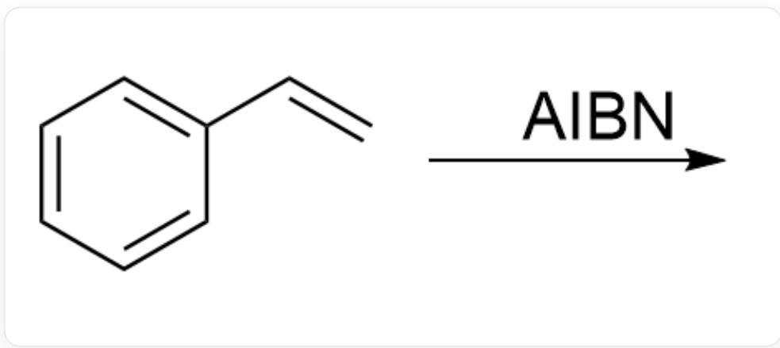
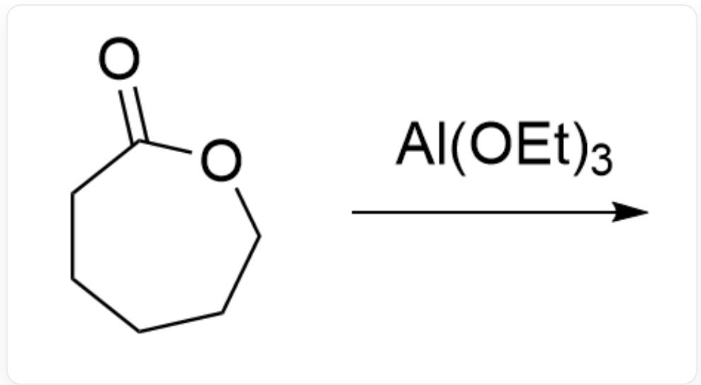
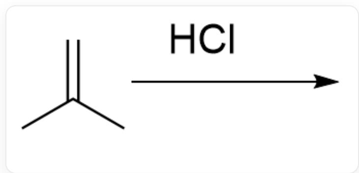
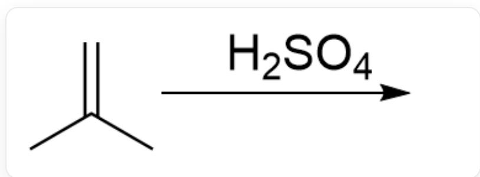

# Question

Here are several reactions. Which of them are living polymerizations?

Reaction 1:

  
O=C1OCCCCC1> [Na]OCC>

Reaction 2:

  
[ \mathrm{C = CC1 = CC = CC = C1 > N\# CC(C)(C) / N = N / C(C)(C)C\# N > } ]

Reaction 3:

  
C=C(C#N)C(OC)=O>0>

# Reaction 4:

  
O=C1NCCCCC1> [Na]OCC>

# Reaction 5:

O=C1OCCCCC1>CCO[Al](OCC)OCC>

Reaction 6:

C=C(C)C>CI>

Reaction 7:

$\mathrm{C = C(C)C > O = S(O)(O) = O > }$

# Reaction 8:

C=COC>II.>

A. 1,2,3,4,5,6,7,8  
B. 1,2,3,5,6,7,8  
C. 5,8  
D. 7,8  
E. 1,2,7,8  
F. 4,5,6,7,8  
G. 1,2,3,4,5  
H. 1,2,5,6,7,8  
No option indicated all the living polymerization reactions

# Answer

Correct Answer: C

# Detailed Explanation

In a living polymerization, the initiator generates a sufficient number of active centers, each of which reacts with monomers. The active centers are relatively stable with few side reactions until the reaction is terminated by the addition of a quenching agent. That is, living polymerization is characterized by fast initiation, slow propagation, no chain transfer, and no termination.

# CHECKPOINT

1 PTS

Living polymerization features fast initiation, slow propagation, no chain transfer, and no termination

Reactions 1 and 4 involve chain transfer reactions where anions attack sites other than monomers, and thus are not living polymerizations.

# CHECKPOINT

1 PTS

Reactions 1 and 4 involve chain transfer reactions

Reaction 2 is a radical polymerization with chain termination reactions, where the active chains are uncontrolled, and thus it is not a living polymerization.

# CHECKPOINT

1 PTS

Reaction 2 has unstable active centers and involves chain termination reactions

In Reaction 3, water acts as a quenching agent for the active centers, leading to chain termination reactions, and thus it is not a living polymerization.

# CHECKPOINT

1 PTS

Reaction 3 involves chain termination reactions

Reaction 5 is a coordination polymerization, where the O in the active center coordinates with Al, resulting in stable active centers and controllable polymerization, making it a living polymerization.

# CHECKPOINT

1 PTS

Reaction 5 features O in the active center coordinating with Al, leading to stable active centers and controllable polymerization

Hydrochloric acid cannot initiate the polymerization of isobutene, so Reaction 6 is not a living polymerization.

# CHECKPOINT

1 PTS

Hydrochloric acid cannot initiate the polymerization of isobutene

Reaction 7 is a cationic polymerization of isobutene, involving chain transfer reactions.

# CHECKPOINT

1 PTS

Reaction 7 is a cationic polymerization of isobutene with chain transfer reactions

In Reaction 8, hydroiodic acid first iodinates the double bond to form an iodinated substrate. Iodine acts as a Lewis acid to activate the C-I bond, preventing the formation of free carbocations and thereby suppressing chain transfer and termination reactions in cationic polymerization, making it a living polymerization.

# CHECKPOINT

1 PTS

Reaction 8 involves iodine as a Lewis acid activating the C-I bond, suppressing chain transfer and termination reactions