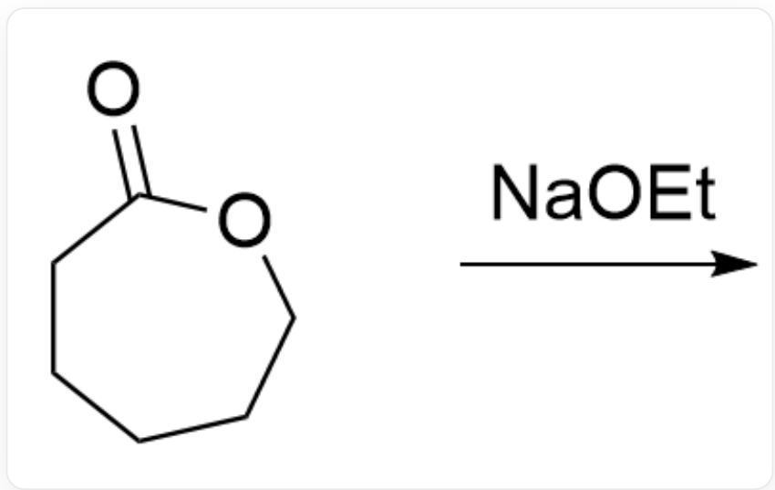
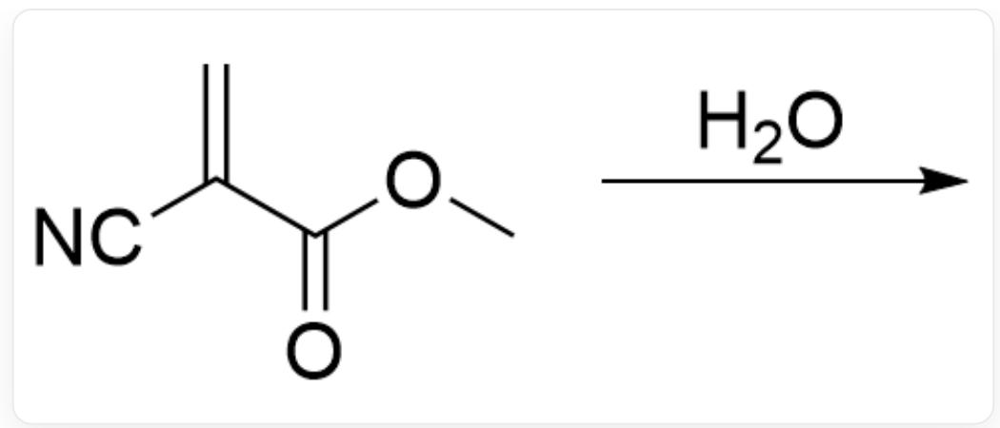
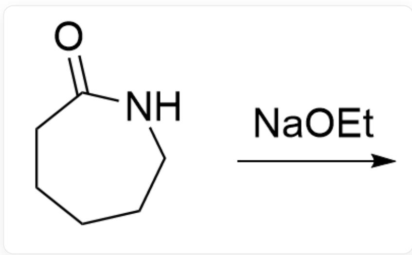
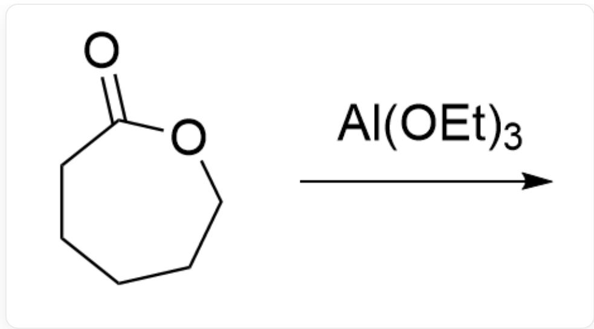
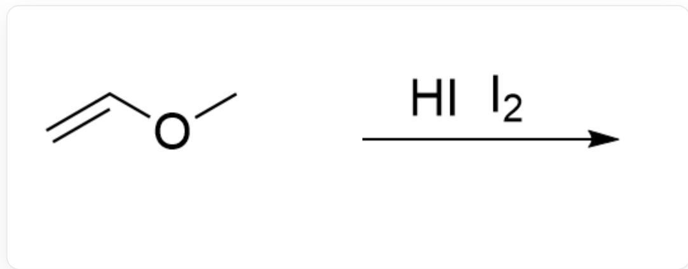

# 题目

下面有几个反应，其中是活性聚合的有哪些？

反应1:

  
O=C1OCCCCC1> [Na]OCC>

反应2:

  
[ \mathrm{C = CC1 = CC = CC = C1 > N\# CC(C)(C) / N = N / C(C)(C)C\# N > } ]

反应3:

  
C=C(C#N)C(OC)=O>0>

反应4:

  
O=C1NCCCCC1> [Na]OCC>

反应5:

O=C1OCCCCC1>CCO[Al](OCC)OCC>

反应6:

C=C(C)C>CI>

反应7：

$\mathrm{C = C(C)C > O = S(O)(O) = O > }$

反应8:

C=COC>II.>

A. 1,2,3,4,5,6,7,8  
B.  $1,2,3,5,6,7,8$  
C. 5,8  
D. 7,8  
E. 1,2,7,8  
F. 4,5,6,7,8  
G. 1,2,3,4,5  
H.  $1,2,5,6,7,8$  
I. 没有选项指出了所有的活性聚合反应

# 答案

正确答案: C

# 详细解析

活性聚合反应由引发剂产生足够多的活性中心，每个活性中心与单体反应，活性中心较稳定且副反应少，直到加入淬灭剂终止反应。即活性聚合具有快引发、慢增长、无转移、无终止的特点。

# CHECKPOINT

1 PTS

活性聚合快引发、慢增长、无转移、无终止

反应1和反应4存在阴离子进攻单体外其他链或其他位点的链转移反应，不是活性聚合

# CHECKPOINT

1 PTS

反应1和反应4存在链转移反应

反应2是自由基聚合，具有链终止反应，活性链不可控，不是活性聚合

# CHECKPOINT

1 PTS

反应2活性中心不稳定，存在链终止反应

反应3中水是活性中心的淬灭剂，存在链终止反应，不是活性聚合

# CHECKPOINT

1 PTS

反应3存在链终止反应

反应5是配位聚合，活性中心的O与Al配位，活性中心较稳定，聚合可控，是活性聚合

# CHECKPOINT

1 PTS

反应5活性中心的O与Al配位，活性中心较稳定，聚合可控

盐酸不能引发异丁烯的聚合，反应6不是活性聚合

# CHECKPOINT

1 PTS

盐酸不能引发异丁烯的聚合

反应7为异丁烯阳离子聚合，存在链转移反应

# CHECKPOINT

1 PTS

反应7为异丁烯阳离子聚合，存在链转移反应

反应8中氢碘酸首先使双键碘化得到碘代底物，碘单质作为Lewis酸可以活化C-I键，不存在自由的碳正离子，抑制了阳离子聚合的链转移和链终止反应，是活性聚合

# CHECKPOINT

1 PTS

反应8碘单质作为Lewis酸活化C-I键，抑制链转移和链终止反应