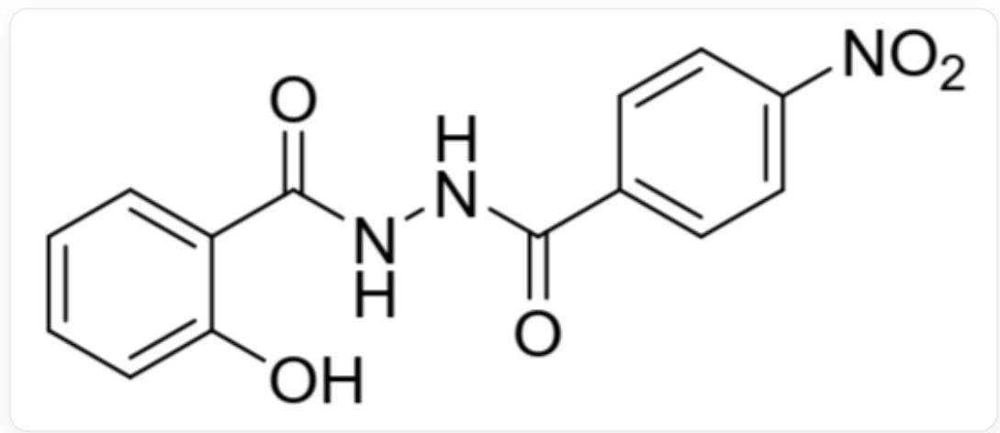
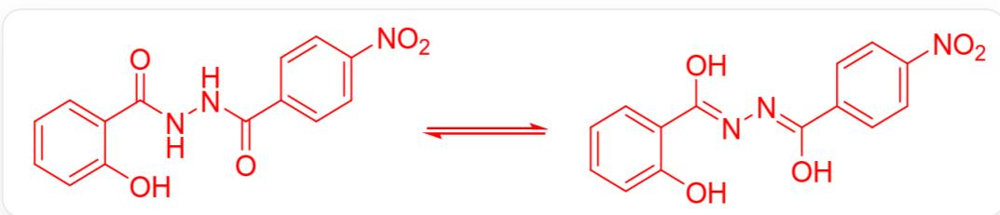
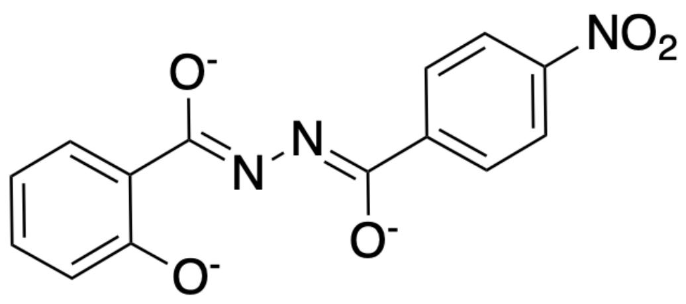

# Question

At room temperature,  $0.15\mathrm{g}$  of the compound  $\mathbf{H}_3\mathbf{L}$  (structure shown in Figure 1) was dissolved in anhydrous ethanol, followed by the addition of  $1\mathrm{mL}$  of pyridine solution and  $0.09\mathrm{g}$  of nickel acetate. The mixture was stirred at  $50^{\circ}\mathrm{C}$  for  $30\mathrm{min}$  to obtain a solution. Slow evaporation in air yielded block-shaped single crystals  $\mathbf{X}$  with a  $48\%$  yield. Elemental analysis of  $\mathbf{X}$  revealed: C 52.94; H 3.33; N 12.87; O

14.69 (all in mass percent,  $\%$

  
Fig. 1. The SMILES representation of this molecule is: O=C(NNC(C1=CC=C([N+])
([O-])=O)C=C1)=O)C2=CC=CC=C2O

The chemical formula of  $\mathbf{X}$  was deduced through calculations.

Infrared spectroscopy was performed on both compound  $\mathbf{H}_3\mathbf{L}$  and the resulting complex  $\mathbf{X}$ , yielding the following results.

Key IR absorption peaks  $\left(\mathrm{KBr},\mathrm{cm}^{-1}\right):\mathrm{H}_3\mathbf{L}:1692;1590;1543;1520;\mathbf{X}:1602;1563;1518$

By analyzing the differences in their IR spectra, the coordination structure of  $\mathbf{L}$  was deduced.

Which of the following options is correct?

A. None of the other options are correct

B. In a  $\mathbf{X}$  molecule, the product of the total quantities of various atoms is 172800.  
C. In a molecule of  $\mathbf{X}$ , the product of the total number of various atoms is 345600.  
D. In a  $\mathbf{X}$  molecule, the product of the total numbers of various atoms is 10800.  
E. The UV-visible absorption peak of the coordinated  $\mathbf{L}$  molecular structure (excluding the absorption of the central Ni) may exhibit a significant red shift.  
F. The variation in IR absorption peaks is caused by the formation of coordinate bonds when  $\mathbf{L}$  molecules coordinate, leading to the weakening of the original infrared-active four chemical bonds.  
G. There is no change in the position of the double bond in the L molecule before and after coordination.

# Answer

Correct Answer: E

# Detailed Explanation

From the elemental analysis results, we obtain  $n(\mathrm{C}): n(\mathrm{O}) = 4.80$ ,  $n(\mathrm{C}): n(\mathrm{H}) = 1.33$ , and  $n(\mathrm{N}): n(\mathrm{O}) = 1.00$ .

The nitrogen-containing ligands in  $\mathbf{X}$  can only be  $\mathbf{L}$  and pyridine, with the chemical formulas  $\mathrm{C_{14}H_8N_3O_5}$  and  $\mathrm{C}_5\mathrm{H}_5\mathrm{N}$ , respectively.

From  $n(\mathbf{N}): n(\mathbf{O}) = 1.00$ , it can be deduced that the ratio of  $\mathbf{L}$  to pyridine is  $1:2$ .

# CHECKPOINT

1 PTS

The ratio of  $\mathbf{L}$  to pyridine in the ligands is  $1:2$

Assuming  $\mathbf{X}$  contains  $1\mathbf{L}$  and 2 pyridines, the number of C atoms would be 24, N and O atoms would each be 5, and H atoms would be 18, which precisely matches the ratios obtained from the elemental analysis. Therefore,  $\mathbf{X}$  contains only  $\mathbf{L}$  and pyridine as ligands. If the number of  $\mathbf{L}$  in  $\mathbf{X}$  is  $x = 2$ , then the number of pyridines is  $2x$ .

The central metal is clearly Ni. When  $x = 2$ , the remaining mass  $M = 176.1 \, \mathrm{g/mol}$  corresponds to 3 Ni atoms. Thus, the chemical formula of X is  $\mathrm{Ni}_3\mathrm{L}_2(\mathrm{C}_5\mathrm{H}_5\mathrm{N})_4$ , written as  $\mathrm{Ni}_3\mathrm{C}_{48}\mathrm{H}_{36}\mathrm{O}_{10}\mathrm{N}_{10}$ , with a coefficient product of 518400. Options A, B, C, and D are incorrect.

# CHECKPOINT

1 PTS

The chemical formula of  $\mathbf{X}$  is  $\mathrm{Ni}_3\mathrm{L}_2(\mathrm{C}_5\mathrm{H}_5\mathrm{N})_4$ , with a coefficient product of 518400

When the compound  $\mathbf{H}_3\mathbf{L}$  exists alone, it exhibits the equilibrium shown in Figure 2:

  
Fig. 2, the figure depicts a reversible reaction:  $\mathrm{O} = \mathrm{C}(\mathrm{C}1 = \mathrm{CC} = \mathrm{CC} = \mathrm{C}1\mathrm{O})\mathrm{NNC}(\mathrm{C}2 = \mathrm{CC} = \mathrm{C}(\mathrm{C} = \mathrm{C}2)[\mathrm{N} + ]$

$$
([ O - ]) = O) = O > > O = [ N + ] ([ O - ]) C (C = C 3) = C C = C 3 / C (O) = N / N = C (O) / C 4 = C C = C C = C 4 0
$$

Thus,  $\mathbf{H}_3\mathbf{L}$  displays four major infrared absorption peaks. The difference between  $\mathbf{X}$  and  $\mathbf{H}_3\mathbf{L}$  lies in the absence of the carbonyl absorption peak near  $1700~\mathrm{cm}^{-1}$ , making option F incorrect. When  $\mathbf{L}$  coordinates with the central metal, it undergoes keto-enol tautomerization, with the structure shown in Figure 3, making option G incorrect.

  
Fig. 3, the molecular structure is represented in SMILES as:  $[O - ]C(C(C = C1) = CC = C1[N + ]$

$$
([ O - ]) = O) = N N = C (C 2 = C C = C C = C 2 [ O - ]) [ O - ]
$$

When coordinated,  $\mathbf{L}$  forms a large conjugated system, causing the absorption peak to redshift, making option E correct.

# CHECKPOINT

2 PTS

The difference between  $\mathbf{X}$  and  $\mathbf{H}_3\mathbf{L}$  is the absence of the carbonyl absorption peak near  $1700~\mathrm{cm}^{-1}$ , and  $\mathbf{L}$  forms an enol isomer upon coordination.