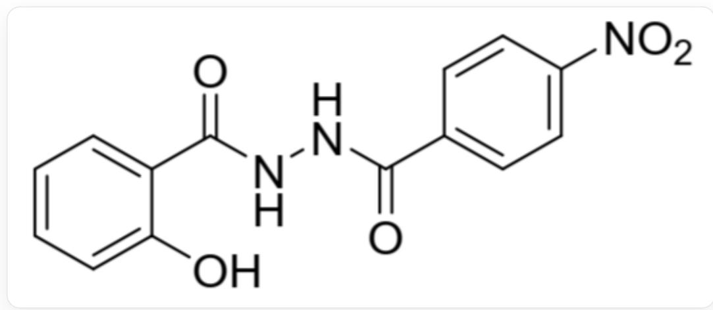
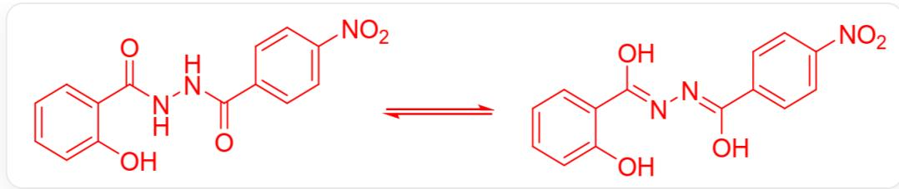
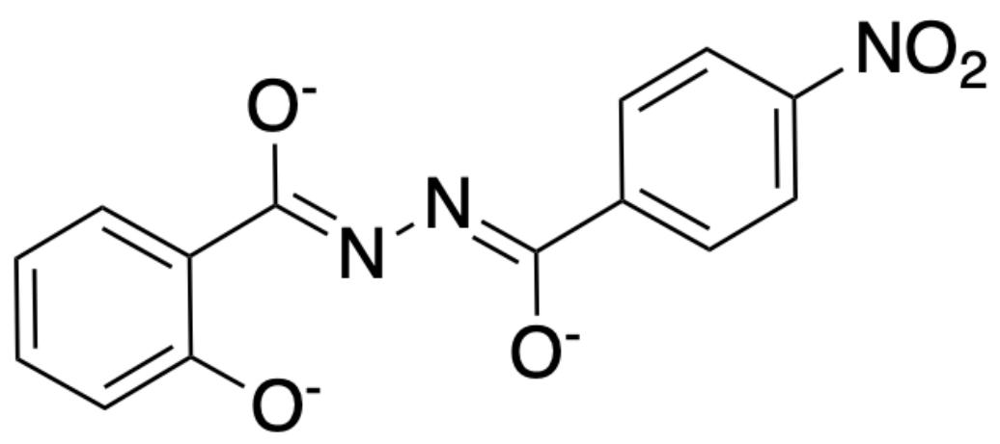

# 题目

在室温下将  $0.15 \mathrm{~g}$  化合物  $\mathrm{H}_{3} \mathrm{~L}$  (结构如图1所示)溶解于无水乙醇中, 加入  $1 \mathrm{~mL}$  吡啶溶液和  $0.09 \mathrm{~g}$  乙酸镍, 将混合物在  $50^{\circ} \mathrm{C}$  下搅拌  $30 \mathrm{~min}$ , 得到溶液。在空气中缓慢蒸发,以  $48 \%$  的产率得到了块状单晶  $\mathbf{X}$  。对  $\mathbf{X}$  元素分析可知: C 52.94; H 3.33; N 12.87; O 14.69 (均为质量分数,  $\%$  )。

  
Fig. 1, 该分子以SMILES表示为:  $O = C(N N C(C 1 = C C = C([N + ])([O - ]) = O) C = C 1) = O) C 2 = C C = C C = C 2 O$

通过计算, 推出  $\mathbf{X}$  的化学式。

对化合物  $\mathrm{H}_3\mathbf{L}$  以及所得的配合物  $\mathbf{X}$  分别进行红外光谱测定, 得到如下所示的结果。

主要的IR吸收峰  $\left(\mathrm{KBr},\mathrm{cm}^{-1}\right):\mathrm{H}_3\mathbf{L}:1692;1590;1543;1520;\mathbf{X}:1602;1563;1518$  。

考虑二者IR光谱的区别的来源,推算  $\mathbf{L}$  配位时的结构。

以下选项正确的是？

A. 其他选项均不正确

B. 一个  $\mathbf{X}$  分子中, 各种原子总数量的乘积为  $172800$  
C. 一个  $\mathbf{X}$  分子中, 各种原子总数量的乘积为  $345600$  
D. 一个  $\mathbf{X}$  分子中, 各种原子总数量的乘积为  $10800$  
E. 配位后的  $\mathrm{L}$  分子结构（不考虑中心Ni的吸收）紫外-可见吸收峰可能发生明显红移  
F. IR 吸收峰的变化是  $\mathbf{L}$  分子配位时形成配位键, 导致原来有红外吸收的四根化学键强度变弱引起的  
G. L分子配位前后未发生双键位置的变化

# 答案

正确答案: E

# 详细解析

由元素分析结果可得  $n(\mathrm{C}):n(\mathrm{O}) = 4.80,n(\mathrm{C}):n(\mathrm{H}) = 1.33,n(\mathrm{N}):n(\mathrm{O}) = 1.00$

X中含氮配体只可能为  $\mathbf{L}$  和吡啶,化学式分别为  $\mathrm{C_{14}H_8N_3O_5}$  和  $\mathrm{C}_5\mathrm{H}_5\mathrm{N}$

由  $n(\mathrm{N}):n(\mathrm{O}) = 1.00$  可知，  $\mathbf{L}$  和吡啶的个数比为  $1:2$

# CHECKPOINT

1 PTS

配体中  $\mathbf{L}$  和吡啶的个数比为  $1:2$

假设  $\mathbf{X}$  中  $\mathbf{L}$  为1个，吡啶为2个，则C的个数为24，N和O的个数均为5，H的个数为18，恰好符合上述元素分析所得的比例，故  $\mathbf{X}$  中只含有  $\mathbf{L}$  和吡啶两种配体。设  $\mathbf{X}$  中  $\mathbf{L}$  的个数为  $x = 2$  ，则吡啶的个数为  $2x$

中心金属显然为 Ni, 故当  $x = 2$  时, 剩余  $M = 176.1 \mathrm{~g} / \mathrm{mol}$ , 对应于 3 个 Ni, 故 X 的化学式为  $\mathrm{Ni}_{3} \mathrm{~L}_{2} (\mathrm{C}_{5} \mathrm{H}_{5} \mathrm{~N})_{4}$ , 写作  $\mathrm{Ni}_{3} \mathrm{C}_{48} \mathrm{H}_{36} \mathrm{O}_{10} \mathrm{~N}_{10}$ , 各系数乘积为 518400, 选项 A、B、C、D 错误。

# CHECKPOINT

1 PTS

$\mathbf{X}$  的化学式为  $\mathrm{Ni}_3\mathrm{L}_2(\mathrm{C}_5\mathrm{H}_5\mathrm{N})_4$ ，各系数乘积为518400

化合物  $\mathrm{H}_3\mathrm{L}$  单独存在时,存在图2所示的平衡:

Fig. 2, 图中为一可逆反应:  $O = C(C1 = CC = CC = C1O)NNC(C2 = CC = C(C = C2)[N + ]([O - ]) = O) = O > > O = [N + ]$  
  
$([\mathrm{O - }])\mathrm{C}(\mathrm{C = C3}) = \mathrm{CC} = \mathrm{C3} / \mathrm{C}(\mathrm{O}) = \mathrm{N} / \mathrm{N} = \mathrm{C}(\mathrm{O}) / \mathrm{C4} = \mathrm{CC} = \mathrm{CC} = \mathrm{C40}$

故  $\mathbf{H}_3\mathbf{L}$  显示了4个主要的红外吸收峰，X与  $\mathrm{H}_3\mathrm{L}$  的区别在于  $1700~\mathrm{cm}^{-1}$  附近的羰基吸收峰没有显示，选项F错误。L与中心金属配位时发生烯醇式异构变化，结构如图3所示，选项G错误。

  
Fig. 3, 图中分子以SMILES表示为: [O-]C(C(C=C1)=CC=C1[N+]([O-])=O)=NN=C(C2=CC=CC=C2[O-])[O-]

配位时的L整体形成较大的共轭体系，吸收峰发生红移，选项E正确。

# CHECKPOINT

2 PTS

X 与  $\mathrm{H}_{3} \mathrm{~L}$  的区别在于  $1700 \mathrm{~cm}^{-1}$  附近的羰基吸收峰没有显示，  $\mathbf{L}$  配位时形成烯醇异构体。