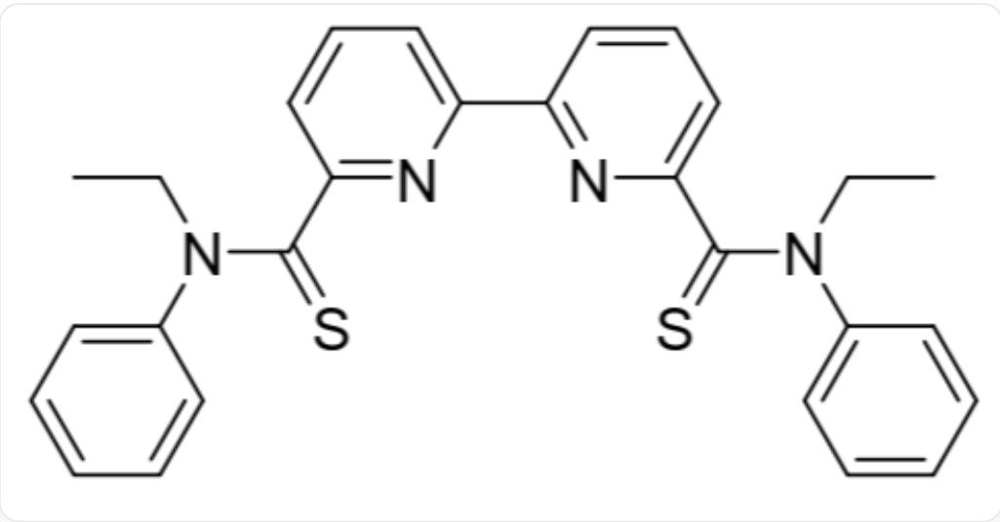

# Question

Extractant L (structure shown in Figure 1) can extract  $\mathrm{Pd(NO_3)_2}$  from the aqueous phase to the organic phase  $(\mathrm{CHCl}_3)$ :

$$
2 \mathrm {P d} ^ {2 +} (\mathrm {a q}) + 4 \mathrm {N O} _ {3} ^ {-} (\mathrm {a q}) + \mathrm {L} (\mathrm {o}) \rightleftharpoons \mathrm {P d} _ {2} (\mathrm {N O} _ {3}) _ {4} \mathrm {L} (\mathrm {o})
$$

In the above equation, aq represents the aqueous phase, and o represents the organic phase.  $\mathrm{Pd}^{2+}$  and  $\mathrm{NO}_3^-$  exist only in the aqueous phase, and L and  $\mathrm{Pd}_2(\mathrm{NO}_3)_4\mathrm{L}$  exist only in the organic phase. At the beginning of the reaction, the volumes of the aqueous phase and the organic phase are the same, and the concentrations of each species are controlled as follows:

$$
c _ {0} \left(\mathrm {N O} _ {3} ^ {-}\right) = 1. 0 0 \mathrm {m o l / L}; c _ {0} (\mathrm {L}) = 2. 0 \times 1 0 ^ {- 3} \mathrm {m o l / L}; c _ {0} \left(\mathrm {P d} ^ {2 +}\right) = 1. 0 \times 1 0 ^ {2} \mathrm {m g / L};
$$

At equilibrium, it is measured that:

$$
c \left(\mathrm {P d} ^ {2 +}\right): c \left(\mathrm {P d} _ {2} \left(\mathrm {N O} _ {3}\right) _ {4} \mathrm {L}\right) = 0. 3 0
$$

Fig .1, the molecule in the figure is represented by SMILES as:  
  
CCN(C1=CC=CC=C1)C(=S)C2=NC(=CC=C2)C3=NC(=CC=C3)C(=S)N(CC)C4=CC=CC=C4

Which of the following options are correct:

A. All other options are incorrect.  
B. The equilibrium constant for the extraction reaction is  $1.7 \times 10^{7}$  
C. The equilibrium constant for the extraction reaction is  $8.2 \times 10^{-4}$ .  
D. The equilibrium constant for the extraction reaction is  $2.1 \times 10^{3}$  
E. Extraction rate was  $77\%$  
F. Extraction rate:  $23\%$  
G. Increasing the initial  $\mathrm{NO}_3^-$  concentration cannot increase the extraction rate at equilibrium.  
H. Increasing the initial concentration of L does not increase the extraction rate at equilibrium.

1. Increasing the initial concentration of  $\mathrm{Pd}^{2+}$  can increase the extraction rate at equilibrium.  
J. Extending the reaction time can improve the extraction rate at equilibrium.

# Answer

Correct Answer: B

# Detailed Explanation

Extraction rate  $E = 2 \times 1 / (0.30 + 2 \times 1) = 87\%$

# CHECKPOINT

1 PTS

Extraction rate is  $87\%$

Options E and F are incorrect.

Convert the initial concentration of  $\mathrm{Pd}^{2+}$  to molar concentration:

$$
c _ {0} \left(\mathrm {P d} ^ {2 +}\right) = 1. 0 \times 1 0 ^ {2} \mathrm {m g / L} / 1 0 6. 4 \mathrm {g / m o l} = 9. 4 \times 1 0 ^ {- 4} \mathrm {m o l / L}
$$

Therefore, at equilibrium:

$$
\mathrm {c} \left(\mathrm {P d} ^ {2 +}\right) = (1 - 0. 8 7) \times 9. 4 \times 1 0 ^ {- 4} \mathrm {m o l} / \mathrm {L} = 1. 2 \times 1 0 ^ {- 4} \mathrm {m o l} / \mathrm {L}
$$

# CHECKPOINT

0.5 PTS

Calculated equilibrium c  $\left(\mathrm{Pd}^{2 + }\right) = 1.2\times 10^{-4}\mathrm{mol / L}$

$$
\mathrm {c} \left(\mathrm {P d} _ {2} \left(\mathrm {N O} _ {3}\right) _ {4} \mathrm {L}\right) = 0. 8 7 \times 9. 4 \times 1 0 ^ {- 4} \mathrm {m o l} / \mathrm {L} \div 2 = 4. 1 \times 1 0 ^ {- 4} \mathrm {m o l} / \mathrm {L}
$$

# CHECKPOINT

0.5 PTS

Calculated equilibrium c  $\left(\mathrm{Pd}_{2}\left(\mathrm{NO}_{3}\right)_{4} \mathrm{~L}\right)=4.1 \times 10^{-4} \mathrm{~mol} / \mathrm{L}$

The concentration of  $\mathbf{L}$  at equilibrium is:

$$
\mathrm {c (L)} = 2. 0 \times 1 0 ^ {- 3} \mathrm {m o l / L} - 4. 1 \times 1 0 ^ {- 4} \mathrm {m o l / L} = 1. 6 \times 1 0 ^ {- 3} \mathrm {m o l / L}
$$

# CHECKPOINT

0.5 PTS

Calculated equilibrium  $c(\mathrm{L}) = 1.6 \times 10^{-3} \, \mathrm{mol/L}$

The nitrate ion is in large excess in the system, and its equilibrium concentration is:

$$
c \left(\mathrm {N O} _ {3} ^ {-}\right) = c _ {0} \left(\mathrm {N O} _ {3} ^ {-}\right) = 1. 0 0 \mathrm {m o l} / \mathrm {L}
$$

Equilibrium constant  $K = c(\mathrm{Pd}_2(\mathrm{NO}_3)_4\mathrm{L}) / c^2 (\mathrm{Pd}^{2 + })c^4 (\mathrm{NO}_3^-)c(\mathrm{L}) = 1.7\times 10^7$

# CHECKPOINT

1 PTS

Calculated equilibrium constant as  $1.7 \times 10^{7}$

Option B is correct, C and D are incorrect.

Increasing the extraction rate is actually trying to find a way to shift the equilibrium to the right. Increasing any species on the left side of the equation other than  $\mathrm{Pd}^{2+}$  can increase the extraction rate. Options G, H, and I are incorrect. Extending the reaction time after equilibrium will not change the concentration of each species. Option J is incorrect.