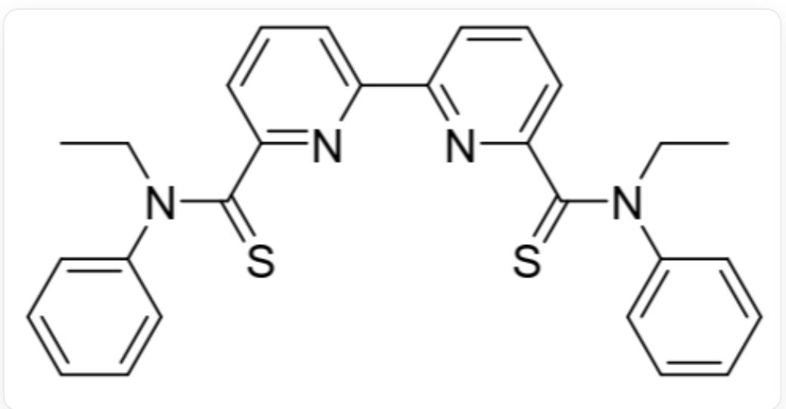

# 题目

萃取剂 L(结构如图1) 能将  $\mathrm{Pd}(\mathrm{NO}_3)_2$  从水相萃取至有机相  $\left(\mathrm{CHCl}_3\right)$ :

$$
2 \mathrm {P d} ^ {2 +} (\mathrm {a q}) + 4 \mathrm {N O} _ {3} ^ {-} (\mathrm {a q}) + \mathrm {L} (\mathrm {o}) \rightleftharpoons \mathrm {P d} _ {2} (\mathrm {N O} _ {3}) _ {4} \mathrm {L} (\mathrm {o})
$$

上式中aq表示水相，o表示有机相。  $\mathrm{Pd}^{2 + }$  、  $\mathrm{NO}_3^-$  仅存在于水相，L和  $\mathrm{Pd}_2(\mathrm{NO}_3)_4\mathrm{L}$  仅存在于有机相。反应开始时，水相和有机相体积相同，控制各物种浓度如下：

$$
c _ {0} \left(\mathrm {N O} _ {3} ^ {-}\right) = 1. 0 0 \mathrm {m o l} / \mathrm {L}; c _ {0} (\mathrm {L}) = 2. 0 \times 1 0 ^ {- 3} \mathrm {m o l} / \mathrm {L}; c _ {0} \left(\mathrm {P d} ^ {2 +}\right) = 1. 0 \times 1 0 ^ {2} \mathrm {m g} / \mathrm {L};
$$

平衡时，测得：

$$
c \left(\mathrm {P d} ^ {2 +}\right): c \left(\mathrm {P d} _ {2} \left(\mathrm {N O} _ {3}\right) _ {4} \mathrm {L}\right) = 0. 3 0
$$

  
Fig .1, 图中分子以SMILES表示为:

$$
C C N (C 1 = C C = C C = C 1) C (= S) C 2 = N C (= C C = C 2) C 3 = N C (= C C = C 3) C (= S) N (C C) C 4 = C C = C C = C 4
$$

# 以下选项正确的是：

A. 其他选项均不正确  
B. 萃取反应的平衡常数为  $1.7 \times 10^{7}$  
C. 萃取反应的平衡常数为  $8.2 \times 10^{-4}$  
D. 萃取反应的平衡常数为  $2.1 \times 10^{3}$  
E. 萃取率为  $77\%$  
F. 萃取率为  $23\%$  
G. 提高  $\mathrm{NO}_{3}^{-}$ 初始浓度无法提高平衡时的萃取率  
H. 提高  $\mathrm{L}$  初始浓度无法提高平衡时的萃取率  
I. 提高  $\mathrm{Pd}^{2+}$  初始浓度可以提高平衡时的萃取率  
J. 延长反应时间可以提高平衡时的萃取率

# 答案

正确答案: B

# 详细解析

萃取率  $E = 2 \times 1 / (0.30 + 2 \times 1) = 87\%$

# CHECKPOINT

1 PTS

萃取率为  $87\%$

选项E、F错误。

将  $\mathrm{Pd}^{2+}$  的初始浓度转化为摩尔浓度为:

$$
c _ {0} \left(\mathrm {P d} ^ {2 +}\right) = 1. 0 \times 1 0 ^ {2} \mathrm {m g / L} / 1 0 6. 4 \mathrm {g / m o l} = 9. 4 \times 1 0 ^ {- 4} \mathrm {m o l / L}
$$

故平衡时, 有:

$$
\mathrm {c} \left(\mathrm {P d} ^ {2 +}\right) = (1 - 0. 8 7) \times 9. 4 \times 1 0 ^ {- 4} \mathrm {m o l} / \mathrm {L} = 1. 2 \times 1 0 ^ {- 4} \mathrm {m o l} / \mathrm {L}
$$

# CHECKPOINT

0.5 PTS

算得平衡时  $\mathrm{c(Pd^{2 + }) = 1.2\times 10^{-4}mol / L}$

$$
\mathrm {c} \left(\mathrm {P d} _ {2} \left(\mathrm {N O} _ {3}\right) _ {4} \mathrm {L}\right) = 0. 8 7 \times 9. 4 \times 1 0 ^ {- 4} \mathrm {m o l} / \mathrm {L} \div 2 = 4. 1 \times 1 0 ^ {- 4} \mathrm {m o l} / \mathrm {L}
$$

# CHECKPOINT

0.5 PTS

算得平衡时  $\mathrm{c(Pd_2(NO_3)_4L) = 4.1\times 10^{-4}mol / L}$

平衡时  $\mathbf{L}$  的浓度为：

$$
\mathrm {c (L)} = 2. 0 \times 1 0 ^ {- 3} \mathrm {m o l / L} - 4. 1 \times 1 0 ^ {- 4} \mathrm {m o l / L} = 1. 6 \times 1 0 ^ {- 3} \mathrm {m o l / L}
$$

# CHECKPOINT

0.5 PTS

算得平衡时  $\mathrm{c(L)} = 1.6\times 10^{-3}\mathrm{mol / L}$

体系中硝酸根离子大过量, 其平衡浓度为:

$$
c \left(\mathrm {N O} _ {3} ^ {-}\right) = c _ {0} \left(\mathrm {N O} _ {3} ^ {-}\right) = 1. 0 0 \mathrm {m o l} / \mathrm {L}
$$

平衡常数  $K = c\left(\mathrm{Pd}_{2}\left(\mathrm{NO}_{3}\right)_{4} \mathrm{~L}\right) / c^{2}\left(\mathrm{Pd}^{2+}\right)c^{4}\left(\mathrm{NO}_{3}^{-}\right)c(\mathrm{~L}) = 1.7 \times 10^{7}$

# CHECKPOINT

1 PTS

算得平衡常数为  $1.7 \times 10^{7}$

选项B正确，C、D错误

提高萃取率实际上就是想办法让平衡右移，提高  $\mathrm{Pd}^{2+}$  以外的方程左侧物种均可提高萃取率，选项G、H、I错误。平衡后延长反应时间不会改变各物种浓度，选项J错误。