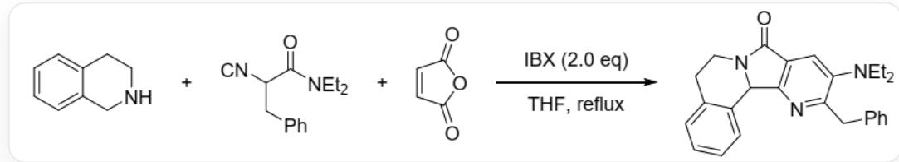
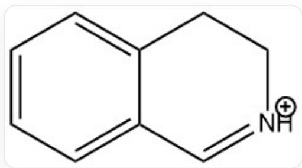
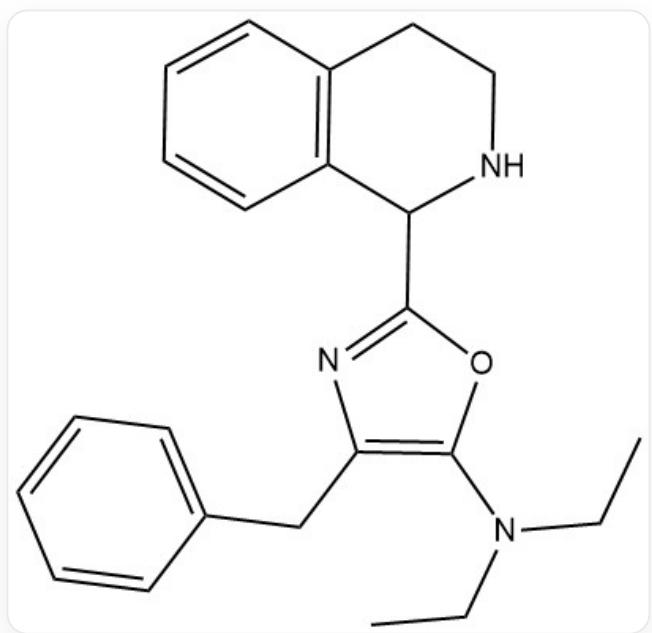
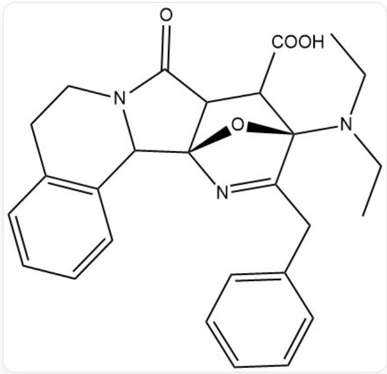

# Question

The following three-component reaction forms a new ring system:

This image is a one-step chemical reaction equation. On the left side of the arrow are three reactants, numbered A, B, and C, connected by + signs. Their SMILES structures are: A: C1=CC=C2CNCCC2=C1; B: O=C(N(CC)CC)C([N+]#[C-])CC1=CC=CC=C1; C: C1=CC(=O)OC1=O. Above the arrow is the text "IBX (2.0 eq)", and below the arrow is the text "THF, reflux". On the right side of the arrow is the SMILES structure of a product: CCN(C1=CC2=C(N=C1CC3=CC=CC=C3)C4C5=C(CCN4C2=O)C=CC=C5)CC

Where IBX is 2-iodoxybenzoic acid, which can selectively oxidize alcohols, amines, oximes, allylic groups, etc. In this reaction, one reactant is first oxidized by IBX to generate a positive ion  $\mathbf{X}$ , which then reacts with another molecule to obtain  $\mathbf{Y}$  containing three aromatic rings, and finally reacts with the third molecule to obtain the product through a series of processes.

Regarding this reaction, the following statements are correct:

①. Substance A undergoes a nucleophilic reaction with the positive ion X.  
②.  $\mathbf{Y}$  contains an aromatic ring with two heteroatoms in the ring.  
(3). The last molecule involved in the reaction is C.  
④. The amide bond in B disappears due to nucleophilic addition.  
⑤. The IBX in the reaction is in excess.  
(6) The pyridine ring of the product has only 2 carbon atoms from C.

A. ①③⑤  
B. ②④⑤  
C. ②③⑥  
D. ③④⑥  
E. ①②④⑤  
F. ①③④⑥  
G. ①③⑤⑥  
H. ②③⑤⑥  
1. All other options are incorrect

# Answer

Correct Answer: H

# Detailed Explanation

For the object of IBX oxidation, maleic anhydride C is difficult to oxidize. Both A and B have benzylic positions that can be oxidized, but the amino group in A makes the benzylic position easier to oxidize, and it will also produce an iminium ion as an oxidation product. B, on the other hand, is difficult to obtain a positive ion after being oxidized. At the same time, according to the product structure analysis, the benzylic position of B should not have participated in the reaction. Therefore, the first step of the reaction should be the oxidation of A to an iminium ion by IBX, ① is incorrect.

# CHECKPOINT

1 PTS

$\mathbf{X}$  is derived from the oxidation of  $\mathbf{A}$ , ① is incorrect.

The resulting structure of  $\mathbf{X}$  is:

  
C12=CC=CC=C1C=[NH+]CC2

$\mathbf{X}$  is a good nucleophilic substrate. There is no good nucleophilic site in  $\mathbf{C}$ , but in the isonitrile structure of  $\mathbf{B}$ , the carbon atom has a negative formal charge, which can perform nucleophilic attack on the imine in  $\mathbf{X}$ .

Subsequently, this carbon atom becomes a good electrophilic site again due to the positive formal charge of the adjacent nitrogen atom, which can be attacked by the oxygen atom in the amide bond to form a favorable five-membered ring structure, and then isomerizes to form an aromatic ring, obtaining  $\mathbf{Y}$ . Because the amide bond here participates in the reaction as a nucleophilic group rather than a site, ④ is incorrect.

# CHECKPOINT

1 PTS

The amide bond participates in the reaction as a nucleophilic group rather than a site, ④ is incorrect

The structure of  $\mathbf{Y}$  is:

  
CCN(C1=C(N=C(O1)C2NCCC3=C2C=CC=C3)CC4=CC=CC=C4)CC

There is an oxazole ring in it, ② is correct.

# CHECKPOINT

2 PTS

The structure of  $\mathbf{Y}$  is CCN(C1=C(N=C(O1)C2NCCC3=C2C=CC=C3)CC4=CC=CC=C4)CC, ② is correct

At this time, both  $\mathbf{A}$  and  $\mathbf{B}$  have participated in the reaction, and maleic anhydride  $\mathbf{C}$  participates in the reaction last, ③ is correct.

# CHECKPOINT

1 PTS

C participates in the reaction last, ③ is correct

The aromaticity of the oxazole ring is not very strong and it is very electron-rich. At the same time,  $\mathbf{C}$  is an electron-deficient diene, and a Diels-Alder reaction can occur between the two.

# CHECKPOINT

1 PTS

Diels-Alder reaction occurs between  $\mathbf{Y}$  and  $\mathbf{C}$

At this time, there is a strongly electrophilic anhydride and a strongly nucleophilic secondary amine in the molecule, and nucleophilic substitution can occur between the two to obtain an amide structure, generating:

CCN(C1=C(N=C(O1)C2NCCC3=C2C=CC=C3)CC4=CC=CC=C4)CC

Then, the product is obtained through decarboxylation, ring-opening, and dehydration aromatization.

# CHECKPOINT

1 PTS

The obtained molecule further undergoes amidation, decarboxylation, and dehydration processes to obtain the product.

The pentavalent iodine in IBX will be reduced to trivalent iodine. The molar ratio of the oxidation of A and the consumption of IBX in the reaction is 1:1. In addition, IBX does not oxidize other molecules, so IBX is excessive,  $⑤$  is correct.

# CHECKPOINT

1 PTS

IBX participates in the reaction in one equivalent, 2eq IBX is excessive,  $⑤$  is correct.

The pyridine ring is derived from the Diels-Alder reaction. The nitrogen atom and 3 carbon atoms in it come from the oxazole ring in  $\mathbf{Y}$ , and the other two carbon atoms come from  $\mathbf{C}$ ,  $⑥$  is correct.

# CHECKPOINT

1 PTS

The two carbon atoms in the pyridine ring come from C, ⑥ is correct.

In summary,  $2356$  are correct, so option H should be selected.