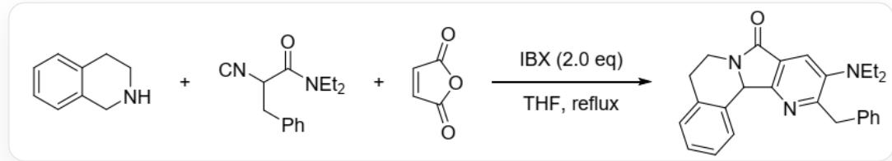
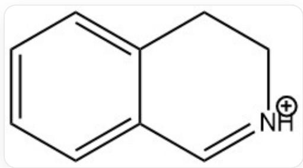
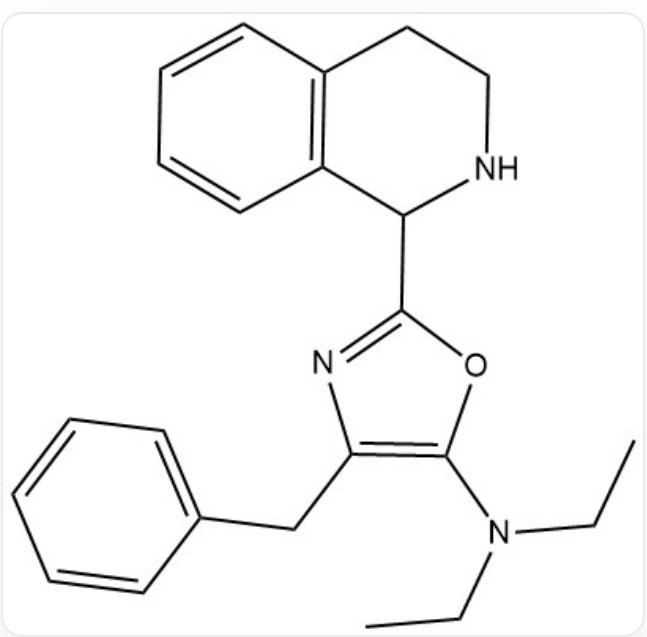
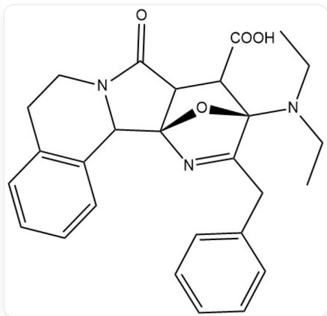

# 题目

以下三组分反应中形成了新的环系：

本图是一个单步化学反应方程式，箭头左侧是编号为A，B，C的三个反应物，之间用+号连接。它们的

SMILES结构式分别为：A：C1=CC=C2CNCCC2=C1；B：O=C(N(CC)CC)C([N+]#

[C-])CC1=CC=CC=C1; C: C1=CC(=O)OC1=O。箭头上方是文字“IBX (2.0 eq)”, 下方是文字“THF,

reflux”。箭头右侧是SMILES结构式为

CCN(C1=CC2=C(N=C1CC3=CC=CC=C3)C4C5=C(CCN4C2=O)C=CC=C5)CC的一种产物

其中IBX是2-碘酰苯甲酸，可以对醇、胺、肟、烯丙基等进行选择性氧化。在本反应中，某一反应物首先被IBX氧化生成正离子X，随后再与另一个分子反应得到含有三个芳香环的Y，最后与第三个分子反应，经一系列过程得到产物。

针对这一反应，下列说法正确的有：

(1). 物质  $\mathrm{A}$  对正离子  $\mathrm{X}$  进行了亲核反应  
②. Y 中有一个环内有两个杂原子的芳环。  
(3). 最后参与反应的分子是 C。  
(4).B中的酰胺键因被亲核加成而消失。  
(5). 反应中的IBX是过量的。  
(6)产物的吡啶环上有且仅有2个碳原子来自C。

A.

$①③⑤$

B. ②④⑤  
C. ②③⑥  
D. ③④⑥  
E. ①②④⑤  
F. ①③④⑥  
G. ①③⑤⑥  
H. ②③⑤⑥

I. 其它选项均不正确

# 答案

正确答案: H

# 详细解析

对于IBX氧化的对象，马来酸酐C很难被氧化，A与B中都存在可被氧化的苄位，但A的氨基使得苄位更容易被氧化，也会产生亚胺正离子这一氧化产物。而B被氧化后很难得到正离子，同时根据产物结构分析，B的苄位应该并没有参与反应，因此反应的第一步应该是A被IBX氧化为亚胺正离子，①错误。

CHECKPOINT

1 PTS

X由A氧化而来，  $①$  错误

得到的X结构为：

  
C12=CC=CC=C1C=[NH+]CC2

X是很好的亲核底物，C中并没有很好的亲核位点，而B中的异腈结构中，碳原子上有负的形式电荷，可以对X中的亚胺进行亲核。随后这个碳原子由于旁边氮原子的正形式电荷又变为了一个很好的亲电位点，可以被酰胺键中的氧原子亲核形成有利的五元环结构，再异构化后形成芳环，得到Y。因为酰胺键在这里作为亲核基团而非位点参与反应，因此④错误。

# CHECKPOINT

1 PTS

酰胺键作为亲核基团而非位点参与反应，④错误

# $\mathbf{Y}$  的结构为：

  
CCN(C1=C(N=C(O1)C2NCCC3=C2C=CC=C3)CC4=CC=CC=C4)CC

其中存在一个噁唑环，②正确。

# CHECKPOINT

2 PTS

Y的结构为CCN(C1=C(N=C(O1)C2NCCC3=C2C=CC=C3)CC4=CC=CC=C4)CC，②正确

此时A与B均已参与反应，马来酸酐C最后参与反应，③正确。

# CHECKPOINT

1 PTS

C最后参与反应, ③正确

噁唑环的芳香性不太强又很富电子，同时C是一个缺电子双烯体，两者之间可以发生Diels-Alder反应。

# CHECKPOINT

1 PTS

$\mathbf{Y}$  与  $\mathbf{C}$  之间发生Diels-Alder反应

此时分子内有一个强亲电性的酸酐，还有强亲核性的二级胺，两者可发生亲核取代得到酰胺结构，生成：

CCN(C1=C(N=C(O1)C2NCCC3=C2C=CC=C3)CC4=CC=CC=C4)CC

随后经脱羧、开环与脱水芳构化得到产物。

# CHECKPOINT

1 PTS

D-A产物发生分子内酰胺化，脱羧，脱水过程得到产物。

IBX中的五价碘会被还原为三价碘，反应中A的氧化与IBX消耗的摩尔比为1:1，除此之外IBX不氧化其它分子，因此IBX是过量的，⑤正确。

# CHECKPOINT

1 PTS

IBX以一当量参与反应，2eq IBX是过量的，⑤正确。

吡啶环由Diels-Alder反应得来，其中的氮原子与3个碳原子来源于Y中的噁唑环，另外两个碳原子来源于C，⑥正确。

# CHECKPOINT

1 PTS

吡啶环中的两个碳原子来源于C，⑥正确。

综上，②③⑤⑥正确，应选择H选项。