# Question

The following is a total synthesis route:

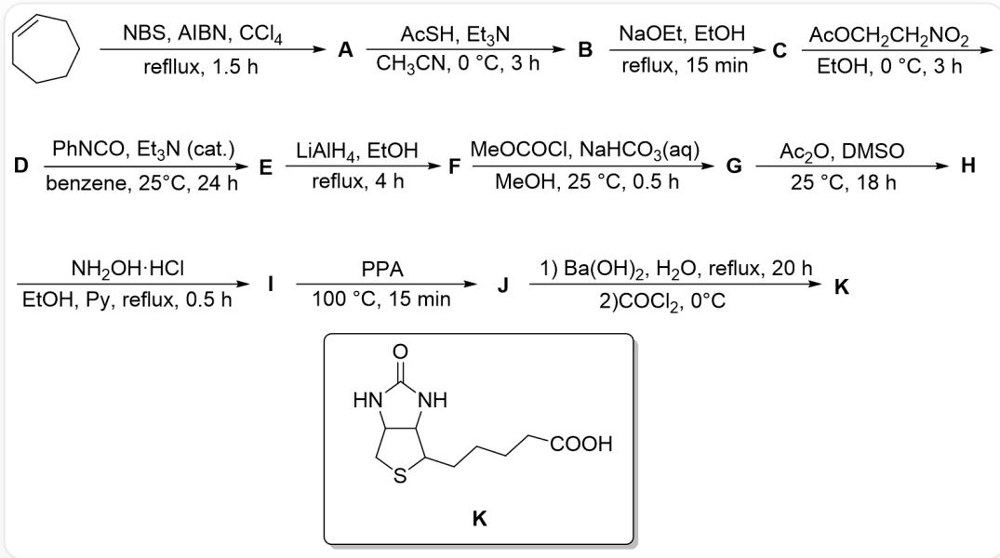

Compound K (SMILES O=C(N1)NC2C1CSC2CCCCC(O)=O) was synthesized through a multi-step reaction: C1=CCCCC1>>[A], [A]>>[B], [B] >>[C], [C]>>[D], [D]>>[E], [E]>>[F], [F]>>[G], [G]>>[H], [H]>>[I], [I]>>[J], [J]>>[K]. The reaction conditions are: (1) NBS, AIBN,  $\mathrm{CCl}_4$ , reflux for 3 hours (2) AcSH,  $\mathrm{Et}_3\mathrm{N}$ ,  $\mathrm{CH}_3\mathrm{CN}$ , react at 0 degrees Celsius for 4 hours (3) EtONa, EtOH, reflux for 15 minutes (4)  $\mathrm{AcOCH}_2\mathrm{CH}_2\mathrm{NO}_2$ , EtOH, react at 0 degrees Celsius for 3 hours (5) PhNCO,  $\mathrm{Et}_3\mathrm{N}$  (catalytic amount), PhH, react at 25 degrees Celsius for 24 hours (6) LiAlH₄, EtOH, reflux for 4 hours (7) MeOCOCl, NaHCO₃(aq), MeOH, react at 25 degrees Celsius for half an hour (8)  $\mathrm{Ac}_2\mathrm{O}$ , DMSO, react at 25 degrees Celsius for 18 hours (9) NH₂OH·HCl, EtOH, Py, reflux for half an hour (10) PPA, react at 100 degrees Celsius for 15 minutes (11) Divided into two steps, first  $\mathrm{Ba(OH)}_2$ ,  $\mathrm{H}_2\mathrm{O}$ , reflux for 20 hours, and then add  $\mathrm{COCl}_2$  and react at 0 degrees Celsius

Given that the molecular formula of  $\mathbf{D}$  is  $\mathrm{C_9H_{15}NO_2S}$ , and  $\mathbf{C}$  is a sodium salt. Which of the following statements is correct:

1. The conversion of  $\mathbf{D}$  to  $\mathbf{E}$  involves an intermediate containing a carbon-nitrogen triple bond.  
2.  $\mathbf{E}$  contains 2 rings.  
3. The molecular formula of  $\mathbf{H}$  is  $\mathrm{C_{11}H_{17}NO_3S}$ .

4. J contains a seven-membered ring.

5. The transformation from  $\mathbf{I}$  to  $\mathbf{J}$  may produce a compound with high ring strain, with a molecular formula of  $\mathrm{C_{11}H_{16}N_2O_2S}$ .

A. All other options are incorrect  
B. 2,4  
C. 1,3,5  
D. 1,2  
E. 2,4,5  
F. 1,4,5  
G. 1,2,4,5  
H.  $1, 2, 3, 4$  
1. 2,3,4  
J. 3,4,5  
K. 4  
L. 3,5

M. 1,2,3,4,5  
N. 2,5

# Answer

Correct Answer: C

# Detailed Explanation

(1) The reaction is allylic radical halogenation, A is BrC1C=CCCCC1

# CHECKPOINT

1 PTS

A is BrC1C=CCCCC1

(2) The reaction is the substitution of  $\mathrm{Br}^{-}$  by  $\mathrm{AcS}^{-}$ ,  $\mathbf{B}$  is CC(SC1C=CCCCC1)=O

# CHECKPOINT

1 PTS

B is CC(SC1C=CCCCC1)=0

(3) The reaction is the removal of the acetyl group by  $\mathrm{EtO}^{-}$ ,  $\mathbf{C}$  is [Na]SC1C=CCCCC1

# CHECKPOINT

1 PTS

C is [Na]SC1C=CCCCC1

(4) Acetylation can occur here, but it is meaningless since the acetyl group was just removed in the previous step, so it can only be the substitution of  $\mathrm{AcO}^{-}$ ,  $\mathbf{D}$  is  $\mathrm{O = [N + ](CCSC1C = CCCCC1)[O - ]}$

# CHECKPOINT

1 PTS

D is  $\mathrm{O} = [\mathrm{N} + ](\mathrm{CCSC1C} = \mathrm{CCCCC1})[\mathrm{O} - ]$

(5) This condition is very classic, it can convert nitro compounds to nitrile oxide  $[O-][N+]\# \text{CCSC1C} = \text{CCCCC1}$ , which is relatively reactive, and subsequent intramolecular  $[3+2]$  reaction easily occurs to give  $\mathbf{E}$ : C12C3CCCCC1ON=C2CS3

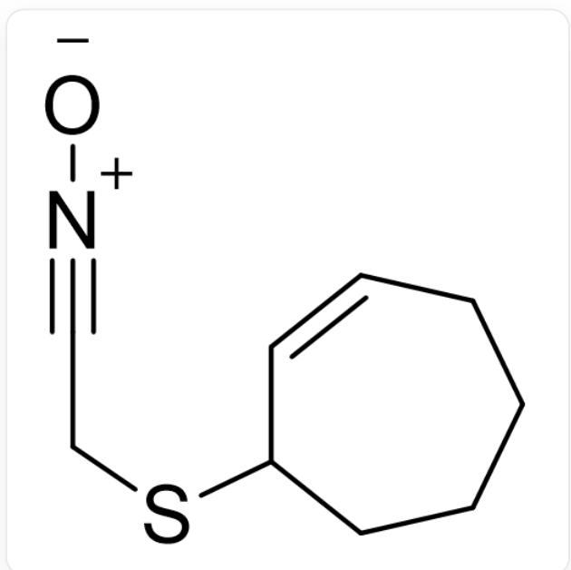  
SMILES is [O-][N+]#CCSC1C=CCCCC1

# CHECKPOINT

1 PTS

E is C12C3CCCCC1ON=C2CS3

Therefore, the intermediate contains a carbon-nitrogen triple bond, and  $\mathbf{E}$  contains three rings, statement 1 is correct, statement 2 is wrong  
(6)  $\mathrm{LiAlH_4}$  reductively cleaves the N-O bond, and then reduces the carbon-nitrogen double bond to give  $\mathbf{F}$ : NC(CS1)C2C1CCCCC2O

# CHECKPOINT

# 1 PTS

F is NC(CS1)C2C1CCCCC2O

(7) MeOCOCl reacts with the most nucleophilic amino group in F to give G: OC1CCCCC2C1C(NC(OC)=O)CS2

# CHECKPOINT

# 1 PTS

G is OC1CCCCC2C1C(NC(OC)=O)CS2

(8) If the hydroxyl group in  $\mathbf{F}$  is acetylated, it is meaningless to add hydroxylamine later; therefore, DMSO has oxidizing properties, here it is similar to Swern oxidation, but the dehydrating agent is replaced by  $\mathrm{Ac}_2\mathrm{O}$ . H: O=C1CCCCC2C1C(NC(OC)=O)CS2

# CHECKPOINT

# 1 PTS

H is  $O = C1CCCCC2C1C(NC(OC) = O)CS2$

The molecular formula of  $\mathbf{H}$  is  $\mathrm{C_{11}H_{17}NO_3S}$ , statement 3 is correct

(9) Hydroxylamine condenses with the carbonyl group to give I: O/N=C1CCCCC2C\1C(NC(OC)=O)CS2

# CHECKPOINT

1 PTS

I is O/N=C1CCCCC2C\1C(NC(OC)=O)CS2

(10) Beckmann rearrangement occurs to give  $\mathbf{J}: \mathrm{O} = \mathrm{C}(\mathrm{N}1)\mathrm{CCCCC2C1C}(\mathrm{NC}(\mathrm{OC}) = \mathrm{O})\mathrm{CS}2$

# CHECKPOINT

1 PTS

J is  $O = C(N1)CCCCC2C1C(NC(OC) = O)CS2$

J contains a five-membered ring and an eight-membered ring, statement 4 is wrong

Beckmann rearrangement may also not involve alkyl migration, but rather cleavage of the C-C bond to form a carbocation (which can be stabilized by the neighboring sulfur atom), followed by closing the three-membered ring and dehydration to form O=C(N1C2C1CSC2CCCCC#N)OC, the molecular formula is  $\mathrm{C_{11}H_{16}N_2O_2S}$ , statement 5 is correct

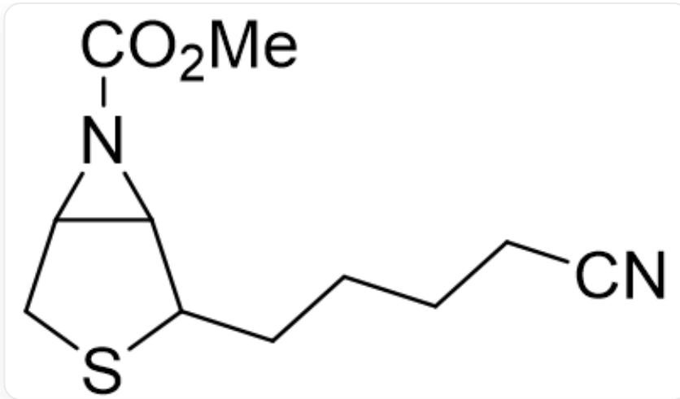  
SMILES is O=C(N1C2C1CSC2CCCCCC#N)OC

# CHECKPOINT

1 PTS

Beckmann rearrangement can form O=C(N1C2C1CSC2CCCCC#N)OC byproduct

(11) Hydrolyze the amide, then react the two amino groups with  $\mathrm{COCl}_2$  to close the five-membered ring

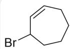  
A

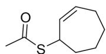  
B

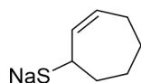  
C

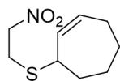  
D

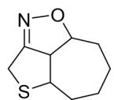  
E

  
F

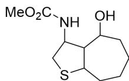  
G

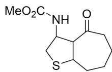  
H

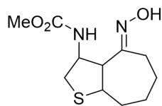  
1

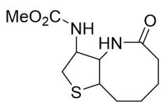  
J

The figures are  $\mathbf{A}\sim \mathbf{J}$  respectively, see the above process for SMILES