# 题目

以下为一条全合成路线：

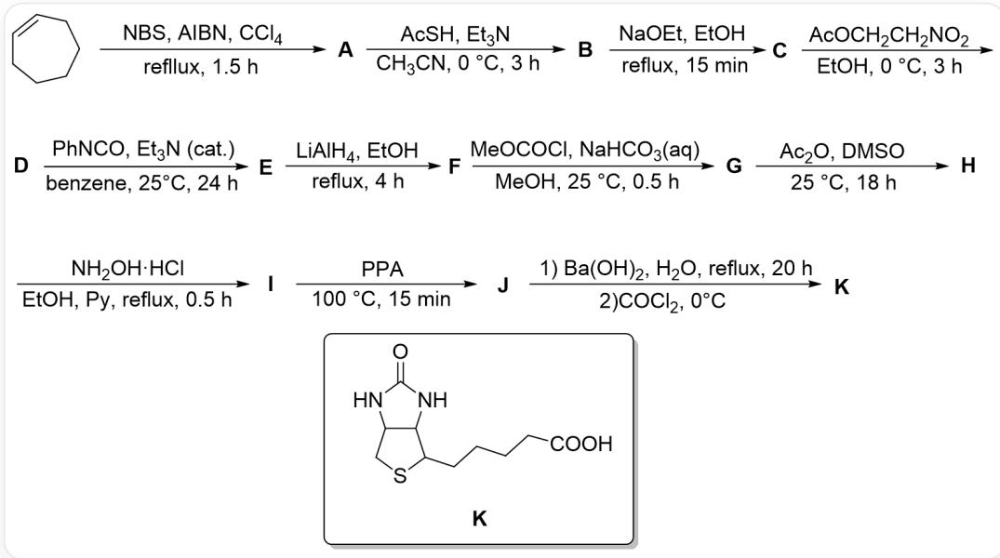

通过多步反应合成了化合物K（SMILES为O=C(N1)NC2C1CSC2CCCCC(O)=O）：C1=CCCCCC1>>[A], [A]>>[B], [B] >>[C], [C] >>[D], [D] >>[E], [E] >>[F], [F] >>[G], [G] >>[H], [H] >>[I], [I] >>[J], [J] >>[K]。反应条件为：(1)NBS, AIBN, CCl₄, 回流3小时 (2)AcSH, Et₃N, CH₃CN, 0摄氏度反应4小时 (3)EtONa, EtOH, 回流15分钟 (4)AcOCH₂CH₂NO₂, EtOH, 0摄氏度反应3小时 (5)PhNCO, Et₃N(催化量), PhH, 25摄氏度反应24小时 (6)LiAlH₄, EtOH, 回流4小时 (7)MeOCOCl, NaHCO₃(aq), MeOH, 25摄氏度反应半小时 (8)Ac₂O, DMSO, 25摄氏度反应18小时 (9)NH₂OH·HCl, EtOH, Py, 回流半小时 (10)PPA, 100摄氏度反应15分钟 (11)分为两步，先是Ba(OH)₂, H₂O, 回流20小时，再是加入COCl₂在0摄氏度下反应

已知  $\mathbf{D}$  的分子式为  $\mathrm{C}_{9} \mathrm{H}_{15} \mathrm{NO}_{2} \mathrm{~S}$ ,  $\mathbf{C}$  为钠盐。下面说法正确的是:

1. D转化为E经历一个含有碳氮三键的中间体  
2. E中含有2个环  
3.  $\mathbf{H}$  的分子式为  $\mathrm{C_{11}H_{17}NO_3S}$  
4. J含七元环  
5. I 到 J 时可能产生一个环张力较大的化合物, 分子式为  $\mathrm{C}_{11} \mathrm{H}_{16} \mathrm{~N}_{2} \mathrm{O}_{2} \mathrm{~S}$

A. 其他选项均不正确  
B. 2,4  
C. 1,3,5  
D. 1, 2  
E. 2,4,5  
F. 1,4,5  
G. 1,2,4,5  
H. 1,2,3,4  
I. 2,3,4  
J. 3,4,5  
K. 4  
L. 3,5  
M. 1,2,3,4,5  
N. 2,5

# 答案

正确答案: C

# 详细解析

(1)该反应为烯丙位的自由基卤化，A 为BrC1C=CCCCC1

# CHECKPOINT

1 PTS

A为BrC1C=CCCCC1

(2)该反应为  $\mathrm{AcS}^{-}$  对于  $\mathrm{Br}^{-}$  的取代，B 为CC(SC1C=CCCCC1)=O

# CHECKPOINT

1 PTS

B 为 CC(SC1C=CCCCC1)=O

(3)该反应为  $\mathrm{EtO}^{-}$  反应脱去乙酰基，C 为[Na]SC1C=CCCCC1

# CHECKPOINT

1 PTS

C为[Na]SC1C=CCCCC1

(4)这里可以乙酰化，但上一步刚脱掉乙酰基，没有意义，只能是取代  $\mathrm{AcO}^{-}$ ， $\mathbf{D}$  为  $\mathrm{O} = [\mathrm{N} + ]$  (CCSC1C=CCCCC1)[O-]

# CHECKPOINT

1 PTS

D 为  $O = [N + ]$  (CCSC1C=CCCCC1)[O-]

(5)这个条件十分经典，可以将硝基化合物转化为氧化腈  $[O-][N+]\# CCSC1C = CCCCC1$  ，它比较活泼，后续容易发生分子内  $[3+2]$  反应得到  $\mathbf{E}$  ：C12C3CCCCC1ON=C2CS3

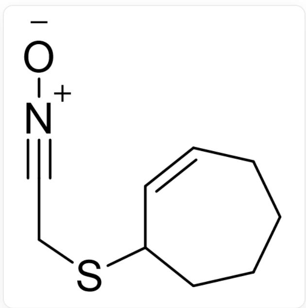  
SMILES为[O-][N+]#CCSC1C=CCCCC1

# CHECKPOINT

1 PTS

E为C12C3CCCCC1ON=C2CS3

因此中间体含碳氮三键，E含三个环，说法1正确，说法2错误  
(6)  $\mathrm{LiAlH_4}$  将N-O键还原裂解，接着还原碳氮双键得到F：NC(CS1)C2C1CCCCC2O

# CHECKPOINT

1 PTS

$\mathbf{F}$  为NC(CS1)C2C1CCCCC2O

(7)MeOCOC1与F中亲核性最强的氨基反应得到G：OC1CCCCC2C1C(NC(OC)=O)CS2

# CHECKPOINT

1 PTS

G为OC1CCCCC2C1C(NC(OC)=O)CS2

(8)若  $\mathbf{F}$  中羟基发生乙酰化，后续加入羟胺没有意义；因此而DMSO有氧化性，这里类似Swern氧化，将脱水剂换成了  $\mathrm{Ac}_2\mathrm{O}$  。H：O=C1CCCCC2C1C(NC(OC)=O)CS2

# CHECKPOINT

1 PTS

H为O=C1CCCCC2C1C(NC(OC)=O)CS2

$\mathbf{H}$  的分子式为  $\mathrm{C}_{11} \mathrm{H}_{17} \mathrm{NO}_3 \mathrm{~S}$ , 说法3正确  
(9)羟胺与羰基缩合得到I：O/N=C1CCCCC2C\1C(NC(OC)=O)CS2

# CHECKPOINT

1 PTS

I为O/N=C1CCCCC2C\1C(NC(OC)=O)CS2

(10)发生Beckmann重排得到J：O=C(N1)CCCCC2C1C(NC(OC)=O)CS2

# CHECKPOINT

1 PTS

J为O=C(N1)CCCCC2C1C(NC(OC)=O)CS2

J 含五元环和八元环，说法4错误

Beckmann重排也可能不发生烷基迁移，而是断裂C-C键形成碳正离子（这里可以被硫原子邻基参与稳定），随后关三元环脱水，形成O=C(N1C2C1CSC2CCCCC#N)OC，分子式为  $\mathrm{C_{11}H_{16}N_2O_2S}$ ，说法5正确

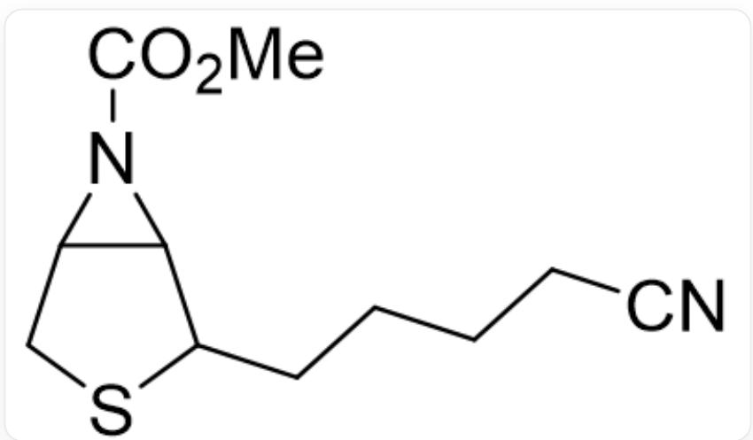  
SMILES为O=C(N1C2C1CSC2CCCCC#N)OC

# CHECKPOINT

1 PTS

Beckmann重排可以形成O=C(N1C2C1CSC2CCCCC#N)OC副产物

(11)将酰胺水解, 随后两个氨基与  $\mathrm{COCl}_{2}$  反应关五元环

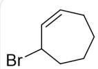  
A

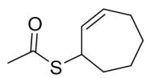  
B

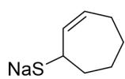  
C

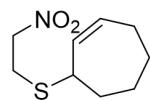  
D

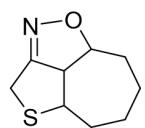  
E

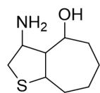  
F

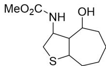  
G

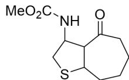  
H

  
1

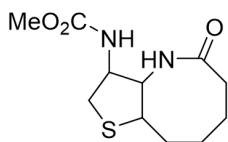  
J

图中分别为A~J，SMILES见上面的过程