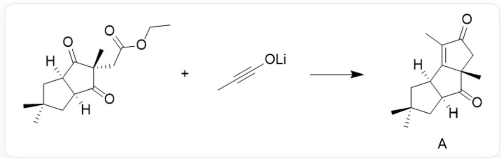
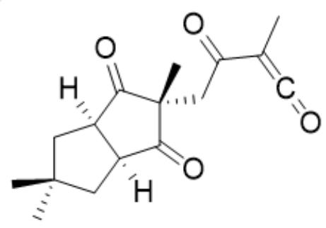
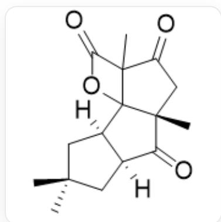

# Question

Organolithium alkynolates are one of the commonly used organolithium reagents. As shown in the reaction below, pre-prepared lithium propargyl alcoholate can be used to synthesize the natural product A with another substrate. Two key electroneutral intermediates B and C are formed during the formation of A.

  
CC1(C)C[C@]2([H])[C@](C([C@@](C)(CC(OCC)=O)C2=O)=O)([H])C1和CC#CO[Li]反应可合成  
CC1=C2[C@@](CC1=O)(C)C([C@@]3([H])CC(C)(C)C[C@]32[H])=O

The following statements are available:

1.  $\mathbf{A}$  and  $\mathbf{B}$  have the same number of rings.  
2. A and C have the same number of rings.  
3. B and C have the same number of oxygen atoms.  
4. B contains an alkynyl group.  
5. C contains 4 double bonds.  
6. Gas is released during the formation of  $\mathbf{A}$ .

Which of the above statements are correct:

A. 1,4  
B. 2,3

C. 2,4  
D. 3,5  
E. 3,6  
F. 5,6  
G. 6

# Answer

Correct Answer: E

# Detailed Explanation

The reaction mainly proceeds through three steps to obtain A:

1. In lithium alkynol, the alkyne terminal carbon connected to oxygen carries a positive charge, and the other end carries a negative charge. During the reaction, the electrons of the oxygen anion are transferred to form a lithium enolate of ketene, which promotes the negatively charged terminal carbon to attack the ester carbonyl carbonyl in another reactant. Ethoxy leaves, and a nucleophilic substitution reaction occurs to generate intermediate product B. The chemical formula of B is:

CC1(C)C[C@]2([H])[C@](C([C@@](C)(CC(C(C)=C=O)=O)C2=O)=O)([H])C1

# CHECKPOINT

1 PTS

A nucleophilic substitution reaction occurs, and the negatively charged terminal carbon in the ketene anion attacks the ester carbonyl carbonyl of another reactant.

# CHECKPOINT

2 PTS

The chemical formula of B is CC1(C)C[C@]2([H])[C@](C([C@@](C)(CC(C(C)=C=O)=O)C2=O)=O) ([H])C1

2. There are two carbonyl groups on the ring in  $\mathbf{B}$ . Among them, the carbonyl group located at the top of the figure undergoes a  $[2 + 2]$  cycloaddition reaction with the carbon-carbon double bond in the ketene to form compound  $\mathbf{C}$  with a four-membered ring and a five-membered ring. The chemical formula of  $\mathbf{C}$  is:

$\mathrm{O = C1[C@@]2([H])CC(C)(C)C[C@@]2([H])C3(O4)[C@]1(C)CC(C3(C)C4 = O) = O}$

# CHECKPOINT

1 PTS

A  $[2 + 2]$  cycloaddition reaction occurs, and the carbonyl group in B reacts with the carbon-carbon double bond in the ketene to form product C.

# CHECKPOINT

2 PTS

The

chemical

formula

of

C is

$\mathrm{O = C1[C@]2([H])CC(C)(C)C[C@]2([H])C3(O4)}$

$\mathrm{[C@]1(C)CC(C3(C)C4 = O) = O}$

3. The ester group in C undergoes an elimination reaction, producing  $\mathrm{CO}_{2}$  gas and obtaining product A with a carbon-carbon double bond.

# CHECKPOINT

1 PTS

An elimination reaction occurs, producing  $\mathrm{CO}_{2}$  gas and a carbon-carbon double bond

Therefore, the existing statements 3 and 6 are correct. Select option E.