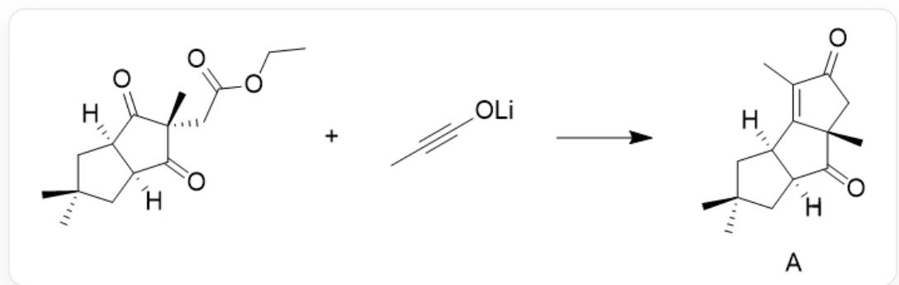
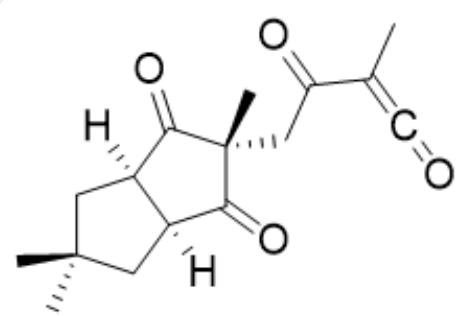
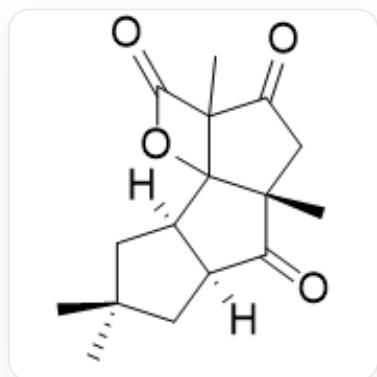

# 题目

有机炔醇锂是常用的有机锂试剂之一，如下图反应中，用预先制备的丙炔醇锂与另一底物可合成天然产物 A。形成 A 过程中有两个关键电中性中间体 B 和 C。

  
CC1(C)C[C@]2([H])[C@](C([C@@](C)(CC(OCC)=O)C2=O)=O)([H])C1和CC#CO[Li]反应可合成  
CC1=C2[C@@](CC1=O)(C)C([C@@]3([H])CC(C)(C)C[C@]32[H])=O

现有以下说法：

1. A 与 B 的环数相同。  
2. A 与 C 的环数相同。  
3. B 与 C 中氧元素的个数相同。  
4. B 中含有炔基。  
5. C 中含有 4 个双键。  
6. 形成 A 过程中有气体放出。

以上说法正确的是:

A. 1,4  
B. 2,3

C. 2,4  
D. 3,5  
E. 3,6  
F. 5,6  
G. 6

# 答案

正确答案: E

# 详细解析

该反应过程中主要经过三步反应得到 A :

1. 炔醇锂中连接氧的炔基端基碳带正电，另一端带负电。反应时，氧负离子的电子打下来，形成烯酮的锂烯醇负离子，促使该带负电端基碳进攻另一反应物中的酯基羰基羰，乙氧基离去，发生亲核取代反应生成中间产物B。B的化学式为：

CC1(C)C[C@]2([H])[C@](C([C@@](C)(CC(C(C)=C=O)=O)C2=O)=O)([H])C1

# CHECKPOINT

1 PTS

发生亲核取代反应，烯酮负离子中带负电的端基碳进攻另一反应物的酯基羰基羰。

# CHECKPOINT

2 PTS

B 的化学式为CC1(C)C[C@]2([H])[C@](C([C@@](C)(CC(C(C)=C=O)=O)C2=O)=O)([H])C1

2. B 中环上有两个羰基。其中，处于图中上方羰基与烯酮中碳碳双键发生  $[2 + 2]$  环加成反应，形成带有四元环和五元环的化合物 C。C 的化学式为：

  
$\mathrm{O = C1[C@@]2([H])CC(C)(C)C[C@@]2([H])C3(O4)[C@]1(C)CC(C3(C)C4 = O) = O}$

# CHECKPOINT

1 PTS

发生  $[2 + 2]$  环加成反应，B 中羰基与烯酮中碳碳双键反应，形成产物 C。

# CHECKPOINT

2 PTS

C 的化学式为  $\mathrm{O} = \mathrm{C}1[\mathrm{C}@\mathrm{a}]2([\mathrm{H}])\mathrm{CC}(\mathrm{C})(\mathrm{C})\mathrm{C}[\mathrm{C}@\mathrm{a}]2([\mathrm{H}])\mathrm{C}3(\mathrm{O}4)[\mathrm{C}@\mathrm{a}]1(\mathrm{C})\mathrm{CC}(\mathrm{C}3(\mathrm{C})\mathrm{C}4 = \mathrm{O}) = 0$

3. C 中酯基发生消去反应, 有  $\mathrm{CO}_{2}$  气体生成, 并得到带碳碳双键的产物 A 。

# CHECKPOINT

1 PTS

发生消去反应，生成  $\mathrm{CO}_{2}$  气体和碳碳双键

因此，现有说法正确的是3,6。选择E选项。