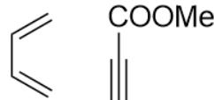
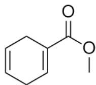
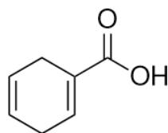
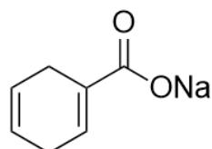
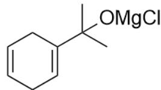
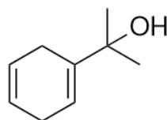
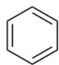

# Question

A and B undergo  $[4 + 2]$  cycloaddition reaction to obtain compound C  $(\mathrm{C_8H_{10}O_2})$ . C is hydrolyzed in acidic environment to D and methanol, and hydrolyzed in alkaline environment to E and methanol. E can spontaneously convert to D under acidic conditions. C reacts with excess methylmagnesium chloride in tetrahydrofuran to obtain F. F is treated with aqueous ammonium chloride solution to obtain the main product G  $(\mathrm{C_9H_{14}O})$  and a small amount of H. G can be converted relatively completely to H by treatment with concentrated acid, with the release of gas.

The following options are correct:

A. All other options are incorrect  
B. A, B, D can all be deprotonated by a strong base (such as potassium tert-butoxide)  
C. H does not possess strong toxicity.  
D. Generation of  $\mathbf{H}$  from  $\mathbf{G}$  is accompanied by the formation of one molecule of a small molecule with a relative molecular mass of 44.  
E.  $\mathbf{F}$  possesses a chiral carbon atom.  
F. G's product in a strong alkaline solution (such as an ethanol solution of potassium hydroxide) has a tetrasubstituted double bond.  
G. More than 3 correct items are in the options.  
H. Exactly two of the other options are correct.

# Answer

Correct Answer: A

# Detailed Explanation

A and B undergo  $[4 + 2]$  cycloaddition reaction to obtain compound C  $\left(\mathrm{C}_{8} \mathrm{H}_{10} \mathrm{O}_{2}\right)$ , with an unsaturation degree of 4, and at least one six-membered ring, indicating that C has three unsaturated bonds;

# CHECKPOINT

1 PTS

C has three unsaturated bonds and a six-membered ring

C is hydrolyzed in an acidic environment to D and methanol, and hydrolyzed in a basic environment to E and methanol. E can spontaneously convert to D in an acidic environment, which can be inferred that C contains a methyl ester substituent on the six-membered ring; then D is the corresponding carboxylic acid, and E is the sodium salt of the carboxylic acid.

# CHECKPOINT

1 PTS

C contains a methyl ester substituent on the six-membered ring

# CHECKPOINT

0.5 PTS

D is the corresponding carboxylic acid

# CHECKPOINT

0.5 PTS

$\mathbf{E}$  is the sodium salt of the carboxylic acid

C reacts with excess methyl magnesium chloride in tetrahydrofuran to obtain  $\mathbf{F}$ ; it can be inferred that it is the reaction of the methyl ester group with the Grignard reagent, then the product  $\mathbf{F}$  is the magnesium salt of a tertiary alcohol;

# CHECKPOINT

1 PTS

$\mathbf{F}$  is the magnesium salt of a tertiary alcohol

$\mathbf{F}$  is treated with an aqueous solution of ammonium chloride to obtain the main product  $\mathbf{G}$ , at which point the magnesium salt of the tertiary alcohol is hydrolyzed to obtain the tertiary alcohol. The molecular formula of  $\mathbf{G}$  is  $(\mathrm{C}_{9}\mathrm{H}_{14}\mathrm{O})$ , with an unsaturation degree of 3, thus containing a six-membered ring and two double bonds, and containing a tertiary alcohol structure transformed from a methyl ester substituent on a six-membered ring. Due to the characteristics of the cycloaddition reaction, the two double bonds generally constitute a 1,4-cyclohexadiene structure; thus, it is easy to draw the structure of  $\mathbf{G}$  as CC(O)(C)C1=CCC=CC1.

# CHECKPOINT

1 PTS

The two double bonds generally constitute a 1,4-cyclohexadiene structure due to the characteristics of the cycloaddition reaction

# CHECKPOINT

1 PTS

The structure of  $\mathbf{G}$  is CC(O)(C)C1=CCC=CC1

Deducing backwards, F is CC(C)(O[Mg]Cl)C1=CCC=CC1; E is O=C(O[Na])C1=CCC=CC1, D is O=C(O)C1=CCC=CC1,

# CHECKPOINT

0.5 PTS

F is CC(C)(O[Mg]Cl)C1=CCC=CC1

# CHECKPOINT

0.5 PTS

E is  $\mathrm{O = C(O[Na])C1 = CCC = CC1}$

# CHECKPOINT

0.5 PTS

D is  $\mathrm{O} = \mathrm{C}(\mathrm{O})\mathrm{C}1 = \mathrm{CCC} = \mathrm{CC}1$

C is  $\mathrm{O} = \mathrm{C}(\mathrm{OC})\mathrm{C}1 = \mathrm{CCC} = \mathrm{CC}1$ , which exactly matches its molecular formula.

A and B undergo  $[4 + 2]$  to generate C, it is easy to obtain A and B as  $C = CC = C$ ,  $C\# CC(OC) = O$ , respectively.

# CHECKPOINT

1 PTS

A is  $C = C C = C$

# CHECKPOINT

1 PTS

B is C#CC(OC) = O

A is butadiene, because the basicity required to break the carbon-hydrogen bond is much stronger than the basicity of potassium tert-butoxide, so it cannot be deprotonated by potassium tert-butoxide, so option B is incorrect.

# CHECKPOINT

1 PTS

A is butadiene and cannot be deprotonated

G is treated with a strong acid, and the tertiary alcohol becomes a carbocation; at this time, there is no eliminable hydrogen on the ring, so only one molecule of propene can be eliminated to obtain a cyclohexadiene cation, which immediately aromatizes to generate benzene C1=CC=CC=C1; therefore, H is benzene C1=CC=CC=C1.

# CHECKPOINT

1 PTS

H is benzene  $\mathrm{C1 = CC = CC = C1}$

Benzene is toxic, option C is incorrect; the small molecule released from  $\mathbf{G}$  to generate  $\mathbf{H}$  is propene, with a relative molecular mass of 42, option D is incorrect.

# CHECKPOINT

1 PTS

The small molecule released from  $\mathbf{G}$  to generate  $\mathbf{H}$  is propene

G is treated with a strong base, and the tertiary alcohol can only be eliminated to a terminal alkene, which is a disubstituted double bond, with the structure  $\mathrm{C = C(C)C1 = CCC = CC1}$ ; this structure does not have a tetrasubstituted double bond, so option F is incorrect.

# CHECKPOINT

1 PTS

The product of treating  $\mathbf{G}$  with a strong base is  $C = C(C)C1 = CCC = CC1$

In summary, options B-F are all incorrect, and option A is correct.

  
A+B

  
C

  
D

  
E

  
F

  
G

  
H

This figure gives the structural formulas of the unknown structures  $\mathbf{A} - \mathbf{H}$  in this question, and their SMILES

are all given in the analysis:  $\mathbf{A}$  and  $\mathbf{B}$  are  $C = C = C$  and  $C\# CC(OC) = 0$  respectively,  $\mathbf{C}$  is

$\mathrm{O = C(OC)C1 = CCC = CC1}$ $\mathbf{F}$  is CC(C)(O[Mg]Cl)C1=CCC=CC1;  $\mathbf{E}$  is  $O = C(O[Na])C1 = CCC = CC1$  ,D is

$\mathrm{O = C(O)C1 = CCC = CC1}$  ，  $\mathbf{G}$  isCC(O)(C)C1=CCC=CC1，His  $C1 = CC = CC = C1$