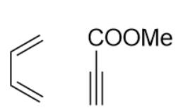
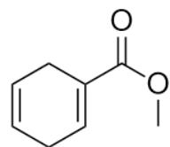
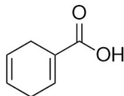
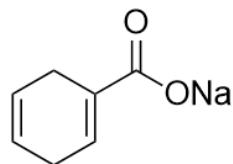
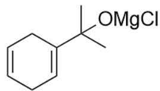
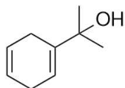
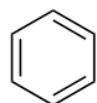

# 题目

A和B发生  $[4 + 2]$  环加成反应得到化合物C（  $\mathrm{C_8H_{10}O_2}$  )。C在酸性环境中水解为D和甲醇，碱性环境中水解成E和甲醇，E可在酸性环境下自发转化为D。C和足量甲基氯化镁在四氢呋喃中反应，得到F，F用氯化铵水溶液处理，获得主要产物G（  $\mathrm{C_9H_{14}O}$  ）和少量H。G用浓酸处理可以较完全地转化为H,同时有气体放出。

下列选项正确的是：

A. 其他选项均不正确  
B. A, B, D均可被强碱（如叔丁醇钾）夺取质子  
C. H不具有很强的毒性  
D. 由  $\mathbf{G}$  生成  $\mathbf{H}$  的同时伴随着一分子相对分子质量为44的小分子生成  
E. F 具有手性碳原子  
F. G 在强碱溶液中（如氢氧化钾的乙醇溶液）生成的产物具有四取代双键  
G. 选项中有3个以上的正确项  
H. 其他选项中恰有两个正确项

# 答案

正确答案: A

# 详细解析

A 和 B 发生  $[4 + 2]$  环加成反应得到化合物 C  $\left(\mathrm{C}_{8} \mathrm{H}_{10} \mathrm{O}_{2}\right)$ , 不饱和度为 4 , 且至少有一个六元环, 说明 C 存在三个不饱和键;

# CHECKPOINT

1 PTS

C存在三个不饱和键和六元环

C在酸性环境中水解为D和甲醇,碱性环境中水解成E和甲醇，E可在酸性环境下自发转化为D，可以推断C含有六元环上的甲酯基取代基；那么D为对应的羧酸，E为羧酸的钠盐。

# CHECKPOINT

1 PTS

C 含有六元环上的甲酯基取代基

# CHECKPOINT

0.5 PTS

D为对应的羧酸

# CHECKPOINT

0.5 PTS

E为羧酸的钠盐

C 和足量甲基氯化镁在四氢呋喃中反应, 得到  $\mathbf{F}$ ; 可推断是甲酯基与格氏试剂的反应, 那么产物  $\mathbf{F}$  为三级醇的镁盐;

# CHECKPOINT

1 PTS

F为三级醇的镁盐

F 用氯化铵水溶液处理, 获得主要产物 G, 此时三级醇的镁盐水解得到三级醇。G 分子式为  $\left(\mathrm{C}_{9} \mathrm{H}_{14} \mathrm{O}\right)$ ,不饱和度为 3 , 从而含有一个六元环和两个双键, 且含有一个六元环上的甲酯基取代基转化为的三级醇结构。两个双键由于环加成反应特点, 一般构成 1 , 4-环己二烯的结构; 从而很容易绘制得到 G 结构为 CC(O) (C) C1=CCC=CC1。

# CHECKPOINT

1 PTS

两个双键由于环加成反应特点，一般构成1，4-环己二烯的结构

# CHECKPOINT

1 PTS

G结构为CC(O)(C)C1=CCC=CC1

倒推得到  $\mathbf{F}$  为CC(C)(O[Mg]Cl)C1=CCC=CC1；E为  $0 = C(O[\mathrm{Na}])\mathrm{C}1 = \mathrm{CCC} = \mathrm{CC}1$  ，D为 $0 = C(O)C1 = CCC = CC1,$

# CHECKPOINT

0.5 PTS

F 为CC(C)(O[Mg]Cl)C1=CCC=CC1

# CHECKPOINT

0.5 PTS

E为  $\mathrm{O = C(O[Na])C1 = CCC = CC1}$

# CHECKPOINT

0.5 PTS

D 为  $O = C(O)C1 = CCC = CC1$

C 为  $O = C(OC)C1 = CCC = CC1$  ，刚好符合其分子式。

A与B发生  $[4 + 2]$  生成C，易得A，B分别为  $C = CC = C$  ，C#CC(OC)=O。

# CHECKPOINT

1 PTS

A 为  $C = C C = C$

# CHECKPOINT

1 PTS

B为C#CC(OC)=O

A 为丁二烯，因为断开碳氢键需要的碱性远强于叔丁醇钾的碱性，无法被叔丁醇钾拔除质子，选项B错误。

# CHECKPOINT

1 PTS

A 为丁二烯，无法被拔除质子

G 加入强酸处理, 三级醇变为碳正离子; 此时环上没有可消除的氢, 因此只能消去一分子丙烯得到环己二烯正离子, 其立即芳构化生成苯  $\mathrm{C} 1=\mathrm{CC}=\mathrm{CC}=\mathrm{C} 1$ ; 因此  $\mathbf{H}$  为苯  $\mathrm{C} 1=\mathrm{CC}=\mathrm{CC}=\mathrm{C} 1$  。

# CHECKPOINT

1 PTS

H为苯C1=CC=CC=C1

苯具有毒性，选项C错误；G生成H放出的小分子为丙烯，相对分子质量为42，选项D错误。

# CHECKPOINT

1 PTS

G生成H放出的小分子为丙烯

G加入强碱处理，三级醇只能消除为末端烯烃，为二取代双键，结构为C=C(C)C1=CCC=CC1；该结构不存在四取代的双键，选项F错误。

# CHECKPOINT

1 PTS

G加入强碱处理产物为C=C(C)C1=CCC=CC1

综上，选项B-F均错误，选项A正确。

  
A+B

  
C

  
D

  
E

  
F

  
G

  
H

本图给出了本题未知结构A - H的结构式，其SMILES在解析中已经全都给出：A，B分别为C=CC=C,

C#CC(OC)=O, C为O=C(OC)C1=CCC=CC1, F为CC(C)(O[Mg]Cl)C1=CCC=CC1; E为

O=C(O[Na])C1=CCC=CC1，D为O=C(O)C1=CCC=CC1，G为CC(O)(C)C1=CCC=CC1，H为C1=CC=CC=C1