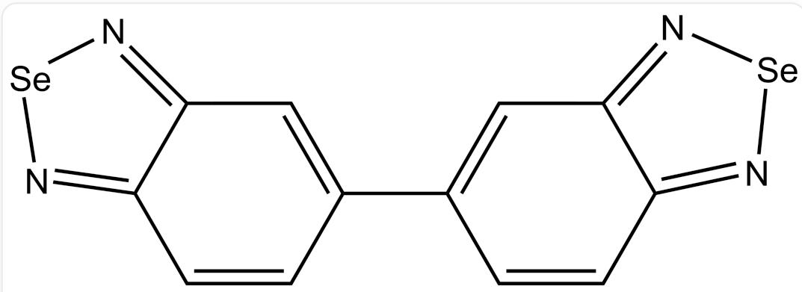

# Question

The element  $\mathbf{X}$  is an indispensable element for the human body and a versatile life-sustaining nutrient, holding significant importance.

I. Purification of  $\mathbf{X}$ :  $\mathbf{X}$  is often associated with another heavy element  $\mathbf{Y}$  from the same group in some minerals, making the separation of  $\mathbf{X}$  from  $\mathbf{Y}$  crucial during purification.

Method 1 involves dissolving  $\mathbf{X}$  containing trace amounts of  $\mathbf{Y}$  in concentrated  $\mathrm{HNO}_3$  solution, evaporating the  $\mathrm{HNO}_3$ , and then adding hydroiodic acid to the solution.

Method 2 involves dissolving  $\mathbf{X}$  containing trace amounts of  $\mathbf{Y}$  in concentrated  $\mathrm{Na}_2\mathrm{SO}_3$  solution at  $363\mathrm{K}$ .

II. Content Analysis of  $\mathbf{X}$ : Reacting  $3,3^{\prime}$ -diaminobenzidine with  $\mathbf{X}$  in a stable but non-highest oxidation state in  $0.1\mathrm{mol} / \mathrm{L}^{-1}$  hydrochloric acid produces a bright yellow compound  $\mathbf{M}$ . After adjusting to  $\mathrm{pH} = 6$ , toluene is used for extraction, followed by spectrophotometric determination, which is a sensitive and characteristic analytical method for  $\mathbf{X}$ .

Using the above method to determine the  $\mathbf{X}$  content in a sample, which may contain trace metal impurities, high-purity  $\mathbf{X}$  with a mass of  $m_{1}$  is used as the starting material. After a series of treatments, a  $25~\mathrm{mL}$  aqueous solution of  $\mathbf{M}$  is obtained. Extraction with  $1\mathrm{mL}$  toluene and measurement at  $z\mathrm{nm}$  using a  $1\mathrm{cm}$  cuvette with toluene as the reference yields absorbance A. Repeated experiments provide the following data:

<table><tr><td>m1/μg</td><td>0.5</td><td>1.0</td><td>3.0</td><td>5.0</td><td>10.0</td><td>0.0</td></tr><tr><td>A</td><td>0.060</td><td>0.090</td><td>0.210</td><td>0.335</td><td>0.631</td><td>0.034</td></tr></table>

After preprocessing  $1.0\mathrm{g}$  of the sample, a solution containing  $\mathbf{X}$  with a mass of  $m_{2}$  is added, where the oxidation state of  $\mathbf{X}$  is the same as that used in the spectrophotometric method above.

Using the same method, absorbance A is measured at  $z$  nm with a 1 cm cuvette and toluene as the reference. Repeated experiments provide the following data:

<table><tr><td>m2/μg</td><td>0</td><td>0.5</td><td>1.0</td><td>3.0</td><td>5.0</td><td>10.0</td></tr><tr><td>A</td><td>0.046</td><td>0.072</td><td>0.091</td><td>0.211</td><td>0.359</td><td>0.657</td></tr></table>

The partition coefficient of  $\mathbf{M}$  in the toluene-water system is  $\mathrm{k_D} = 25.4$

Regarding the above analytical process, the following statements are made:

1. In Method 1, when hydroiodic acid is added, the two main reactions occurring in the solution involve changes in the oxidation states of both  $\mathbf{X}$  and  $\mathbf{Y}$ .  
2. Both Method 1 and Method 2 require extraction and filtration to obtain purified  $\mathbf{X}$  
3. The analytical method mentioned in "Content Analysis of  $\mathbf{X}$ " requires the addition of a small amount of disodium EDTA salt.  
4. Compound  $\mathbf{M}$  can possess a twofold rotation axis, two mutually perpendicular mirror planes, and a center of symmetry through the rotation of covalent bonds.  
5. The  $\mathbf{X}$  content in the sample is  $0.100\mathrm{ppm}$ .

This problem specifies that all data points must be included when fitting the curve.

Among the above statements, the correct options are (for calculation-related options, an error margin of less than  $5\%$  is considered correct).

A. 1,3,4  
B. 1,3  
C. 1,4

D. 1,4,5  
E. 1,2  
F. 2,3,4  
G. 2,4  
H. 3,4,5  
1. 3,4  
J. 3,5  
K. 2,3  
L. 1,3,4,5  
M. 1,2,3,4  
N. 2,3,4,5  
O.  $1, 2, 4, 5$  
P.  $1,2,3,5$  
Q. 1,5

R. 4,5

# Answer

Correct Answer: J

# Detailed Explanation

From the question stem,  $\mathbf{X}$  is an essential element for the human body and often coexists in nature with its heavier congener  $\mathbf{Y}$  in mineral forms. It can be determined that:

# CHECKPOINT

1 PTS

Element  $\mathbf{X}$  is Se

# CHECKPOINT

1 PTS

Element  $\mathbf{Y}$  is Te

Method 1:

# CHECKPOINT

1 PTS

$$
\mathrm {H} _ {2} \mathrm {S e O} _ {3} + 4 \mathrm {H I} \rightarrow \mathrm {S e} + 2 \mathrm {I} _ {2} + 3 \mathrm {H} _ {2} \mathrm {O}
$$

# CHECKPOINT

1 PTS

$$
\mathrm {H} _ {2} \mathrm {T e O} _ {3} + 6 \mathrm {H I} \rightarrow \mathrm {H} _ {2} \mathrm {T e I} _ {6} + 3 \mathrm {H} _ {2} \mathrm {O}
$$

Method 2:

# CHECKPOINT

1 PTS

$$
\mathrm {S e} + \mathrm {N a} _ {2} \mathrm {S O} _ {3} \rightarrow \mathrm {N a} _ {2} \mathrm {S e S O} _ {3}
$$

In Method 1, the oxidation state of Se changes, and it precipitates, while the oxidation state of Te remains unchanged, staying in the solution. Filtration can directly separate Se in its elemental form.

In Method 2, the oxidation state of Se changes, remaining in the solution, while Te does not dissolve.

# CHECKPOINT

1 PTS

In both Method 1 and Method 2, the oxidation state of Se changes, while in Method 1, the oxidation state of Te remains unchanged

From the reaction equations, Statement 1 is incorrect, and Statement 2 is incorrect.

The disodium salt of EDTA can complex with transition metal ions in the sample, masking them to prevent oxidation of  $3,3^{\prime}$ -diaminobenzidine or the formation of colored complexes with  $3,3^{\prime}$ -diaminobenzidine, which would interfere with the measurement. Statement 3 is correct.

# CHECKPOINT

1 PTS

The disodium salt of EDTA can mask transition metal ions to prevent interference in the measurement.

Structure of compound M:

  
5,5'-bibenzo[c][1,2,5]selenadiazole

$$
C 1 2 = N [ S e ] N = C 1 C = C C (C 3 = C C 4 = N [ S e ] N = C 4 C = C 3) = C 2
$$

# CHECKPOINT

2 PTS

The structure of compound M is C12=N[Se]N=C1C=CC(C3=CC4=N[Se]N=C4C=C3)=C2

From the structure of  $\mathbf{M}$ , it can be concluded that as the central carbon-carbon single bond rotates, it cannot simultaneously possess a twofold rotation axis, two mutually perpendicular mirror planes, and an inversion center. Statement 4 is incorrect.

# CHECKPOINT

1 PTS

a twofold rotation axis, an inversion center and two mutually perpendicular mirror planes cannot coexist

Sample analysis calculation process:

First, calculate the extraction efficiency  $\mathrm{E}$  of using  $1\mathrm{\;{mL}}$  toluene to extract  ${25}\mathrm{\;{mL}}$  of  $\mathbf{M}$  solution:

$$
\mathrm {E} = \mathrm {k} _ {\mathrm {D}} / \left(\mathrm {k} _ {\mathrm {D}} + \mathrm {V} _ {\text {w a t e r}} / \mathrm {V} _ {\text {s a m p l e}}\right) = 2 5. 4 / (2 5. 4 + 2 5) = 0. 5 0 4
$$

# CHECKPOINT

2 PTS

The extraction efficiency  $\mathbf{E}$  of using  $1\mathrm{mL}$  toluene to extract  $25\mathrm{mL}$  of  $\mathbf{M}$  solution is  $\mathbf{E} = 0.504$

Concentration of selenium in the toluene solution:  $c_{Se} = \frac{\mathrm{n}_{Se,o}}{V} = \frac{E \times \mathrm{n}_{Se,w}}{V} = \frac{\mathrm{Em}_1}{M_{Se}V}$

Since one molecule of  $\mathbf{M}$  contains 2 Se atoms, the concentration of  $\mathbf{M}$ :  $c_{\mathbf{M}} = \frac{1}{2} c_{Se} = \frac{Em_1}{2M_{Se}V}$ .

Absorbance  $\mathrm{A} = \varepsilon lc_{\mathrm{M}} + \mathrm{A}_0 = \frac{\varepsilon lEm_1}{2M_{se}V} +\mathrm{A}_0$  , indicating a linear relationship between  $A$  and  $m_{1}$  with a slope of  $\frac{\varepsilon lE}{2M_{se}V}$

# CHECKPOINT

1 PTS

$$
\mathbf {A} = \frac {\varepsilon l E m _ {1}}{2 M _ {s e} V} + \mathbf {A} _ {0}
$$

Fitting the data from Table 1: (yields  $y = a_{1}x + b_{1}, a_{1} = 0.060035 \left( \mu \mathrm{g}^{-1} \right), b_{1} = 0.031554, r = 0.99995$ )

# CHECKPOINT

1 PTS

Table 1 fitting result:  $y = {0.060035x} + {0.031554}$

$$
\varepsilon = \frac {2 M _ {S e} V}{l E} \times a = 1. 8 8 \times 1 0 ^ {4} \mathrm {L} \cdot \mathrm {m o l} ^ {- 1} \cdot \mathrm {c m} ^ {- 1}
$$

Selenium content in the sample:

For the sample,  $\mathrm{A} = \varepsilon lc_{\mathrm{M}} + \mathrm{A}_0 = \frac{\varepsilon lE(m + m_2)}{2M_{se}V} + \mathrm{A}_0 = \frac{\varepsilon lE}{2M_{se}V} \times m_2 + \frac{\varepsilon lEm}{2M_{se}V} + \mathrm{A}_0$

showing a linear relationship between  $A$  and  $m2$ ;

# CHECKPOINT

1 PTS

$$
\mathbf {A} = \frac {\varepsilon l E}{2 M _ {s e} V} \times m _ {2} + \frac {\varepsilon l E m}{2 M _ {s e} V} + \mathbf {A} _ {0}
$$

Fitting the data from the table: yields  $y = a_{2}x + b_{2}, a_{2} = 0.062024\left(\mu \mathrm{g}^{-1}\right), b_{2} = 0.037754, r = 0.99920$ .

# CHECKPOINT

1 PTS

Table 2 fitting result:  $y = {0.062024x} + {0.037754}$

From  $b_{1} = \mathsf{A}_{0}, b_{2} = \frac{\varepsilon l E m}{2 M_{s e} V} + \mathsf{A}_{0}$ , it follows that  $a_{2} = \frac{k^{\prime}\varepsilon l E}{2 M_{s e} V} = \frac{b_{2} - b_{1}}{\mathrm{n}}$

$$
m = \frac {b _ {2} - b _ {1}}{a _ {2}} = 0. 0 9 9 9 6 \mu \mathrm {g}
$$

$\mathrm{w} = \frac{m}{m_0}\times 1\times 10^6\mathrm{ppm} = 0.100\mathrm{ppm}$  . Statement 5 is correct.

If calculated using  $a_1$ , the result is 0.103ppm, which is within the error margin and also correct.

# CHECKPOINT

2 PTS

$$
\mathrm {w} = 0. 1 0 0 \mathrm {p p m o r} 0. 1 0 3 \mathrm {p p m}
$$

Thus, Statements 3 and 5 are correct, and the answer is J.