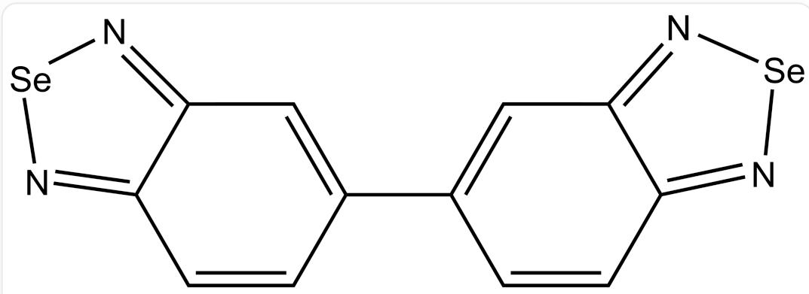

# 题目

某元素X是人体不可或缺的一种元素,也是一种多功能的生命营养素,具有重要意义。

一、X的提纯：X与和它同族的另一种重元素Y在一些矿物中常常伴生，因此提纯X时将其与Y元素分离至关重要。

方法1是将含有少量Y的X溶于浓  $\mathrm{HNO}_3$  溶液中，蒸除  $\mathrm{HNO}_3$  后，向溶液中加入氢碘酸。

方法2是将含有少量Y的X在363K下溶于浓  $\mathrm{Na_2SO_3}$  溶液。

二、X的含量分析：使用  $3,3^{\prime}$  -二氨基联苯胺与处于某一稳定价态但并非最高价的X在  $0.1\mathrm{mol} / \mathrm{L}^{-1}$  盐酸中反应可以生成一种鲜黄色化合物M，调节  $\mathrm{pH} = 6$  后用甲苯进行萃取，对其进行分光光度测定，是对X灵敏且特征的分析方法。

用上述分析方法测定某样品中的X含量，样品中可能含有微量杂质金属。以质量为  $m_{1}$  的高纯X单质为起始物, 经过一系列处理后得到  $25\mathrm{mL}$  M的水溶液, 用  $1\mathrm{mL}$  甲苯萃取后, 于  $z\mathrm{nm}$  处用  $1\mathrm{cm}$  比色皿

以甲苯作参比测得吸光度A。重复多次实验,得到以下数据:

<table><tr><td>m1/μg</td><td>0.5</td><td>1.0</td><td>3.0</td><td>5.0</td><td>10.0</td><td>0.0</td></tr><tr><td>A</td><td>0.060</td><td>0.090</td><td>0.210</td><td>0.335</td><td>0.631</td><td>0.034</td></tr></table>

将  $1.0 \mathrm{~g}$  该样品预处理后，加入含  $\mathbf{X}$  元素的质量为  $m_{2}$  的溶液，且该溶液中  $\mathbf{X}$  元素的价态与上一步分光光度法中所用的  $\mathbf{X}$  相同。

采用相同的方法, 于  $z \mathrm{~nm}$

处用  $1 \mathrm{~cm}$  比色皿以甲苯为参比测得吸光度 A。重复多次实验, 得到以下数据:

<table><tr><td>m2/μg</td><td>0</td><td>0.5</td><td>1.0</td><td>3.0</td><td>5.0</td><td>10.0</td></tr><tr><td>A</td><td>0.046</td><td>0.072</td><td>0.091</td><td>0.211</td><td>0.359</td><td>0.657</td></tr></table>

已知  $\mathbf{M}$  在甲苯-水体系中的分配系数  $\mathrm{k}_{\mathrm{D}} = 25.4$ 。

关于上述分析过程，有如下说法：

1 方法1中加入氢碘酸时溶液中主要发生的2个反应，X元素和Y元素的价态均发生变化。  
2 方法1与方法2都需要通过萃取、过滤获得提纯后的X元素。  
3 “X的含量分析”中提到的分析方法，需要加入少量EDTA二钠盐。  
4 化合物M通过共价键的旋转，可以同时拥有二重旋转轴、两个相互垂直的镜面、对称中心。  
5 该样品中  $\mathbf{X}$  元素含量为  $0.100\mathrm{ppm}$  。

本题规定：在进行拟合曲线时，所有的数据点都需要参与拟合。

以上说法中正确的选项有(涉及计算的选项，误差小于  $5 \%$  即正确)

A. 1,3，4  
B. 1, 3  
C. 1, 4  
D. 1, 4, 5  
E. 1, 2

F. 2,3,4  
G. 2, 4  
H. 3, 4, 5  
1. 3,4  
J. 3, 5  
K. 2, 3  
L. 1, 3, 4, 5  
M. 1, 2, 3, 4  
N. 2, 3, 4, 5  
O. 1, 2, 4, 5  
P. 1, 2, 3, 5  
Q. 1, 5  
R. 4, 5

# 答案

正确答案: J

# 详细解析

由题干，X是人体必要元素，且在自然界中经常以矿物形式和同族重元素Y伴生，可以确定：

# CHECKPOINT

1 PTS

X元素是Se

# CHECKPOINT

1 PTS

Y元素是Te

方法1:

# CHECKPOINT

1 PTS

$$
\mathrm {H} _ {2} \mathrm {S e O} _ {3} + 4 \mathrm {H I} \rightarrow \mathrm {S e} + 2 \mathrm {I} _ {2} + 3 \mathrm {H} _ {2} \mathrm {O}
$$

# CHECKPOINT

1 PTS

$$
\mathrm {H} _ {2} \mathrm {T e O} _ {3} + 6 \mathrm {H I} \rightarrow \mathrm {H} _ {2} \mathrm {T e I} _ {6} + 3 \mathrm {H} _ {2} \mathrm {O}
$$

方法2:

# CHECKPOINT

1 PTS

$$
\mathrm {S e} + \mathrm {N a} _ {2} \mathrm {S O} _ {3} \rightarrow \mathrm {N a} _ {2} \mathrm {S e S O} _ {3}
$$

方法1中Se元素价态发生变化，以沉淀形式析出，Te元素价态不变，仍保留在溶液中，过滤可直接分离出Se单质。

方法2中Se元素价态发生变化，保留在溶液中，Te不会溶解。

# CHECKPOINT

1 PTS

方法1和方法2Se价态均发生变化，方法1Te价态不变

由反应方程式，说法1错误，说法2错误。

EDTA二钠盐可以与试样中的过渡金属离子络合而掩蔽之,防止其氧化  $3,3^{\prime}$  -二氨基联苯胺或与  $3,3^{\prime}$  -二氨基联苯胺发生络合形成有色物质,干扰测定。说法3正确。

# CHECKPOINT

1 PTS

EDTA 二钠盐可以掩蔽过渡金属离子防止其干扰测定。

化合物M的结构：

  
5,5'-bibenzo[c][1,2,5]selenadiazole

$$
C 1 2 = N [ S e ] N = C 1 C = C C (C 3 = C C 4 = N [ S e ] N = C 4 C = C 3) = C 2
$$

# CHECKPOINT

2 PTS

化合物M的结构为C12=N[Se]N=C1C=CC(C3=CC4=N[Se]N=C4C=C3)=C2

由M的结构可以判断，随着中间碳碳单键的旋转，不可以同时拥有二重旋转轴、相互垂直的2个镜面、对称中心；说法4错误。

# CHECKPOINT

1 PTS

二重旋转轴，对称中心和相互垂直的2个镜面无法同时存在

样品分析计算过程：

首先计算利用  $1 \mathrm{~mL}$  甲苯萃取  $25 \mathrm{~mL} \mathrm{M}$  的溶液的萃取率  $\mathrm{E}$ :

$$
\mathrm {E} = \mathrm {k _ {D}} / (\mathrm {k _ {D}} + \mathrm {V _ {w a t e r}} / \mathrm {V _ {s a m p l e}}) = 2 5. 4 / (2 5. 4 + 2 5) = 0. 5 0 4
$$

# CHECKPOINT

2 PTS

利用  $1 \mathrm{~mL}$  甲苯萃取  $25 \mathrm{~mL} \mathrm{M}$  的溶液的萃取率  $\mathrm{E} = 0.504$

甲苯溶液中硒元素的浓度:  $c_{Se} = \frac{n_{Se,o}}{V} = \frac{E \times n_{Se,w}}{V} = \frac{Em_1}{M_{Se}V}$

由于1分子  $\mathbf{M}$  中含有2个Se原子，  $\mathbf{M}$  的浓度：  $c_{\mathrm{M}} = \frac{1}{2} c_{Se} = \frac{Em_1}{2M_{Se}V}$

吸光度  $\mathrm{A} = \varepsilon lc_{\mathrm{M}} + \mathrm{A}_0 = \frac{\varepsilon lEm_1}{2M_{se}V} +\mathrm{A}_0$  ，推出  $A$  与  $m_{1}$  存在线性关系且斜率为  $\frac{\varepsilon lE}{2M_{se}V}$

# CHECKPOINT

1 PTS

$$
\mathbf {A} = \frac {\varepsilon l E m _ {1}}{2 M _ {s e} V} + \mathbf {A} _ {0}
$$

用表1中数据拟合：得  $y = a_{1}x + b_{1}, a_{1} = 0.060035\left(\mu \mathrm{g}^{-1}\right), b_{1} = 0.031554, r = 0.99995$

# CHECKPOINT

1 PTS

表1拟合结果：  $y = 0.060035x + 0.031554$

$$
\varepsilon = \frac {2 M _ {S e} V}{l E} \times a = 1. 8 8 \times 1 0 ^ {4} \mathrm {L} \cdot \mathrm {m o l} ^ {- 1} \cdot \mathrm {c m} ^ {- 1}
$$

样品中硒的含量：

对样品有  $\mathrm{A} = \varepsilon lc_{\mathrm{M}} + \mathrm{A}_0 = \frac{\varepsilon lE(m + m_2)}{2M_{se}V} +\mathrm{A}_0 = \frac{\varepsilon lE}{2M_{se}V}\times m_2 + \frac{\varepsilon lEm}{2M_{se}V} +\mathrm{A}_0,$

$A$  与  $m2$  存在线性关系;

# CHECKPOINT

1 PTS

$$
\mathbf {A} = \frac {\varepsilon l E}{2 M _ {s e} V} \times m _ {2} + \frac {\varepsilon l E m}{2 M _ {s e} V} + \mathbf {A} _ {0}
$$

用表中数据拟合：得  $y = a_{2}x + b_{2}, a_{2} = 0.062024(\mu \mathrm{g}^{-1}), b_{2} = 0.037754, r = 0.99920$

# CHECKPOINT

1 PTS

表2拟合结果:  $y = {0.062024x} + {0.037754}$

由  $b_{1} = \mathbf{A}_{0}, b_{2} = \frac{\varepsilon l E m}{2 M_{s e} V} + \mathbf{A}_{0}$ , 可知  $a_{2} = \frac{k^{\prime} \varepsilon l E}{2 M_{s e} V} = \frac{b_{2} - b_{1}}{\mathrm{n}}$ ,

$$
m = \frac {b _ {2} - b _ {1}}{a _ {2}} = 0. 0 9 9 9 6 \mu \mathrm {g}
$$

$\mathrm{w} = \frac{m}{m_0} \times 1 \times 10^6 \mathrm{ppm} = 0.100 \mathrm{ppm}$  说法5正确。

如果利用  $a_1$  进行计算，得到结果为  $0.103 \mathrm{ppm}$  在误差范围内，同样正确。

# CHECKPOINT

2 PTS

$$
\mathrm {w} = 0. 1 0 0 \text {或} 0. 1 0 3 \mathrm {p p m}
$$

从而说法3，5正确，选择J。