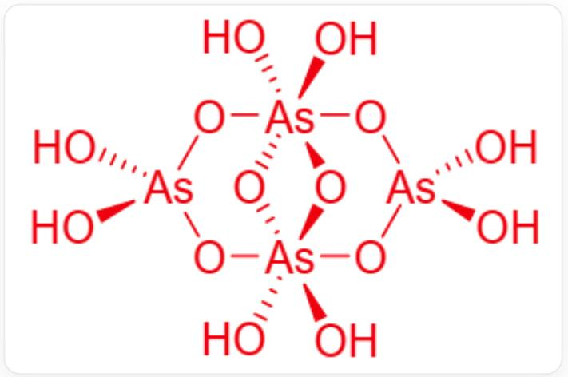

# Question

$\mathbf{N}$ 's simple substance is an important semiconductor material and can be used as a dopant for silicon. In nature, one form in which  $\mathbf{N}$  exists is compound  $\mathbf{A}$ ;  $\mathbf{A}$  is a readily sublimable, sparingly soluble solid containing  $60.9\%$ $\mathbf{N}$ .  $\mathbf{A}$  dissolves in concentrated nitric acid to form  $\mathbf{B}$ ; passing gas  $\mathbf{C}$  into the acidic solution of  $\mathbf{B}$  yields acid  $\mathbf{D}$  and a yellow precipitate  $\mathbf{E}$ ; heating  $\mathbf{D}$  to remove water yields oxide  $\mathbf{F}$ . Heating  $\mathbf{A}$  in air can also yield oxide  $\mathbf{F}$ ; heating a mixture of  $\mathbf{F}$  and  $\mathrm{S}_2\mathrm{Cl}_2$  in a chlorine atmosphere yields a colorless polar liquid  $\mathbf{G}$  and an irritating gas  $\mathbf{H}$ . An aqueous solution of  $\mathbf{H}$  and  $\mathbf{C}$  reacts to form  $\mathbf{E}$  and water. Furthermore,  $\mathbf{N}$  can also form an oxoacid  $\mathbf{Z}$ ; 1 mol of  $\mathbf{Z}$  hydrolyzes and consumes 2 mol of water, yielding only 4 mol of  $\mathbf{B}$ .  $\mathbf{Z}$  is a centrosymmetric molecule with two  $C_2$  axes passing through the  $\mathbf{N}$  atoms; in the  $\mathbf{Z}$  molecule,  $\mathbf{N}$  has two chemical environments and two coordination numbers.  
The sum of the serial numbers of the correct options is:  
1. Acid  $\mathbf{D}$  is more acidic than  $\mathbf{B}$ .  
2. A and F have the same number of atoms in their simplest chemical formulas.  
3. C and H molecules have different symmetries.  
4. Molecule  $\mathbf{G}$  contains only one lone pair of electrons.  
5. O in  $\mathbf{Z}$  has four chemical environments.  
6. Ideally, if all hydroxyl groups can be completely ionized, molecule  $\mathbf{Z}$  can ionize a maximum of 6 hydrogen ions.

A. 1  
B. 3  
C. 4

D. 6  
E. 7  
F. 8  
G. 5  
H. 9  
1. 10  
J. 11  
K. 12  
L. 13  
M. 14

# Answer

Correct Answer: E

# Detailed Explanation

N's simple substance is a semiconductor material and can be used as a dopant for silicon: Common semiconductor doping elements are mainly elements of Group IIIA and Group VA, including boron, phosphorus, arsenic, etc.

Group IIIA elements may exist in nature as acids, oxides, and hydroxides, while Group VA elements often exist in nature as oxides or sulfides.

# CHECKPOINT

1 PTS

Determined to be Group IIIA or Group VA element.

And because they are all main group elements, their oxidation states in compounds are relatively fixed. Group IIIA elements mainly exist in nature in the  $+3$  valence state, and Group VA elements mainly exist in nature in the  $+3$  and  $+5$  valence states.

According to the question, compound A gives the mass fraction and has the property of being easily sublimated, that is, it is mostly covalent. Group IIIA oxides, hydroxides, and oxyacid salts are not easily sublimated, but some halides of aluminum, such as  $\mathrm{AlCl}_3$ , have sublimability.

For Group VA, certain oxides and sulfides of phosphorus, arsenic, and antimony, as well as white phosphorus, have the property of sublimation. The possible compounds listed above are all binary compounds, which are relatively easy to verify by returning the data.

Using the given data for enumeration and calculation, it can be known that:

$$
\frac{74.9\times 2}{74.9\times 2 + 32.06\times 3} = 60.9\%
$$

Therefore, it is known that  $\mathbf{N}$  is As, and the simplest formula of  $\mathbf{A}$  is  $\mathrm{As}_2\mathrm{S}_3$

# CHECKPOINT

2 PTS

$\mathbf{N}$  is  $\mathrm{As}$ , and the simplest formula of  $\mathbf{A}$  is  $\mathrm{As}_2\mathrm{S}_3$ .

A dissolves in concentrated nitric acid to produce B. Concentrated nitric acid has oxidizing properties and can oxidize all As and S to the highest valence state. Therefore, B is the highest valence oxyacid salt of As, namely  $\mathrm{H}_3\mathrm{AsO}_4$ .

# CHECKPOINT

1 PTS

B is  $\mathrm{H}_3\mathrm{AsO}_4$

Gas  $\mathbf{C}$  is passed into the acidic solution of  $\mathbf{B}$  to generate acid  $\mathbf{D}$  and yellow precipitate  $\mathbf{E}$ .

Among the elements given in the question, S simple substance and some S compounds of As are yellow, and B is  $\mathrm{H}_3\mathrm{AsO}_4$ , the highest valence oxyacid of As, so the added gas C may have reducing properties.

Among the reducing gases, the oxidation product of  $\mathrm{H}_2\mathrm{S}$  can be S simple substance, which is just yellow, and the logic is self-consistent. Suppose C is  $\mathrm{H}_2\mathrm{S}$ , and the reaction is:

$$
2 \mathrm {H} _ {3} \mathrm {A s O} _ {4} + 2 \mathrm {H} _ {2} \mathrm {S} \rightarrow 2 \mathrm {H} _ {3} \mathrm {A s O} _ {3} + 2 \mathrm {S} + 2 \mathrm {H} _ {2} \mathrm {O}
$$

Consistent with the above assumptions.

And  $\mathbf{D}(\mathrm{H}_3\mathrm{AsO}_3)$  is heated to dehydrate to generate oxide. The following conditions are met.

# CHECKPOINT

1 PTS

Therefore,  $\mathbf{C}$  is  $\mathrm{H}_2\mathrm{S}$ , and  $\mathbf{D}$  is  $\mathrm{H}_3\mathrm{AsO}_3$ .

$\mathrm{H}_3\mathrm{AsO}_3$  is dehydrated to produce arsenic trioxide:

$$
2 \mathrm {H} _ {3} \mathrm {A s O} _ {3} \rightarrow \mathrm {A s} _ {2} \mathrm {O} _ {3} + 3 \mathrm {H} _ {2} \mathrm {O}
$$

Therefore,  $\mathbf{F}$  is  $\mathrm{As}_2\mathrm{O}_3$

# CHECKPOINT

1 PTS

F is  $\mathrm{As}_2\mathrm{O}_3$

Similarly, it can be verified that when  $\mathrm{As}_2\mathrm{S}_3$  is heated in the air, because the oxidation capacity of air is weaker than that of oxygen, the generation of  $\mathrm{As}_2\mathrm{O}_3$  is a thermodynamically more stable product under this condition.

Heating a mixture of  $\mathbf{F}$  and  $\mathrm{S}_2\mathrm{Cl}_2$  in a chlorine atmosphere can obtain a colorless polar liquid  $\mathbf{G}$  and an irritating gas  $\mathbf{H}$ .  $\mathrm{S}_2\mathrm{Cl}_2$  is mostly used for chlorination to provide chlorine atoms, while a chlorine atmosphere is an oxidation condition, so this step is an oxidative chlorination reaction.

Sulfur is oxidized to sulfur dioxide, which conforms to the description of an irritating gas.

$$
4 \mathrm {A s} _ {2} \mathrm {O} _ {3} + 9 \mathrm {C l} _ {2} + 3 \mathrm {S} _ {2} \mathrm {C l} _ {2} \rightarrow 8 \mathrm {A s C l} _ {3} + 6 \mathrm {S O} _ {2}
$$

# CHECKPOINT

2 PTS

Therefore,  $\mathbf{G}$  is  $\mathrm{AsCl}_3$ , and  $\mathbf{H}$  is  $\mathrm{SO}_2$

Z is an oxyacid, 1 mol of Z hydrolyzes and consumes 2 mol of water, only yielding 4 mol of B:

B is  $\mathrm{H}_3\mathrm{AsO}_4$

Hydrolysis reaction:  $\mathbf{Z} + 2\mathrm{H}_2\mathrm{O}\rightarrow 4\mathrm{H}_3\mathrm{AsO}_4$

Right side:  $4\mathrm{molH}_3\mathrm{AsO}_4$  contains  $4\mathrm{molAs}\cdot 12\mathrm{molH}\cdot 16\mathrm{molO}$

Left side:  $\mathbf{Z} + 2\mathrm{molH}_2\mathrm{O}$  (containing  $4\mathrm{molH}\cdot 2\mathrm{molO}$ ).

Therefore, Z provides 4 molAs, 8 molH, 14 molO, and the molecular formula is  $\mathrm{H_8As_4O_{14}}$ .

The molecular formula is  $\mathrm{H_8As_4O_{14}}$

# CHECKPOINT

1 PTS

The molecular formula of  $\mathbf{Z}$  is  $\mathrm{H_8As_4O_{14}}$

Simple valence calculation shows that the total valence of As is  $+20$ , each As is  $+5$  valence, there are no lone pair electrons, As has two chemical environments and two coordination numbers, indicating that one coordination number is 4 and the other coordination number is 6.

Assuming that there is no double-bonded oxygen and all oxygen is dicoordinate,  $\mathrm{H_8As_4O_{14}}$  is composed of two tetrahedrally coordinated As and two octahedrally coordinated As, connected by oxygen bridges. There are a total of six bridging oxygens and eight hydroxyl oxygens.

Centrosymmetric molecule, with two  $C_2$  axes passing through the As atoms.

According to the above conditions and the difficulty of ring formation, its structure can be deduced:

O[As]1(O)O[As](O2)(O3)(O)(O)O[As](O)(O)O[As]23(O)(O)O1

# CHECKPOINT

1 PTS

$\mathrm{H}_{8}\mathrm{As}_{4}\mathrm{O}_{14}$  structure is O[As]1(O)O[As](O2)(O3)(O)(O)O[As](O)(O)O[As]23(O)(O)O1

# CHECKPOINT

1 PTS

$\mathrm{H}_{8}\mathrm{As}_{4}\mathrm{O}_{14}$  is composed of two tetrahedrally coordinated As and two octahedrally coordinated As, connected by oxygen bridges. There are a total of six bridging oxygens and eight hydroxyl oxygens.

1. The acidity of acid  $\mathbf{D}$  is weaker than that of  $\mathbf{B}$ . Incorrect.  
2. The simplest formulas of  $\mathbf{A}$  and  $\mathbf{F}$  both contain 5 atoms, correct.  
3. The symmetry of molecules  $\mathbf{C}$  and  $\mathbf{H}$  are the same. Both are bent molecules,  $C_{2v}$  point group, incorrect.

4. The central atom of molecule  $\mathbf{G}$  contains a lone pair of electrons, and each chlorine atom contains three lone pairs of electrons, for a total of 10 pairs. Incorrect.  
5. O in  $\mathbf{Z}$  has four chemical environments. Correct.  
6. Ideally, all hydroxyl groups can be completely ionized, and  $\mathbf{Z}$  molecule can ionize up to 8 hydrogen ions. Incorrect.

The sum of the correct option numbers is 7, choose E.