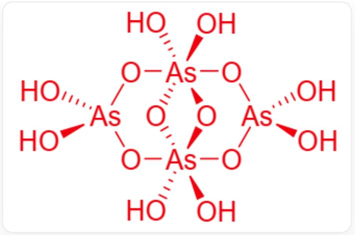

# 题目

N 的单质是一种重要的半导体材料,可作为硅的掺杂物。在自然界中, N 存在的一种形式是化合物 A; A 是易升华的难溶性固体,其中含 N 60.9%。A 溶于浓硝酸生成 B; 向 B 的酸性溶液中通入气体 C,可生成酸 D 和黄色沉淀 E; D 加热脱水可得到氧化物 F。将 A 在空气中加热也可得到氧化物 F; 在氯气气氛下加热 F 与  $\mathrm{S}_{2} \mathrm{Cl}_{2}$  的混合物, 可以得到无色极性液体 G 和刺激性气体 H, H 和 C 的水溶液反应生成 E 和水。不仅如此, N 还可以形成含氧酸 Z; 1 molZ 水解消耗 2 mol 水,仅得到 4 molB 。Z 是中心对称的分子,具有两根穿过 N 原子的  $C_{2}$  轴; Z 分子中, N 有两种化学环境和两种配位数。  
下列选项中，正确选项序号之和为：  
1.酸D的酸性比B强。  
2. A 和 F 最简化学式的原子数相同。  
3. C 和 H 分子的对称性不同。  
4. G 分子仅含有一对孤对电子。  
5. Z 中 O 有四种化学环境。  
6. 理想情况下羟基均可完全电离，Z 分子最多可电离出 6 个氢离子。

A. 1  
B. 3  
C. 4  
D. 6

E. 7  
F. 8  
G. 5  
H. 9  
1. 10  
J. 11  
K. 12  
L. 13  
M. 14

# 答案

正确答案: E

# 详细解析

N的单质是半导体材料，可作为硅的掺杂物：常见的半导体掺杂元素主要为第三主族和第五主族的元素，包括硼、磷、砷等。

而第三主族元素在自然界中可能以酸、氧化物、氢氧化物的形式存在，第五主族元素在自然界中常以氧化物或硫化物的形式存在。

# CHECKPOINT

1 PTS

确定为第三或第五主族元素。

且由于均为主族元素，他们在化合物中的氧化态相对固定。第三主族的元素主要在自然界中以  $+3$  价态存在，第五主族的元素在自然界中主要以  $+3$  以及  $+5$  价态的形式存在。

由题意，化合物A给出了质量分数，且具有易升华的性质，即多以共价性为主。第三主族氧化物、氢氧化物、含氧酸盐均不易升华，但如  $\mathrm{AlCl}_3$  即铝的部分卤化物具有升华性。

而对于第五主族而言，磷、砷、锑的某些氧化物及硫化物、以及白磷单质均具有升华的性质，以上列举的可能化合物均为二元化合物，带回数据验证较为容易。

利用所给数据进行列举计算，可知：

$$
\frac{74.9\times 2}{74.9\times 2 + 32.06\times 3} = 60.9\%
$$

故得知， $\mathbf{N}$  为  $\mathrm{As}$ ， $\mathbf{A}$  最简式为  $\mathrm{As}_2\mathrm{S}_3$ 。

# CHECKPOINT

2 PTS

$\mathbf{N}$  为  $\mathrm{As}$ ,  $\mathbf{A}$  最简式为  $\mathrm{As}_2\mathrm{S}_3$  。

A 溶于浓硝酸生成 B，浓硝酸具有氧化性，可将 As 和 S 全部氧化至最高价，故 B 为 As 的最高价含氧酸盐，即  $\mathrm{H}_{3} \mathrm{~AsO}_{4}$  。

# CHECKPOINT

1 PTS

B为  $\mathrm{H}_3\mathrm{AsO}_4$  。

向 B 的酸性溶液中通入气体 C，生成酸 D 和黄色沉淀 E。

在题目所给元素中，S 单质和部分 As 的 S 化物为黄色，且 B 为  $\mathrm{H}_{3} \mathrm{~AsO}_{4}$ ，As 的最高价含氧酸，故加入的气体 C 可能具有还原性。

而还原性气体中， $\mathrm{H}_2\mathrm{S}$  的氧化产物可以为  $\mathrm{S}$  单质，刚好为黄色，逻辑自洽。不妨假设  $\mathbf{C}$  为  $\mathrm{H}_2\mathrm{S}$ ，有反应：

$$
2 \mathrm {H} _ {3} \mathrm {A s O} _ {4} + 2 \mathrm {H} _ {2} \mathrm {S} \rightarrow 2 \mathrm {H} _ {3} \mathrm {A s O} _ {3} + 2 \mathrm {S} + 2 \mathrm {H} _ {2} \mathrm {O}
$$

符合上述假设。

且  $\mathrm{D}\left(\mathrm{H}_{3} \mathrm{~AsO}_{3}\right)$  加热脱水生成氧化物。下述条件符合。

# CHECKPOINT

1 PTS

故  $\mathbf{C}$  为  $\mathrm{H}_2\mathrm{S}$ ， $\mathbf{D}$  为  $\mathrm{H}_3\mathrm{AsO}_3$ 。

$\mathrm{H}_{3} \mathrm{AsO}_{3}$  脱水生成三氧化二砷:

$$
2 \mathrm {H} _ {3} \mathrm {A s O} _ {3} \rightarrow \mathrm {A s} _ {2} \mathrm {O} _ {3} + 3 \mathrm {H} _ {2} \mathrm {O}
$$

故  $\mathbf{F}$  为  $\mathrm{As}_2\mathrm{O}_3$  。

# CHECKPOINT

1 PTS

$\mathbf{F}$  为  $\mathrm{As}_2\mathrm{O}_3$  。

同样可验证，当  $\mathrm{As}_2\mathrm{S}_3$  在空气中加热，由于空气氧化能力弱于氧气，生成  $\mathrm{As}_2\mathrm{O}_3$  在该条件下是热力学更稳定的产物。

在氯气气氛下加热  $\mathbf{F}$  与  $\mathrm{S}_{2} \mathrm{Cl}_{2}$  的混合物, 可以得到无色极性液体  $\mathbf{G}$  和刺激性气体  $\mathbf{H}$  。  $\mathrm{S}_{2} \mathrm{Cl}_{2}$  多用于氯代提供氯原子, 而在氯气气氛下则是一个氧化的条件, 故此步反应为氧化氯代。

硫被氧化成二氧化硫，符合刺激性气体的描述。

$$
4 \mathrm {A s} _ {2} \mathrm {O} _ {3} + 9 \mathrm {C l} _ {2} + 3 \mathrm {S} _ {2} \mathrm {C l} _ {2} \rightarrow 8 \mathrm {A s C l} _ {3} + 6 \mathrm {S O} _ {2}
$$

# CHECKPOINT

2 PTS

故  $\mathbf{G}$  为  $\mathrm{AsCl}_3$  ，  $\mathbf{H}$  为  $\mathrm{SO}_2$

Z是含氧酸,  $1\mathrm{mol}$  Z水解消耗  $2\mathrm{mol}$  水，仅得到  $4\mathrm{mol}$  B：

B 是  $\mathrm{H}_{3} \mathrm{AsO}_{4}$  。

水解反应：  $\mathbf{Z} + 2\mathrm{H}_2\mathrm{O}\rightarrow 4\mathrm{H}_3\mathrm{AsO}_4$  。

右侧：  $4\mathrm{molH_3AsO_4}$  含  $4\mathrm{molAs}$  、  $12\mathrm{molH}$  、  $16\mathrm{molO}$  。

左侧： $\mathbf{Z} + 2 \mathrm{~molH}_2\mathrm{O}$  （含  $4 \mathrm{~molH}, 2 \mathrm{~molO}$ ）。

因此，Z提供4molAs、8molH、14molO，分子式为  $\mathrm{H_8As_4O_{14}}$  。

分子式为  $\mathrm{H}_{8} \mathrm{As}_{4} \mathrm{O}_{14}$  。

# CHECKPOINT

1 PTS

$\mathbf{Z}$  的分子式为  $\mathrm{H}_{8} \mathrm{~As}_{4} \mathrm{O}_{14}$  。

简单化合价计算得到，As的总化合价为  $+20$  ，每个As为  $+5$  价，无孤对电子，As有两种化学环境和两种配位数，说明一种配位数4,一种配位数6。

假设无双键氧，所有氧均为二配位， $\mathrm{H}_{8} \mathrm{As}_{4} \mathrm{O}_{14}$  由两个四面体配位的 As 和两个八面体配位的 As 组成,通过氧桥连接。共六个桥连氧，八个羟基氧。

中心对称分子,有两根穿过 As 原子的  $C_2$  轴。

根据上述条件以及成环难度，可推其结构：

O[As]1(O)O[As](O2)(O3)(O)(O)O[As](O)(O)O[As]23(O)(O)O1

# CHECKPOINT

1 PTS

$\mathrm{H}_{8} \mathrm{As}_{4} \mathrm{O}_{14}$  结构为  $\mathrm{O[As]1(O)O[As](O2)(O3)(O)(O)O[As](O)(O)O[As]23(O)(O)O1}$

# CHECKPOINT

1 PTS

$\mathrm{H_8As_4O_{14}}$  由两个四面体配位的 As 和两个八面体配位的 As 组成, 通过氧桥连接。共六个桥连氧,八个羟基氧。

1.酸D的酸性比B弱。错误。  
2. A 和 F 分子最简式均含有 5 个原子, 正确。  
3. C 和 H 分子的对称性相同，二者均为折线形分子， $C_{2v}$  点群，错误。  
4. G 分子中心原子含有一对孤对电子, 每个氯原子含有三对孤对电子, 共10对。错误。  
5. Z 中 O 有四种化学环境。正确。

6. 理想情况下羟基均可完全电离，Z 分子最多可电离出 8 个氢离子。错误。

正确选项序号和为7，选择E。