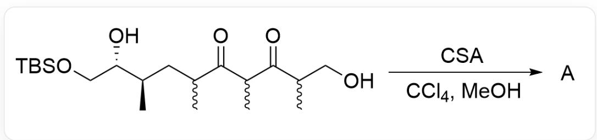
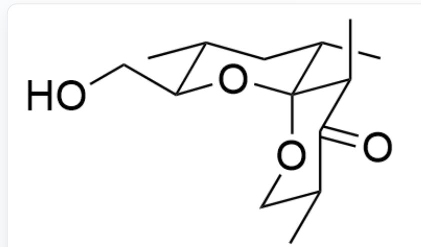
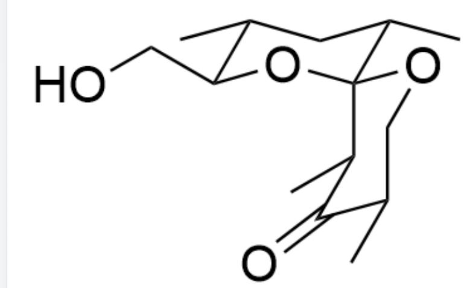
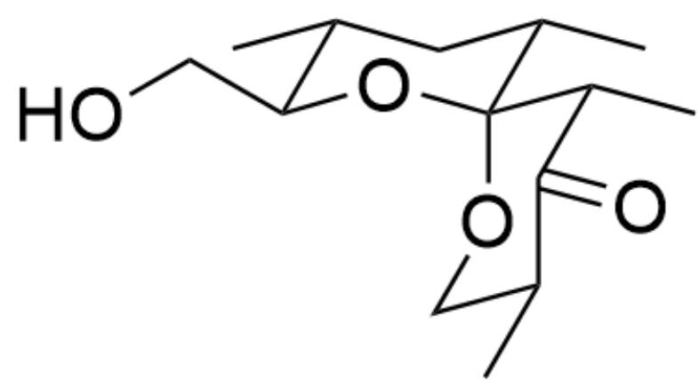
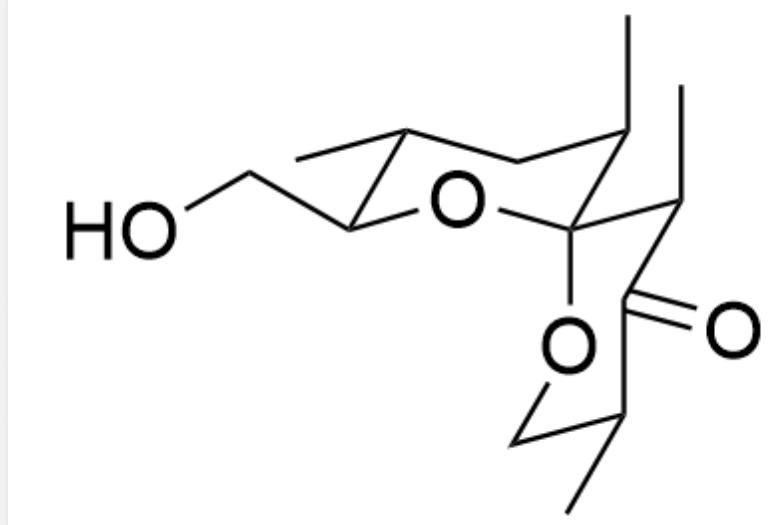
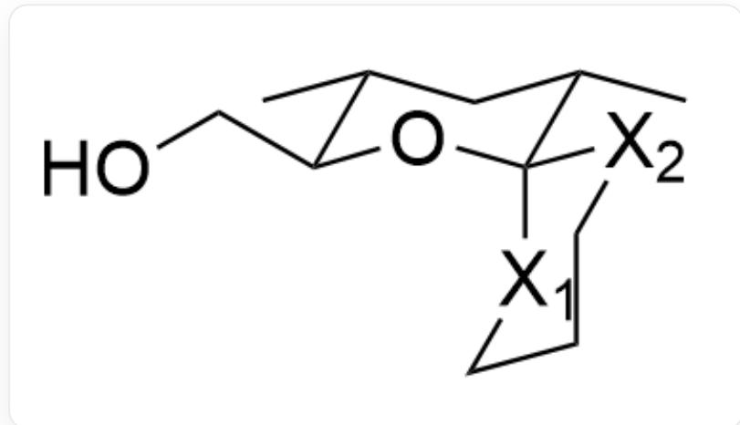
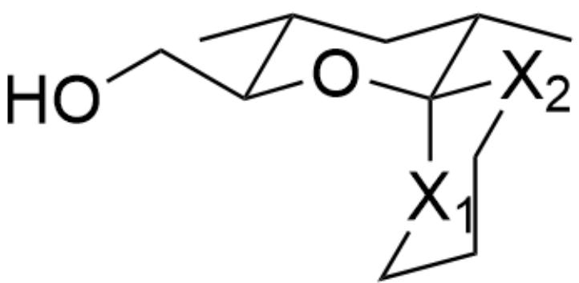
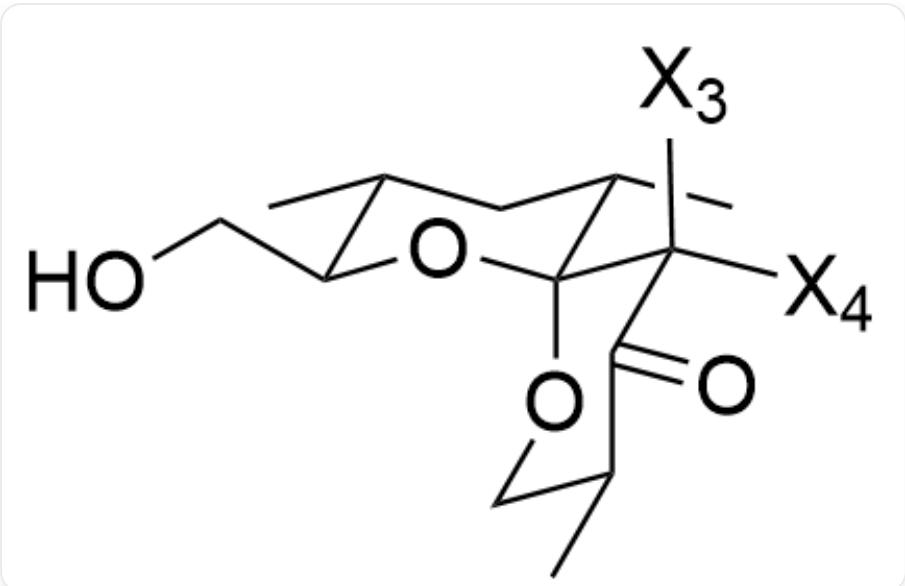
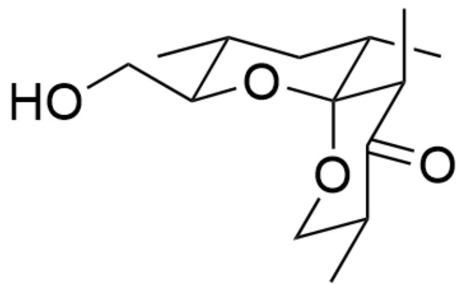

# Question

  
OCC(C)C(C(C)C(C(C)C[C@@H](C)[C@@H](O)CO[Si](C)(C)C(C)(C)C)=O)=O> [CSA],[CCl_4],[MeOH]> [A  
],A is the reaction product

This condensation reaction produces a 6,6-spirocyclic product. Disregarding enantiomers, based on the stability of stereoconformations, please provide the most favored conformation of the condensation reaction product A.

A. All other options are incorrect

B.

  
C[C@H]1[C@H](CO)O[C@@]([C@@H](C)C2=O)(OC[C@@H]2C)[C@@H](C)C1

C.

  
D.

C[C@H]1[C@H](CO)O[C@@](OC[C@@H](C)C2=O)([C@@H]2C)[C@@H](C)C1

  
E.

C[C@H]1[C@H](CO)O[C@@]([C@H](C)C2=O)(OC[C@@H]2C)[C@@H](C)C1

  
F.

C[C@H]1[C@H](CO)O[C@@]([C@@H](C)C2=O)(OC[C@@H]2C)[C@H](C)C1

C[C@H]1[C@H](CO)O[C@@]([C@H](C)C2=O)(OC[C@@H]2C)[C@H](C)C1

# Answer

Correct Answer: B

# Detailed Explanation

First, according to the prompt, the product  $\mathbf{A}$  is a 6,6-spiro product, and a ketal structure is formed after condensation.

In the first chair-like six-membered ring, it is obvious that the methyl group is most stable when it is on the equatorial bond. Therefore, the configuration shown in the figure can be formed, in which two methyl groups and the hydroxymethyl group are all on the equatorial bonds. The configuration of the other spiro ring needs further discussion.

C[C@H]1[C@H](CO)O[C@]2([X2]CCC[X1]2)[C@@H](C)C1

# CHECKPOINT

1 PTS

In the first chair-like six-membered ring, it is obvious that the methyl group is most stable when it is on the equatorial bond

Next, determine the relative position of O. We mark the axial and equatorial bonds at the spiro position as  $\mathrm{X}_1$  and  $\mathrm{X}_2$  respectively. Obviously, due to the anomeric effect, O is more inclined to be in the  $\mathrm{X}_1$  axial bond position.

C[C@H]1[C@H](CO)O[C@]2([X2]CCC[X1]2)[C@@H](C)C1

# CHECKPOINT

1 PTS

Due to the anomeric effect,  $\mathrm{O}$  is more inclined to be in the axial bond position

Therefore, the position of the methyl group on the first carbon connected by the equatorial bond needs further discussion. We mark the two axial and equatorial bonds connected to the carbon at  $\mathrm{X}_2$  as  $\mathrm{X}_3$  and  $\mathrm{X}_4$  respectively, as shown in the figure:

C[C@H]1[C@H](CO)O[C@@]([C@@]([X4])([X3])C2=O)(OC[C@@H]2C)[C@@H](C)C1

For the methyl group close to the center of the ketal structure, being in the  $\mathrm{X}_4$  equatorial bond position will generate a very large repulsive force with the methyl group on the other ring. Therefore, the methyl group preferentially occupies the  $\mathrm{X}_3$  axial bond position.

# CHECKPOINT

1 PTS

For the methyl group close to the center of the ketal structure, being in the  $\mathrm{X}_4$  equatorial bond position will generate a very large repulsive force with the methyl group on the other ring. Therefore, the methyl group preferentially occupies the  $\mathrm{X}_3$  axial bond position.

Finally, there is also a methyl group next to the carbonyl group. Since it extends outside the ring, in the absence of other interference, the methyl group will be more stable on the equatorial bond.

# CHECKPOINT

1 PTS

The last methyl group will be more stable on the equatorial bond

C[C@H]1[C@H](CO)O[C@@]([C@@H](C)C2=O)(OC[C@@H]2C)[C@@H](C)C1

# CHECKPOINT

1 PTS

The most stable conformation of the product: C[C@H]1[C@H](CO)O[C@@]([C@@H](C)C2=O) (OC[C@@H]2C)[C@@H](C)C1