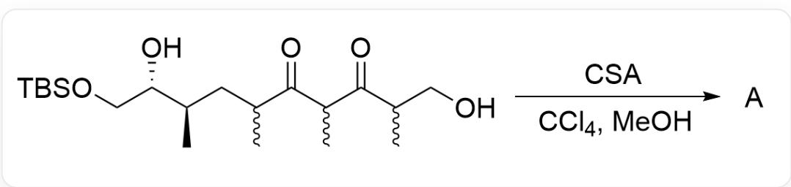
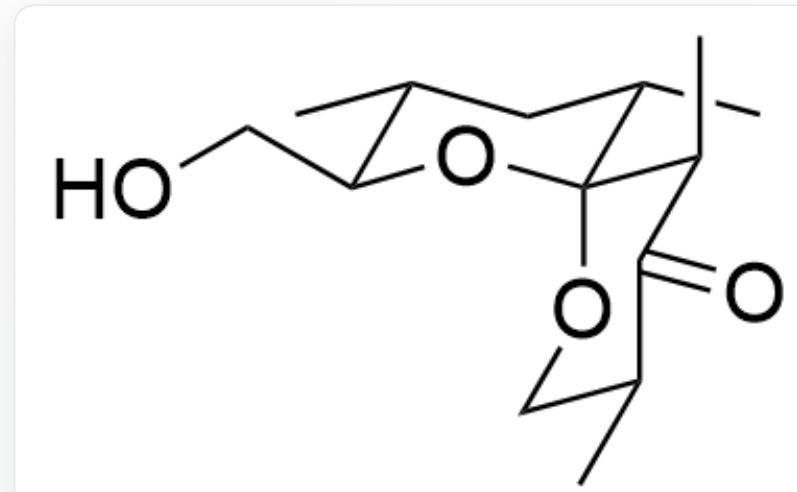
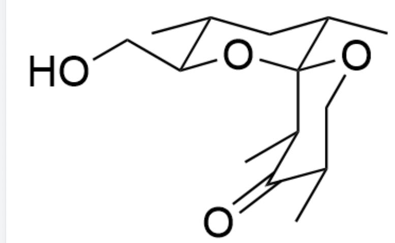
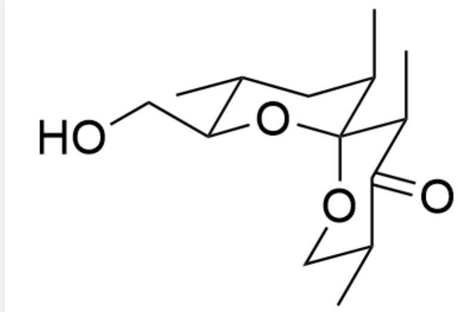
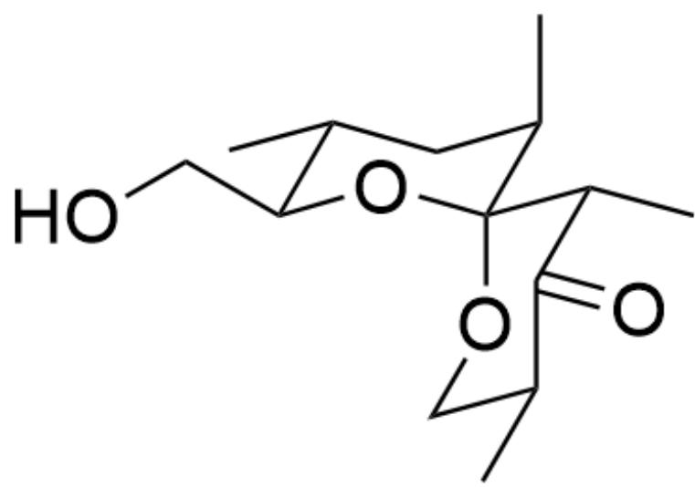
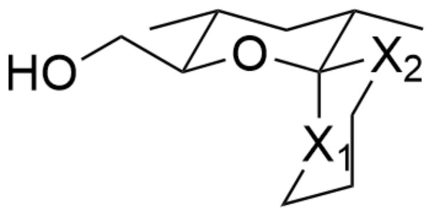
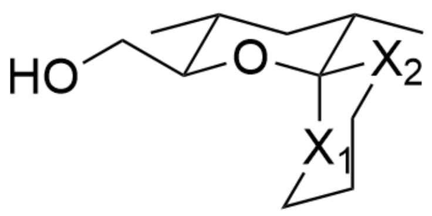
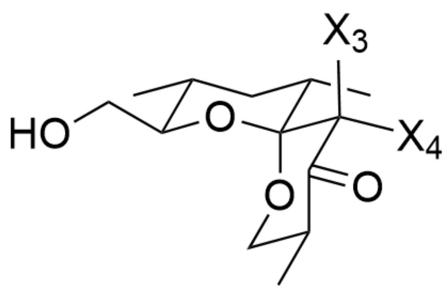
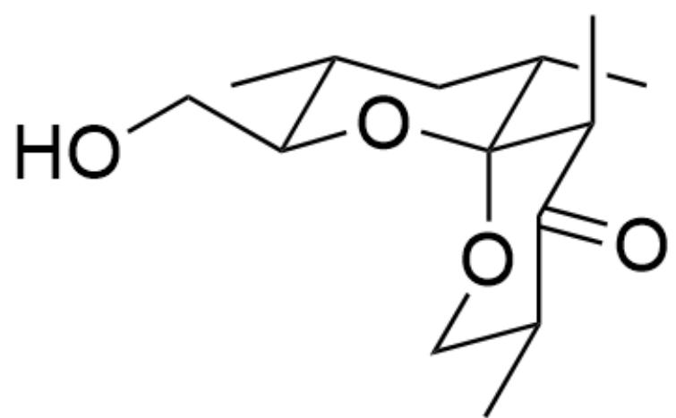

# 题目

  
OCC(C)C(C(C)C(C(C)C[C@@H](C)[C@@H](O)CO[Si](C)(C)C(C)(C)C)=O)=O> [CSA],[CCl_4],[MeOH]> [A  
],A是反应产物

该缩合反应产生了一个6,6-螺环产物，在不考虑对映异构的情况下，根据立体构象的稳定性，请给出缩合反应产物A的最优势构象

A. 其他选项均不正确

B.

  
C[C@H]1[C@H](CO)O[C@@]([C@@H](C)C2=O)(OC[C@@H]2C)[C@@H](C)C1

C.

  
D.

C[C@H]1[C@H](CO)O[C@@](OC[C@@H](C)C2=O)([C@@H]2C)[C@@H](C)C1

  
E.

C[C@H]1[C@H](CO)O[C@@]([C@H](C)C2=O)(OC[C@@H]2C)[C@@H](C)C1

  
F.

C[C@H]1[C@H](CO)O[C@@]([C@@H](C)C2=O)(OC[C@@H]2C)[C@H](C)C1

C[C@H]1[C@H](CO)O[C@@]([C@H](C)C2=O)(OC[C@@H]2C)[C@H](C)C1

# 答案

正确答案: B

# 详细解析

首先根据题干提示可知，产物A是6,6-螺环产物，缩合后形成缩酮结构

在第一个椅式六元环中，显然甲基处于平伏键上时最稳定，因此可以形成如图所示的构型，其中两个甲基和羟甲基均处于平伏键，另一个螺环的构型需要进一步讨论。

C[C@H]1[C@H](CO)O[C@]2([X2]CCC[X1]2)[C@@H](C)C1

CHECKPOINT

1 PTS

在第一个椅式六元环中，显然甲基处于平伏键上时最稳定

接着确定O的相对位置，我们将螺环位置的直立键和平伏键分别标记为  $\mathrm{X}_1$  和  $\mathrm{X}_2$  ，显然由于异头碳效应的存在，O更倾向于处于  $\mathrm{X}_1$  直立键的位置。

C[C@H]1[C@H](CO)O[C@]2([X2]CCC[X1]2)[C@@H](C)C1

# CHECKPOINT

1 PTS

由于异头碳效应的存在，O更倾向于处于直立键的位置

因此平伏键连接的第一个碳上甲基的位置需要进一步讨论，我们将  $\mathrm{X}_{2}$  这个碳连接的两个直立键和平伏键分别标记为  $\mathrm{X}_{3}$  和  $\mathrm{X}_{4}$ ，如图所示：

C[C@H]1[C@H](CO)O[C@@]([C@@]([X4])([X3])C2=O)(OC[C@@H]2C)[C@@H](C)C1

对于靠近缩酮结构中心的甲基，处于  $\mathrm{X}_4$  平伏键的位置会与另一个环上的甲基产生非常大的排斥作用，因此该甲基优先处于  $\mathrm{X}_3$  直立键的位置上。

# CHECKPOINT

1 PTS

对于靠近缩酮结构中心的甲基，处于  $\mathrm{X}_4$  平伏键的位置会与另一个环上的甲基产生非常大的排斥作用，因此该甲基优先处于  $\mathrm{X}_3$  直立键的位置上。

最后还有一个羰基旁的甲基，由于延伸至环外，没有其他干扰的情况下，甲基处于平伏键上会更加稳定

# CHECKPOINT

1 PTS

最后一个甲基处于平伏键上会更加稳定

C[C@H]1[C@H](CO)O[C@@]([C@@H](C)C2=O)(OC[C@@H]2C)[C@@H](C)C1

# CHECKPOINT

1 PTS

产物最稳定构象：C[C@H]1[C@H](CO)O[C@@]([C@@H](C)C2=O)(OC[C@@H]2C)[C@@H](C)C1