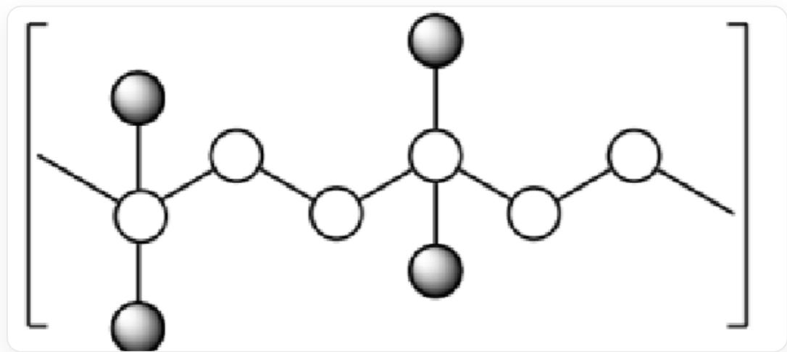
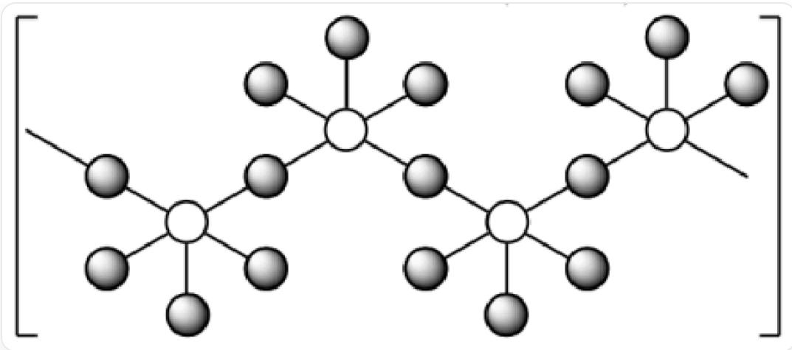
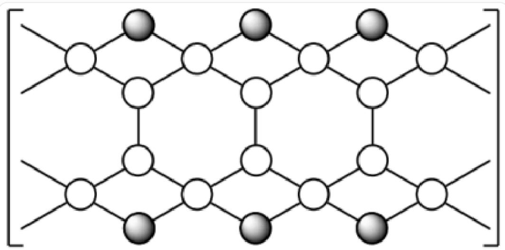
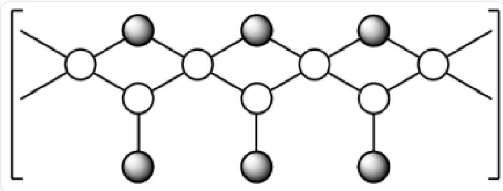

# Question

The non-radioactive element A can form a series of binary polymers with chain-like structures when combined with various halogens. The schematic structures are as follows (hollow/white spheres represent element A, solid/black spheres represent halogens), where the mass fractions of element A in X1 to X4 are  $84.37\%$ ,  $62.67\%$ ,  $76.16\%$ , and  $50.14\%$ , respectively:

- Image for X1

In the image, hollow/white spheres are linked to form a one-dimensional long chain similar to the carbon chain in polyethylene. If the one-dimensional chains are numbered 1, 2, 3..., then every hollow/white sphere numbered 3N is connected to two solid/black spheres as terminal groups.

- Image for X2

In the image, hollow/white spheres and solid/black spheres are alternately linked to form a one-dimensional long chain. Each hollow/white sphere is connected to five solid/black spheres, three of which are terminal groups and two are bridging.

- Image for X3

In the image, hollow/white spheres form long chains of fused hexagon rings sharing edges, resembling the fusion of benzene rings in polyacenes. For every two hollow/white spheres on the same side of a hexagon that are not involved in edge-sharing, an additional solid/black sphere bridges them, forming an extra four-membered ring structure. The hollow/white spheres not involved in edge-sharing hexagons are connected to two hollow/white spheres that are part of edge-sharing hexagons and to two bridging solid/black spheres forming the four-membered ring.

- Image for X4

In the image, hollow/white spheres form the same one-dimensional long chain as in  $^{**}\mathrm{X}1^{**}$ . If the chain is numbered 1, 2, 3..., adjacent odd-numbered hollow/white spheres are bridged by an additional solid/black sphere to form a four-membered ring. Every odd-numbered hollow/white sphere has two bridging solid/black spheres, while even-numbered hollow/white spheres are connected to one terminal solid/black sphere.

Based on the information about the inorganic chain-like polymers in the images, deduce the stoichiometric ratio of A atoms to halogen atoms in X1-X4, and calculate to determine which element A is and the chemical formulas of X1-X4. Then, identify the number of correct propositions from the following:

1. Element A belongs to Group 15.  
2. Element  $\mathbf{A}$  is located in the fifth period.  
3. When the halogen atoms in X1-4 are ordered by their periodic table positions from low to high, the sequence is X1, X2, X4, X3.  
4. The ratio of A atoms to halogen atoms in X1-4, ordered from smallest to largest, is X2, X4, X3, X1.  
5. According to hybrid orbital theory, A atoms in X1 exhibit two hybridization modes, and their ratio is 1:1.  
6. According to hybrid orbital theory,  $\mathbf{A}$  atoms in X2 are  $sp^3 d^2$  hybridized.  
7. X3 contains two types of A atoms with different chemical situations, and their numbers are equal.

A. 0

B. 1  
C. 2  
D. 3  
E. 4  
F. 5  
G. 6  
H. 7

# Answer

Correct Answer: D

# Detailed Explanation

First, based on the problem description and structural diagrams, determine the simplest integer ratio of  $\mathbf{A}$  atoms to halogen atoms (X) for the four polymers (X1, X2, X3, X4).

* X1: The structure consists of a long chain of A atoms, where every third A atom (after every two A atoms) is bonded to two terminal halogen atoms. That is,  $\ldots - \mathrm{A} - \mathrm{A} - \mathrm{A}(\mathrm{X}_2) - \mathrm{A} - \mathrm{A} - \mathrm{A}(\mathrm{X}_2) - \ldots$ . Thus, the repeating unit is  $\mathrm{A}_3\mathrm{X}_2$ .

\*A:X ratio  $= 3:2$

# CHECKPOINT

The simplest formula for  $\mathbf{X1}$  is  $\mathrm{A}_3\mathrm{X}_2$

1 PTS

X2: Each A atom is bonded to five halogen atoms, three of which are terminal and two are bridging. The bridging halogen atoms are shared between two A atoms. Therefore, the effective number of halogen atoms per A atom is  $3 + 2(1/2) = 4$ . The repeating unit is  $\mathrm{AX}_4$ .

\*A:X ratio  $= 1:4$

# CHECKPOINT

The simplest formula for X2 is  $\mathrm{AX}_4$

1 PTS

* X3: The structure is a ladder-like chain composed of fused six-membered rings. From the diagram, the smallest repeating unit contains four A atoms (two on the inner side of the "ladder" and two on the outer side) and two bridging halogen atoms. Thus, the repeating unit is  $\mathrm{A}_4\mathrm{X}_2$ , and the simplest formula is  $\mathrm{A}_2\mathrm{X}$ .

\*A:X ratio  $= 2:1$

# CHECKPOINT

1 PTS

The simplest formula for X3 is  $\mathrm{A}_2\mathrm{X}$

X4: The structure is a long chain of A atoms, where A atoms at even positions are bonded to one terminal halogen atom, and A atoms at odd positions are bridged by one halogen atom. Considering an A(odd)-A(even) repeating unit: A(even) has one terminal halogen; A(odd) is connected to two bridging halogen atoms, each contributing 1/2, totaling 2  $(1/2) = 1$  halogen atom. Thus, two A atoms correspond to two halogen atoms. The repeating unit is  $\mathrm{A}_2\mathrm{X}_2$ , and the simplest formula is AX.

\*A:X ratio  $= 1:1$

# CHECKPOINT

1 PTS

The simplest formula for X4 is AX

2. Inferring Element A and the Chemical Formulas of the Species

Let the atomic weight of element  $\mathbf{A}$  be  $M_A$ , and the atomic weight of the halogen be  $M_X$ . Using the mass fraction formula  $w_A = \frac{n_A \cdot M_A}{n_A \cdot M_A + n_X \cdot M_X}$ , we can derive  $M_A = \frac{w_A \cdot n_X \cdot M_X}{n_A \cdot (1 - w_A)}$ .

We match the four stoichiometric ratios and mass fractions, testing possible halogens (F=19.0, Cl=35.5, Br=79.9, I=126.9) to solve for a consistent  $M_A$ .

* For the formula  ${\mathrm{{AX}}}_{4}\left( {\mathrm{\;A} : \mathrm{X} = 1 : 4}\right)$  ,mass fraction  ${w}_{A} = {62.67}\%$  :

$$
M _ {A} = \frac {0 . 6 2 6 7 \cdot 4 \cdot M _ {X}}{1 \cdot (1 - 0 . 6 2 6 7)} \approx 6. 7 1 6 \cdot M _ {X}.
$$

If  $\mathbf{X}$  is  $\mathbf{F}$  (fluorine),  $M_A\approx 6.716\cdot 19.0 = 127.6$

* For the formula  ${\mathrm{A}}_{3}{\mathrm{X}}_{2}$  (A:X = 3:2),mass fraction  ${w}_{A} = {84.37}\%$  :

$$
M _ {A} = \frac {0 . 8 4 3 7 \cdot 2 \cdot M _ {X}}{3 \cdot (1 - 0 . 8 4 3 7)} \approx 3. 6 0 1 \cdot M _ {X}.
$$

If  $\mathbf{X}$  is  $\mathbf{C}\mathbf{I}$  (chlorine),  $M_A\approx 3.601\cdot 35.5 = 127.8$

* For the formula  ${\mathrm{A}}_{2}\mathrm{X}\left( {\mathrm{A} : \mathrm{X} = 2 : 1}\right)$  ,mass fraction  ${w}_{A} = {76.16}\%$  :

$$
M _ {A} = \frac {0 . 7 6 1 6 \cdot 1 \cdot M _ {X}}{2 \cdot (1 - 0 . 7 6 1 6)} \approx 1. 5 9 7 \cdot M _ {X}.
$$

If  $\mathbf{X}$  is  $\mathbf{Br}$  (bromine),  $M_A \approx 1.597 \cdot 79.9 = 127.6$ .

* For the formula AX (A:X = 1:1), mass fraction  $w_{A} = 50.14\%$

$$
M _ {A} = \frac {0 . 5 0 1 4 \cdot 1 \cdot M _ {X}}{1 \cdot (1 - 0 . 5 0 1 4)} \approx 1. 0 0 5 6 \cdot M _ {X}.
$$

If  $\mathbf{X}$  is I (iodine),  $M_A\approx 1.0056\cdot 126.9 = 127.6$

All calculations point to  $M_A \approx 127.6$ , identifying the element as tellurium (Te). It is a non-radioactive element, consistent with the problem statement.

# CHECKPOINT

2 PTS

Element A is Te

Thus, the chemical formulas of the four species are:

* X1: Te3Cl2  
* X2: TeF₄  
* X3: Te₂Br  
* X4: TeI

# CHECKPOINT

1 PTS

X1-X4 are  $\mathrm{Te}_3\mathrm{Cl}_2$ ,  $\mathrm{TeF}_4$ ,  $\mathrm{Te}_2\mathrm{Br}$ , TeI respectively

---

3. Evaluating the Truth of Propositions

Now, we analyze the eight given propositions one by one:

# 1. Element A belongs to Group V (15)

Tellurium (Te) is located in Group VI (16, the chalcogen group) of the periodic table, not Group V (15, the pnictogen group). Thus, this proposition is false.

# 2. Element A is in the fifth period

The valence electron shell of tellurium (Te) is the fifth shell  $(n = 5)$ , placing it in the fifth period. Thus, this proposition is true.

# CHECKPOINT

1 PTS

Tellurium (Te) is in Group VI, Period 5. Proposition 1 is false, 2 is true

3. When ordering the halogen atoms in X1-4 by increasing period number, the sequence is X1, X2, X4, X3

* X1: Cl (chlorine, Period 3)  
* X2: F (fluorine, Period 2)  
* X3: Br (bromine, Period 4)  
* X4: I (iodine, Period 5)

The correct order from low to high period is:  $\mathrm{F}(\mathrm{X}2) < \mathrm{Cl}(\mathrm{X}1) < \mathrm{Br}(\mathrm{X}3) < \mathrm{I}(\mathrm{X}4)$ . The given sequence is X1, X2, X4, X3. Thus, this proposition is false.

# CHECKPOINT

1 PTS

F (X2)  $< \mathrm{Cl}$  (X1)  $< \mathrm{Br}$  (X3)  $< \mathrm{I}$  (X4). Proposition 3 is false

4. When ordering the A:halogen atom ratio in X1-4 from smallest to largest, the sequence is X2, X4, X3, X1

* X1 (Te₃Cl₂): A:X = 3:2 = 1.5  
* X2 (TeF₄): A:X = 1:4 = 0.25  
* X3 (Te₂Br): A:X = 2:1 = 2.0  
* X4 (TeI): A:X = 1:1 = 1.0

The correct order from smallest to largest is:  $0.25 \, (\mathrm{X}2) < 1.0 \, (\mathrm{X}4) < 1.5 \, (\mathrm{X}1) < 2.0 \, (\mathrm{X}3)$ . The given sequence is X2, X4, X3, X1. Thus, this proposition is false.

# CHECKPOINT

1 PTS

Halogen atom ratios: 0.25 (X2) < 1.0 (X4) < 1.5 (X1) < 2.0 (X3). Proposition 4 is false

5. According to hybridization theory, X1 has two types of hybridized A atoms, with a 1:1 ratio

In the X1 (  $\mathrm{Te}_3\mathrm{Cl}_2$  ) chain, there are two distinct tellurium environments:

* Te bonded to two other Te atoms: 2 bonding pairs and 2 lone pairs,  ${\mathrm{{sp}}}^{3}$  hybridization.

* Te bonded to two Te atoms and two Cl atoms: Te(IV) with 4 bonding pairs and 1 lone pair (total 5 valence electron pairs), sp $^3$ d hybridization.

The ratio of these Te atoms is 2:1, not 1:1. Thus, this proposition is false.

# CHECKPOINT

1 PTS

X1 has two distinct Te environments with a 2:1 ratio. Proposition 5 is false

# 6. According to hybridization theory, X2 has A atoms with  $\mathrm{sp}^3\mathrm{d}^2$  hybridization

In X2 (TeF $_4$ ), each Te atom bonds with five F atoms, and Te is in the +4 oxidation state with 1 lone pair. The total valence electron pairs are 5 (bonding) + 1 (lone) = 6. Six electron pairs correspond to  $\mathfrak{sp}^3\mathfrak{d}^2$  hybridization. Thus, this proposition is true.

# CHECKPOINT

1 PTS

X2 Te atoms are  $\mathfrak{sp}^3\mathfrak{d}^2$  hybridized. Proposition 6 is true

# 7. X3 contains two chemically distinct A atoms in equal numbers

In X3's ladder structure, there are two distinct Te environments:

* Inner Te: bonded to 3 Te atoms.

* Outer Te: bonded to 2 Te atoms and 1 Br atom.

Their counts are equal in the repeating unit (2 each). Thus, this proposition is true.

# CHECKPOINT

1 PTS

X3 has two chemically distinct Te atoms in equal numbers. Proposition 7 is true

In summary, the correct propositions are 2, 6, and 7, totaling 3.

The correct answer is D.