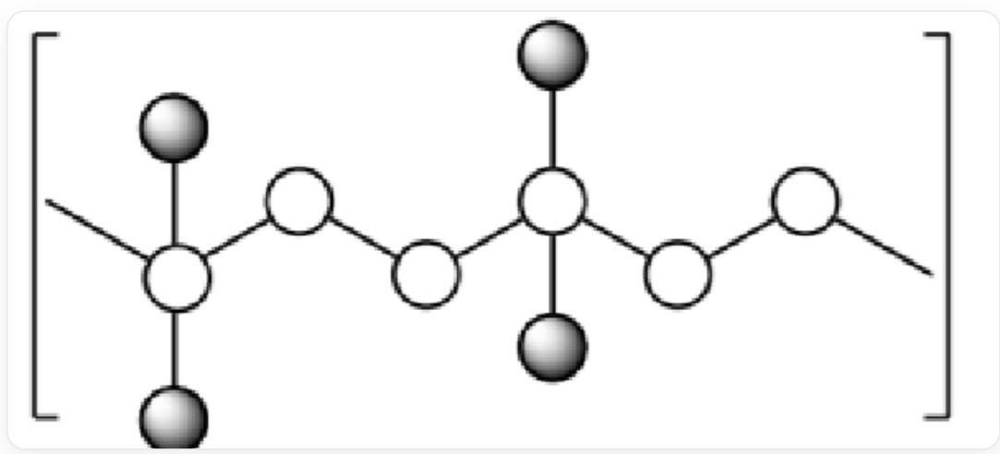
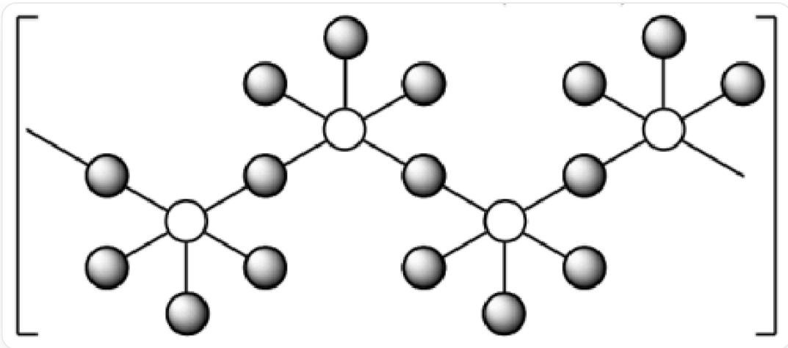
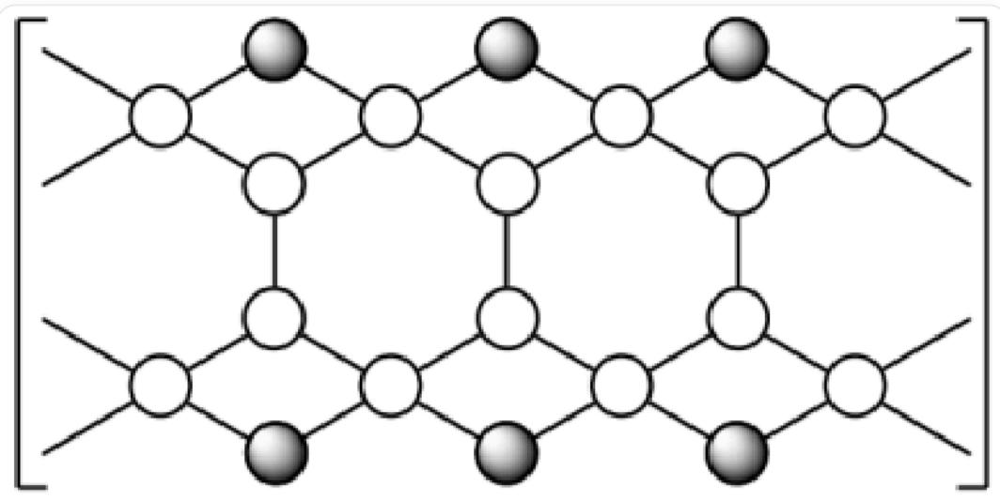
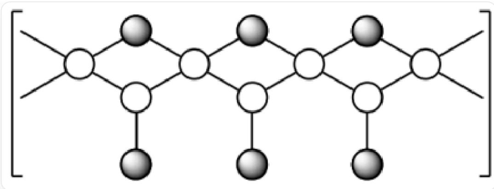

# 题目

非放射性的元素 A 可以与各种卤素形成一系列具有链状结构的二元聚合物, 其结构示意图如下 (空心球/白球为元素 A, 实心球/黑球为卤素), 其中 A 元素的质量分数从X1到X4依次为  $84.37\%$  、  $62.67\%$  、  $76.16\%$  、  $50.14\%$ :

-X1的图片

  
图片中空心球/白球彼此链接形成类似聚乙烯中的碳链的一维长链，若将一维长链编号为1、2、3...，则编号为3N的空心球/白球有2个实心球/黑球作为端基与之相连

-X2的图片

  
图片中空心球/白球与实心球/黑球间隔链接形成一维长链，每个空心球/白球与5个实心球/黑球相连，其中3个为端基、2个为桥联

-X3的图片

  
图片中空心球/白球形成共边相连的正六元环并环结构的长链，其并环方式类似于苯共边并环形成聚并苯，其中每两个未参与相邻共边六元环的同侧空心球/白球，都有一个额外的实心球/黑球进行桥联，形成额外的形成四元环结构，未参与相邻共边六元环的空心球/白球与两个参与相邻共边六元环的空心球/白球相连、与两个参与桥联组成四元环的实心球/黑球相连

-X4的图片

  
图片中空心球/白球形成与X1中相同的一维长链，若将一维长链编号为1、2、3...，则相邻的奇数编号空心球/白球之间与一个额外的桥联的实心球/黑球形成四元环，每隔奇数编号的空心球/白球有两个桥联的实心球/黑球，而偶数编号空心球/白球与一个端基实心球/黑球相连

请结合图片中的无机链状聚合物的信息，推导X1-X4的A原子与卤素原子的计量关系，并通过计算，推断A是何种元素以及X1-X4四个物种的化学式。然后从以下命题中找出正确命题的个数。

1. A 元素位于第五主族  
2.A元素位于第五周期  
3. 将 X1-4 中的卤素原子按照周期高低排序, 由低到高的顺序依次为  $X_{1} 、 X_{2} 、 X_{4} 、 X_{3}$  
4. 计算 X1-4 中 A 原子: 卤素原子数目的比值, 由小到大的顺序依次为 X2、X4、X3、X1  
5. 根据杂化轨道理论，X1 中的 A 原子有两种杂化方式，且原子数目比为  $1: 1$  
6. 根据杂化轨道理论，X2 中的 A 原子为  $sp^3 d^2$  杂化  
7. X3 中含有两种不同化学环境的 A 原子, 且数目相同

A. 0  
B. 1  
C. 2

D. 3  
E. 4  
F. 5  
G. 6  
H. 7

# 答案

正确答案: D

# 详细解析

首先，根据题目描述和结构示意图，确定四种聚合物（X1、X2、X3、X4）中A原子与卤素原子（X）的最简整数比。

* X1: 结构为 A 原子组成的长链，每隔 2 个 A 原子，第 3 个 A 原子上连接 2 个端基卤素原子。即  $-\mathrm{A} - \mathrm{A} - \mathrm{A}(\mathrm{X}_2) - \mathrm{A} - \mathrm{A} - \mathrm{A}(\mathrm{X}_2) - \dots$  。因此，重复单元为  $\mathrm{A}_3\mathrm{X}_2$  。

\*A:X比例  $= 3:2$

# CHECKPOINT

1 PTS

X1的最简式为  $\mathrm{A}_3\mathrm{X}_2$

X2: 每个A原子与5个卤素原子相连，其中3个为端基，2个为桥联。桥联卤素原子被两个A原子共享。因此，每个A原子实际占有的卤素原子数为  $3 + 2(1/2) = 4$  。重复单元为  $\mathrm{AX}_4$  。

\*A:X比例  $= 1:4$

# CHECKPOINT

1 PTS

X2的最简式为  $\mathrm{AX}_4$

* X3: 结构为并六元环构成的梯形长链。从图中可以看出，最小重复单元包含4个A原子（2个在“梯子”内侧，2个在外侧）和2个桥联卤素原子。因此，重复单元为  $\mathrm{A}_4\mathrm{X}_2$  ，最简式为  $\mathrm{A}_2\mathrm{X}$  。

$\mathrm{A}:\mathrm{X}$  比例  $= 2:1$

# CHECKPOINT

1 PTS

X3的最简式为  $\mathrm{A}_2\mathrm{X}$

X4: 结构为 A 原子长链，偶数位 A 原子连接 1 个端基卤素，奇数位 A 原子之间由 1 个卤素原子桥联。考虑一个 A(奇)-A(偶)的重复单元：A(偶)拥有 1 个端基卤素；A(奇)连接了两个桥联卤素，每个贡献  $1/2$ ，总计 2 (1/2) = 1 个卤素。因此，2 个 A 原子对应 2 个卤素原子。重复单元为  $\mathrm{A}_2\mathrm{X}_2$ ，最简式为 AX。

\*A:X比例  $= 1:1$

# CHECKPOINT

1 PTS

X4的最简式为AX

2. 推断元素 A 及各物种化学式

设元素  $\mathbf{A}$  的原子量为  $M_A$  ，卤素的原子量为  $M_X$  。根据质量分数公式  $w_{A} = \frac{n_{A} \cdot M_{A}}{n_{A} \cdot M_{A} + n_{X} \cdot M_{X}}$  ，可以推导出  $M_A = \frac{w_A \cdot n_X \cdot M_X}{n_A \cdot (1 - w_A)}$  。

我们将四组化学计量比和质量分数进行匹配，尝试可能的卤素（F=19.0, Cl=35.5, Br=79.9, I=126.9）以求解一致的  $M_A$ 。

* 对于化学式  $\mathrm{AX}_4$  ( $\mathrm{A}:\mathrm{X} = 1:4$ ), 质量分数  $w_A = 62.67\%$ :

$$
M _ {A} = \frac {0 . 6 2 6 7 \cdot 4 \cdot M _ {X}}{1 \cdot (1 - 0 . 6 2 6 7)} \approx 6. 7 1 6 \cdot M _ {X} 。
$$

若  $\mathbf{X}$  为  $\mathbf{F}$  (氟),  $M_A \approx 6.716 \cdot 19.0 = 127.6$  。

* 对于化学式  $\mathrm{A}_{3} \mathrm{X}_{2}$  ( $\mathrm{A}: \mathrm{X}=3:2$ ), 质量分数  $w_{A}=84.37 \%$ :

$$
M _ {A} = \frac {0 . 8 4 3 7 \cdot 2 \cdot M _ {X}}{3 \cdot (1 - 0 . 8 4 3 7)} \approx 3. 6 0 1 \cdot M _ {X} \circ
$$

若  $\mathbf{X}$  为  $\mathbf{C}\mathbf{I}$  (氯),  $M_A \approx 3.601 \cdot 35.5 = 127.8$  。

* 对于化学式  $\mathrm{A}_2\mathrm{X}$  ( $\mathrm{A}:\mathrm{X} = 2:1$ ), 质量分数  $w_A = 76.16\%$ :

$$
M _ {A} = \frac {0 . 7 6 1 6 \cdot 1 \cdot M _ {X}}{2 \cdot (1 - 0 . 7 6 1 6)} \approx 1. 5 9 7 \cdot M _ {X} \circ
$$

若  $\mathbf{X}$  为  $\mathbf{Br}$  (溴),  $M_A \approx 1.597 \cdot 79.9 = 127.6$  。

* 对于化学式 AX (A:X = 1:1)，质量分数  $w_{A} = 50.14\%$

$$
M _ {A} = \frac {0 . 5 0 1 4 \cdot 1 \cdot M _ {X}}{1 \cdot (1 - 0 . 5 0 1 4)} \approx 1. 0 0 5 6 \cdot M _ {X} \circ
$$

若  $\mathbf{X}$  为I(碘)，  $M_A\approx 1.0056\cdot 126.9 = 127.6$

所有计算都指向  $M_A \approx 127.6$ ，该元素为碲 (Tellurium, Te)。它是一种非放射性元素，符合题意。

# CHECKPOINT

2 PTS

元素A为Te

因此，四种物质的化学式分别为：

* X1: Te₃Cl₂  
* X2: TeF₄  
* X3: Te₂Br  
* X4: TelI

# CHECKPOINT

1 PTS

得到X1-X4分别为  $\mathrm{Te}_3\mathrm{Cl}_2$  、  $\mathrm{TeF}_4$  、  $\mathrm{Te}_2\mathrm{Br}$  、  $\mathrm{TeI}$

---

3.判断命题真伪

现在我们逐一分析给出的8个命题：

# 1.A元素位于第五主族

碲 (Te) 位于元素周期表第六主族 (VIA族, 氧族), 而非第五主族 (VA族, 氮族)。故此命题错误。

# 2.A元素位于第五周期

碲 (Te) 的价电子层为第五层  $(n = 5)$ , 位于第五周期。故此命题正确。

# CHECKPOINT

1 PTS

碲 (Te) 位于元素周期表第六主族第五周期, 命题1错误, 2正确

# 3. 将 X1-4 中的卤素原子按照周期高低排序，由低到高的顺序依次为X1、X2、X4、X3

* X1: Cl (氯, 第三周期)

* X2: F (氟, 第二周期)

* X3: Br (溴, 第四周期)

* X4: I (碘, 第五周期)

按周期从低到高排序应为：F(X2)  $< \mathrm{Cl}$  (X1)  $< \mathrm{Br}$  (X3)  $< \mathrm{I}$  (X4)。题目给出的顺序是X1,X2,X4,X3。故此命题错误。

# CHECKPOINT

1 PTS

F (X2)  $< \mathrm{Cl}$  (X1)  $< \mathrm{Br}$  (X3)  $< \mathrm{I}$  (X4)，故命题3错误

4. 计算 X1-4 中 A 原子: 卤素原子数目的比值, 由小到大的顺序依次为 X2、X4、X3、X1

* X1 (Te₃Cl₂): A:X = 3:2 = 1.5  
* X2 (TeF₄): A:X = 1:4 = 0.25  
* X3 (Te₂Br): A:X = 2:1 = 2.0  
* X4 (TeI): A:X = 1:1 = 1.0

从小到大排序为：0.25 (X2) < 1.0 (X4) < 1.5 (X1) < 2.0 (X3)。题目给出的顺序是 X2, X4, X3, X1。故此命题错误。

# CHECKPOINT

1 PTS

卤素原子数目的比值  $0.25(\mathrm{X}2) < 1.0(\mathrm{X}4) < 1.5(\mathrm{X}1) < 2.0(\mathrm{X}3)$ ，命题4错误

5. 根据杂化轨道理论，X1 中的 A 原子有两种杂化方式，且原子数目比为 1:1

在  $\mathrm{X1}(\mathrm{Te}_3\mathrm{Cl}_2)$  链中，有两种不同环境的碲原子：

* 只与两个碲原子相连的 Te: 有2对成键电子和2对孤对电子, 为  $\mathfrak{sp}^{3}$  杂化。

* 与两个碲原子和两个氯原子相连的 Te: Te(IV) 价态, 有4个成键电子对和1对孤对电子, 共5个价层电子对, 为  $\mathrm{sp}^{3} \mathrm{~d}$  杂化。

这两种 Te 原子的数量比为 2:1，而非 1:1。故此命题错误。

# CHECKPOINT

1 PTS

X1有两种不同环境的碲原子，数量比为2:1，命题5错误

# 6. 根据杂化轨道理论，X2 中的 A 原子为  $\mathrm{sp}^3\mathrm{d}^2$  杂化

在X2  $(\mathrm{TeF}_4)$  的聚合物结构中，每个Te原子与5个F原子成键，且Te为  $+4$  价，中心原子有1对孤对电子。总价层电子对数为5(成键)  $+1$  (孤对)  $= 6$  。6个价层电子对对应的杂化方式为  $\mathfrak{sp}^3\mathfrak{d}^2$  。故此命题正确。

# CHECKPOINT

1 PTS

X2中碲原子的为  $\mathrm{sp}^3\mathrm{d}^2$  杂化，命题6正确

# 7. X3 中含有两种不同化学环境的 A 原子，且数目相同

在 X3 的梯形结构中, 有两种不同化学环境的 Te 原子:

* 内侧 Te: 只与 3 个 Te 原子相连。

* 外侧 Te: 与2个 Te 和1个 Br 相连。

它们在重复单元中数量相同（各2个）。故此命题正确。

# CHECKPOINT

1 PTS

X3中存在两种化学环境的 Te 原子，且在重复单元中数量相同，命题7正确

综上所述，正确的命题共有3个，分别是命题2、命题6和命题7。

正确答案为D。