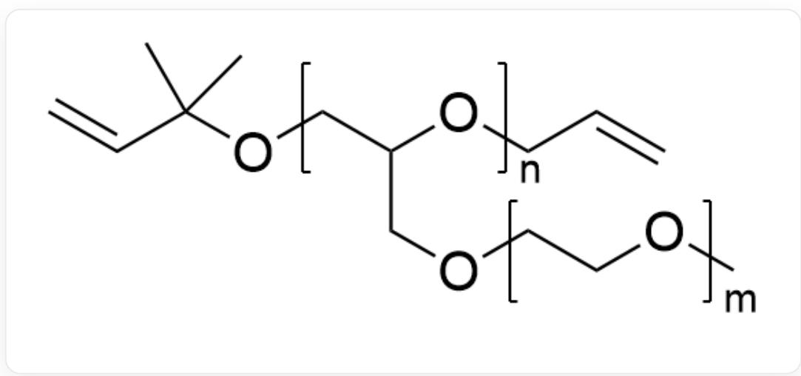
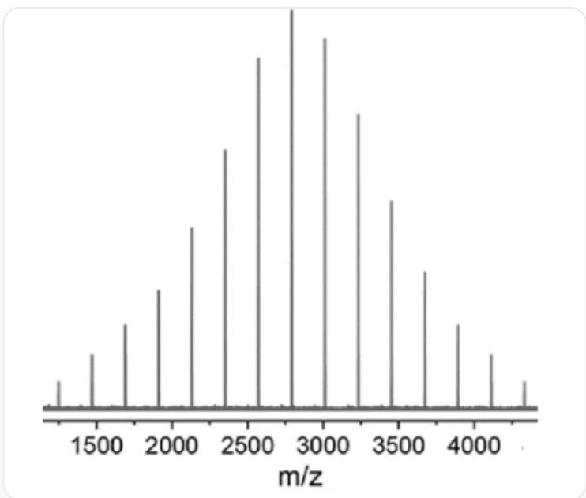
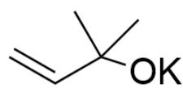
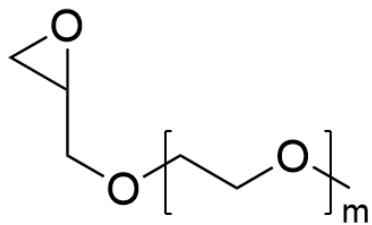
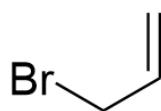

# Question

This image describes a polymer, whose structure can be described as: The polymer has a branched chain, with structures [X]CC(CO[Z])O[Y] and [M]CCO[M]C, with degrees of polymerization of n and m, respectively, where X, Y, M, and Z all represent the linking sites of the polymer monomer, M is connected to M to form the branched chain repeating unit, and [M] is connected to [Z] of the main chain; the end-capping structures are C=CC(C)(C)O[X] and [Y]CC=C, where X and Y represent the linking sites, corresponding to

X and Y of the monomer.

The polymer in the above figure is named  $\mathrm{PEO}^{\mathrm{B}}$ , and its synthesis method is as follows: Under nitrogen protection and in the presence of the crown ether  $18 - \mathrm{C} - 6$ , the ring-opening polymerization of  $\mathbf{B}$  is initiated by the potassium alkoxide initiator  $\mathbf{A}$ , and then the bromide  $\mathbf{C}$  is added for end-capping.

The researchers determined the degree of polymerization of the polymer by MALDI-TOF mass spectrometry, determined its mass-to-charge ratio after  $\mathrm{PEO^B}$  was combined with a sodium ion, and the obtained mass spectrum image is shown below, where the horizontal coordinate represents the mass-to-charge ratio m/z of  $[\mathrm{PEO^B} - \mathrm{Na}]^{+}$ :

This image is a mass spectrum, the horizontal coordinate in the image is the mass-to-charge ratio  $m/z$ , the image has 15 peaks, the spacing between each peak is the same, the peak height is approximately normally distributed, the most central peak is the highest peak, the corresponding horizontal coordinate is about 2800, and the horizontal coordinates corresponding to the leftmost and rightmost lowest peaks are about 1250 and 4350,

The polymer  $\mathrm{PEO}^{\mathrm{B}}$  and a substance POSS containing a thiol structure are mixed in a certain proportion and dissolved in tetrahydrofuran, a lithium salt electrolyte and a small amount of photoinitiator are added, dropped on the surface of a lithium metal plate, the reaction is initiated by ultraviolet light, and the solvent is removed by vacuum drying to obtain a solid polymer electrolyte membrane with a cross-linked structure and good deformability.

According to the above information, which of the following statements is correct:

A. All other options are incorrect  
B.  $m = 2$  
C. The highest peak in the mass spectrum corresponds to a degree of polymerization  $n = 12$

D. The difference between the relative molecular mass of  $\mathbf{A}$  and the relative molecular mass of  $\mathbf{C}$  is less than 2.  
E. The mixing ratio of  $\mathrm{PEO}^{\mathrm{B}}$  and POSS is approximately 1:1

# Answer

Correct Answer: C

# Detailed Explanation

Based on the polymer synthesis pathway and polymer structure, the structure of potassium alkoxide  $\mathbf{A}$  is obviously an end-group structure,  $C = C C(C)(C)O[K]$ . Since it induces ring-opening polymerization,  $\mathbf{B}$  obviously has an ethylene oxide structure, so the structure of  $\mathbf{B}$  is [M]CCOC, the degree of polymerization is m, and the capping structure connected to the M site is [M]OCC1CO1. The bromide  $\mathbf{C}$  used for end-capping has the structure  $C = C CBr$ . According to the chemical formula, option D is incorrect.

# CHECKPOINT

1 PTS

The structure of potassium alkoxide A is  $\mathrm{C = CC(C)(C)O[K]}$

# CHECKPOINT

1 PTS

The structure of  $\mathbf{B}$  is [M]CCOC, the degree of polymerization is m, and the capping structure connected to the M site is [M]OCC1CO1

# CHECKPOINT

1 PTS

The structure of  $\mathbf{C}$  is  $C = C\bar{C} B\bar{r}$

Observing the mass spectrum image, the abscissa of the last peak in the figure differs from the first peak by 3100, a difference of 14 intervals; therefore, it can be determined that the relative molecular mass of monomer  $\mathbf{B}$  is  $3100 / 14 \approx 221$ ; according to the structure of  $\mathbf{B}$ , it can be deduced that  $\mathrm{m} = 3$ .

# CHECKPOINT

1 PTS

The relative molecular mass of monomer  $\mathbf{B}$  is  $3100 / 14\approx 221$

# CHECKPOINT

1 PTS

$$
\mathrm {m} = 3
$$

The  $\mathrm{m/z}$  corresponding to the highest peak is approximately 2800, corresponding to the highest degree of polymerization n, and the end groups are  $\mathrm{C}_5\mathrm{H}_9\mathrm{O}, \mathrm{C}_3\mathrm{H}_4$ ; therefore, it is calculated that  $\mathrm{n} = (2800 - 85 - 40) / 221 \approx 12$

# CHECKPOINT

1 PTS

The degree of polymerization  $n = 12$  corresponding to the highest peak in the mass spectrum

The reaction between  $\mathrm{PEO}^{\mathrm{B}}$  and POSS should be a free radical polymerization reaction between thiol and double bond. To form a cross-linked system, the mixing ratio should be 2:1, and option E is incorrect.

# CHECKPOINT

1 PTS

The reaction between  $\mathrm{PEO^B}$  and POSS should be a free radical polymerization reaction between thiol and double bond

# CHECKPOINT

1 PTS

The mixing ratio of  $\mathrm{PEO}^{\mathrm{B}}$  and POSS should be 2:1

  
A

  
B

  
C

The structure of potassium alkoxide  $\mathbf{A}$  is C=CC(C)(C)O[K]; The structure of  $\mathbf{B}$  is [M]CCOC, the degree of polymerization is m, and the capping structure connected to the M site is [M]OCC1CO1; The structure of  $\mathbf{C}$  is C=CCBr