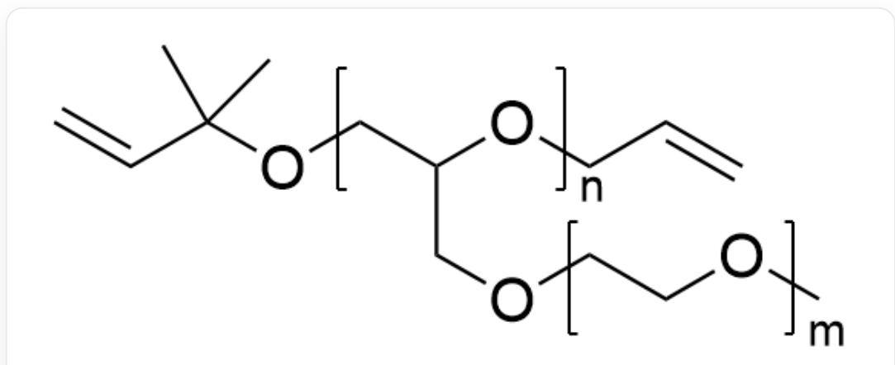
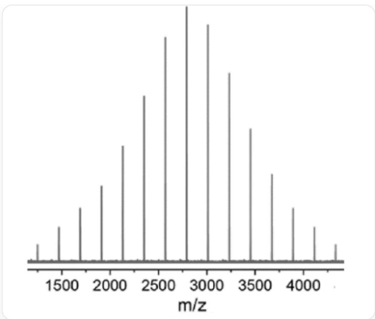
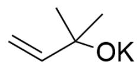
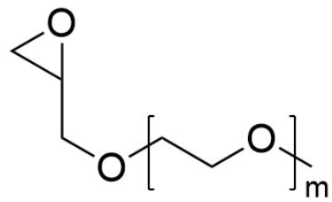
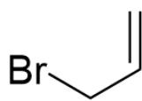

# 题目

该图片描述了一个高分子，其结构可描述为：该高分子是具有一个支链，结构为[X]CC(CO[Z])O[Y]和[M]CCO[M]C，聚合度分别为n和m，其中X,Y,M,Z均表示聚合物单体的链接位点，M与M相连构成支链重复单元，同时[M]与主链的[Z]相连；封端的结构为C=CC(C)(C)O[X]和[Y]CC=C，其中X,Y表示连接位点，与单体的X,Y相对应。

上图的高分子名为  $\mathrm{PEO}^{\mathrm{B}}$  ，其合成方法如下：在氮气保护和冠醚  $18 - \mathrm{C}-6$  存在下，由醇钾引发剂A引发B的开环聚合，之后加入溴化物C封端。

实验人员通过MALDI-TOF质谱测定该高分子的聚合度，使  $\mathrm{PEO^B}$  与一个钠离子结合后测定其质荷比，得到的质谱图像如下图，其中横坐标表示  $[\mathrm{PEO^{B}} - \mathrm{Na}]^{+}$  的质荷比  $\mathrm{m / z}$  ：

本图为质谱图，图片中横坐标为质荷比m/z，图像具有15个峰，每个峰之间的间距相同，峰高约呈正态分布，最中心的峰位为最高峰，对应的横坐标约为2800，最左右两个最低峰对应的横坐标约为1250和4350，

该高分子PEOB与某含有硫醇结构的物质POSS以一定比例混合溶于四氢呋喃，加入锂盐电解质和少量光引发剂，滴在锂金属板表面，用紫外光引发反应，真空干燥去除溶剂，得到具有交联结构和较好变形性的固体高分子电解膜。

根据以上信息，下列说法正确的是：

A. 其他选项均不正确  
B.  $m = 2$  
C. 质谱图中最高的峰对应的聚合度  $n = 12$  
D. A 的相对分子质量减去 C 的相对分子质量的差值小于 2  
E. PEOB和POSS的混合比例约为1:1

# 答案

正确答案: C

# 详细解析

根据高分子合成路径和高分子结构可知，醇钾A的结构很明显为端基结构，C=CC(C)(C)O[K]。由于诱发开环聚合，因此B很明显存在环氧乙烷结构，因此B结构为[M]CCOC，聚合度为m，与M位点连接的封端结构为[M]OCC1CO1。用于封端的溴化物C结构为C=CCBr，根据化学式可知选项D错误。

# CHECKPOINT

1 PTS

醇钾A的结构为C=CC(C)(C)O[K]

# CHECKPOINT

1 PTS

B结构为[M]CCOC，聚合度为m，与M位点连接的封端结构为[M]OCC1CO1

# CHECKPOINT

1 PTS

C结构为C=CCBr

观察质谱图像，图中最后一个峰与第一个峰的横坐标相差3100，相差14个间距；因此可判断单体B的相对分子量为  $3100 / 14 \approx 221$ ；根据B的结构可推算得到  $\mathrm{m} = 3$ 。

# CHECKPOINT

1 PTS

单体B的相对分子量为  $3100 / 14\approx 221$

# CHECKPOINT

1 PTS

$$
\mathrm {m} = 3
$$

最高峰对应的  $\mathrm{m / z}$  约为2800，对应最高聚合度n，端基分别为  $\mathrm{C}_5\mathrm{H}_9\mathrm{O},\mathrm{C}_3\mathrm{H}_4$  ；故计算得 $\mathrm{n} = (2800 - 85 - 40) / 221\approx 12$

# CHECKPOINT

1 PTS

质谱图中最高的峰对应的聚合度  $\mathrm{n} = 12$

PEO $^{\text{B}}$  和 POSS 的反应应当为巯基与双键的自由基聚合反应，为形成交联体系，混合比例应当为 2:1，选项E错误。

# CHECKPOINT

1 PTS

$\mathbf{PEO}^{\mathrm{B}}$  和POSS的反应应当为巯基与双键的自由基聚合反应

# CHECKPOINT

1 PTS

PEO $^{\text{B}}$  和 POSS 混合比例应当为 2:1

  
A

  
B

  
C

醇钾A的结构为C=CC(C)(C)O[K]; B结构为[M]CCOC，聚合度为m，与M位点连接的封端结构为[M]OCC1CO1; C结构为C=CCBr