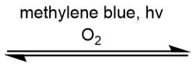
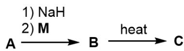
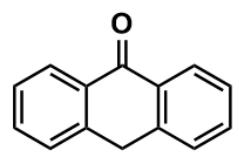
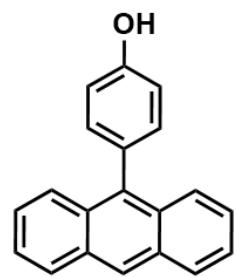
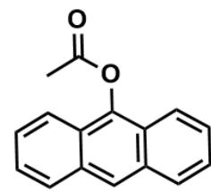

# Question

The following reactions are known:

CC1=C(C(Cl)=O)C=C(C)C2=CC=CC=C21 undergoes a reversible reaction with  $\mathrm{O}_2$  under the conditions of methylene blue and light, yielding compound A. Subsequently, A first reacts with NaH, then with M to form B. Finally, B generates C under heating conditions.

Here,  $\mathbf{B}$  and  $\mathbf{C}$  are isomers. Regarding this reaction, the following experimental facts are observed:

(1) When  $\mathbf{M}$  is replaced with  $\mathbf{N}$  while keeping other conditions unchanged, the corresponding compound analogous to  $\mathbf{B}$  can still be obtained with a high yield. However, in the final step of the reaction, a large amount of oxygen is released, and almost no compound corresponding to  $\mathbf{C}$  is produced.  
(2) During the transformation from  $\mathbf{B}$  to  $\mathbf{C}$ , if  $\mathbf{P}$  is added, the oxidation product  $\mathbf{Q}$  of  $\mathbf{P}$  can be detected, and the yield of  $\mathbf{C}$  is almost the same as when  $\mathbf{P}$  is not added.

  
M

  
N

  
P

$$
\mathbf {M} \text {i s} O = C (C 1 = C C = C C = C 1 C 2) C 3 = C 2 C = C C = C 3; \mathbf {N} \text {i s}
$$

$$
O C (C = C 1) = C C = C 1 C 2 = C 3 C (C = C C = C 3) = C C 4 = C C = C C = C 4 2; \quad P i s
$$

$$
C C (O C 1 = C 2 C = C C = C C 2 = C C 3 = C 1 C = C C = C 3) = O
$$

Which of the following statements is incorrect? (If all are correct, select F.)

A. The number of chiral carbons in A is 2.  
B. There are H atoms in B existing in 12 different chemical environments.  
C. There are 11 types of hydrogen chemical environments in C.  
D.  $\mathbf{B} \rightarrow \mathbf{C}$  is dominated by intramolecular reactions  
E. After replacing  $\mathbf{M}$  with  $\mathbf{N}$ , no corresponding  $\mathbf{C}$  is generated because the spatial distance is too far to achieve oxygen transfer.  
F. All of the above options are correct

# Answer

Correct Answer: C

# Detailed Explanation

First, the reaction process is inferred. Since the question states, "but a large amount of oxygen is released in the final step of the reaction," the first step must involve an addition reaction with  $\mathrm{O}_2$ , forming CC12C=C(C(C3=C1C=CC=C3)(OO2)C)C(Cl)=O, with 2 chiral carbons, making option A correct.

# CHECKPOINT

1 PTS

The structure of A is CC12C=C(C(C3=C1C=CC=C3)(OO2)C)C(Cl)=O

Since  $\mathbf{M}$  is essentially anthranol, NaH will react with the phenolic hydroxyl group, turning  $\mathbf{M}$  into a nucleophile. Subsequently, it reacts with A to form CC12C=C(C(C3=C1C=CC=C3) (OO2)C)C(OC4=C5C=CC=CC5=CC6=C4C=CC=C6)=O, meaning B has 12 chemically distinct hydrogens, making option B correct.

# CHECKPOINT

1 PTS

The

structure

of

B

is

CC12C=C(C(C3=C1C=CC=C3)

$(\mathrm{OO2})\mathrm{C})\mathrm{C}(\mathrm{OC4} = \mathrm{C5}\mathrm{C} = \mathrm{CC} = \mathrm{CC5} = \mathrm{CC6} = \mathrm{C4}\mathrm{C} = \mathrm{CC} = \mathrm{C6}) = \mathrm{O}$

Since the question hints that "B and C are isomers," and  $\mathbf{B}\rightarrow \mathbf{C}$  is a heating process, the transformation yields the thermodynamic product. Structures with more complete benzene rings are more stable, so  $\mathbf{B}\rightarrow \mathbf{C}$  converts two complete benzene rings into three, meaning C is

CC1=CC(=C(C)C2=C1C=CC=C2)C(=O)OC34C5=C(C=CC=C5)C(C6=C3C=CC=C6)OO4, and C has 12 chemically distinct hydrogens, making option C incorrect.

# CHECKPOINT

1 PTS

The

structure

of

C

is

$$
C C 1 = C C (= C (C) C 2 = C 1 C = C C = C 2) C (= O) O C 3 4 C 5 = C (C = C C = C 5) C (C 6 = C 3 C = C C = C 6) O O 4
$$

According to the question, "when  $\mathbf{M}$  is replaced with  $\mathbf{N}$ , under otherwise identical conditions, the compound corresponding to  $\mathbf{B}$  is obtained in high yield, but a large amount of oxygen is released in the final step of the reaction, and almost no compound corresponding to  $\mathbf{C}$  is produced." The key difference between  $\mathbf{M}$  and  $\mathbf{N}$  lies in the fact that, in the corresponding product, the anthracene moiety in the  $\mathbf{N}$ -derived structure is farther from the peroxide bond. Thus, the inability to rearrange and the release of oxygen instead indicate that  $\mathbf{B} \rightarrow \mathbf{C}$  is an intramolecular reaction and is sterically controlled, making options D and E correct.

# CHECKPOINT

1 PTS

$\mathbf{B} \rightarrow \mathbf{C}$  is an intramolecular reaction

In conclusion, the answer is C.