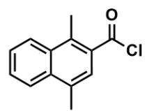
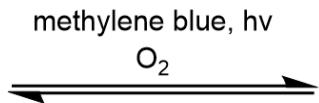
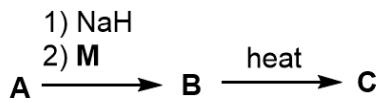
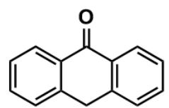
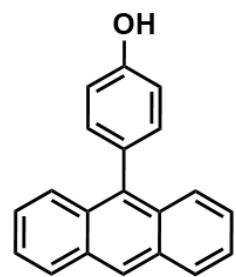
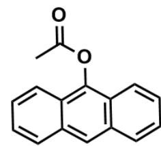

# 题目

已知下列反应：

CC1=C(C(Cl)=O)C=C(C)C2=CC=CC=C21在亚甲基蓝,光照的条件下,和O₂发生可逆反应,生成物质A。随后,A先和\mathsf{mathrm{NaH}}反应,后和\mathsf{mathbf{M}}反应形成\mathsf{mathbf{B}}。最后,\mathsf{mathbf{B}}\(\mathsf{B}\)在加热的条件下生成\mathsf{mathbf{C}}\)\$\$

其中B和C互为同分异构体。关于此反应，有下列实验事实：

(1) 将  $\mathbf{M}$  换成  $\mathbf{N}$ , 其他条件不变, 同样能以较高产率得到相应于  $\mathbf{B}$  的化合物, 但在最后一步反应中放出大量氧气, 且几乎没有相应于  $\mathbf{C}$  的化合物产生;  
(2) 在  $\mathbf{B}$  到  $\mathbf{C}$  的转化过程中加入  $\mathbf{P}$ , 可检测到  $\mathbf{P}$  的氧化产物  $\mathbf{Q}$ , 且  $\mathbf{C}$  的产率和不加入  $\mathbf{P}$  时几乎相同。

  
M

  
N

  
P

$$
\mathbf {M} \text {为} O = C (C 1 = C C = C C = C 1 C 2) C 3 = C 2 C = C C = C 3; \quad \mathbf {N} \text {为}
$$

$$
O C (C = C 1) = C C = C 1 C 2 = C 3 C (C = C C = C 3) = C C 4 = C C = C C = C 4 2; \mathbf {P} \text {为}
$$

$$
C C (O C 1 = C 2 C = C C = C C 2 = C C 3 = C 1 C = C C = C 3) = O
$$

下列说法中错误的是(若均正确，选F)

A. A中手性碳个数为2  
B. B中有存在12种化学环境的H  
C. C中有存在 11 种化学环境的  $\mathrm{H}$  
D.  $\mathbf{B} \rightarrow \mathbf{C}$  以分子内反应为主  
E. M换成N后没有相应C生成是由于空间距离过远无法实现氧气转移  
F. 以上选项都正确

# 答案

正确答案: C

# 详细解析

首先对反应过程进行推断。由于题干指出，“但在最后一步反应中放出大量氧气”，第一步一定是和  $\mathrm{O}_2$  发生加和反应，即形成CC12C=C(C(C3=C1C=CC=C3)(OO2)C)C(Cl)=O，手性碳个数为2，选项A正确。

# CHECKPOINT

1 PTS

A 的结构为CC12C=C(C(C3=C1C=CC=C3)(OO2)C)C(Cl)=O

由于M实质为蒽酚，所以NaH会和酚羟基反应，使M成为一个亲核基团。随后，它和A反应，形成CC12C=C(C(C3=C1C=CC=C3)(OO2)C)C(OC4=C5C=CC=CC5=CC6=C4C=CC=C6)=O，即B中有12种化学环境的氢，选项B正确。

# CHECKPOINT

1 PTS

B的结构为CC12C=C(C(C3=C1C=CC=C3)(OO2)C)C(OC4=C5C=CC=CC5=CC6=C4C=CC=CC6)=O

由于题干提示“B和C互为同分异构体”， $\mathbf{B} \rightarrow \mathbf{C}$  是加热过程，因此发生的是向热力学产物的转化。由于有更多完整苯环的结构会更稳定， $\mathbf{B} \rightarrow \mathbf{C}$  会两个完整的苯环转化为三个完整的苯环，即C为CC1=CC(=C(C)C2=C1C=CC=C2)C(=O)OC34C5=C(C=CC=C5)C(C6=C3C=CC=C6)OO4，即C中有12种化学环境的氢，选项C错误。

# CHECKPOINT

1 PTS

C的结构为CC1=CC(=C(C)C2=C1C=CC=C2)C(=O)OC34C5=C(C=CC=C5)C(C6=C3C=CC=C6)OO4

由于题目描述，“将  $\mathbf{M}$  换成  $\mathbf{N}$ ，其他条件不变，同样能以较高产率得到相应于  $\mathbf{B}$  的化合物，但在最后一步反应中放出大量氧气，且几乎没有相应于  $\mathbf{C}$  的化合物产生”，可以发现  $\mathbf{M}$  和  $\mathbf{N}$  的差别主要体现在：对应产物中， $\mathbf{N}$  对应结构的蒽距离过氧键距离更远。因此，不能重排而只能放出氧气说明  $\mathbf{B} \rightarrow \mathbf{C}$  是分子内反应，且反应受空间位阻控制，选项D和E正确。

# CHECKPOINT

1 PTS

$\mathbf{B} \rightarrow \mathbf{C}$  是分子内反应

综上，选C。