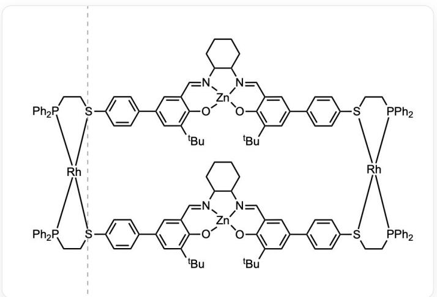
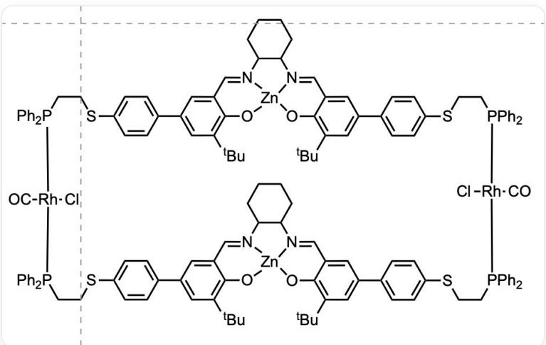

# Question

The structure of supramolecular compound A is shown below, where its charge is not shown:

CC(C1=C2C(C=[N]3C4CCCCC4[N]5=CC6=CC(C7=CC=C([S]

([Rh]89%10)CC[P]8(C%11=CC=CC=C%11)C%12=CC=CC=C%12)C=C7)=CC(C(C)(C)C=C6O[Zn]53O2)=CC(C%13=CC=C([S]9%14CC[P]

([Rh] \(914 \% 15[S](C C[P](C \% 16 = C C = C \% 16) \% 15C \% 17 = C C = C \% 17) C(C = C \% 18) = C C = C \% 18C \% 19 = C C(C(C)(C)C) = C \% 20C(C=

[N]%21C%22CCCCC%22[N]%23=CC%24=CC(C%25=CC=C([S]9CC[P]%10(C%26=CC=C%26)C%27=CC=CC=C%27)C=C%25)=CC(C(C

(C)C=C%240[Zn]%23%210%20)=C%19)(C%28=CC=C=CC=C%28)C%29=CC=CC=C%29)C=C%13)=C1)(C)C

A can change its structure to another supramolecule B in the presence of chloride ions and carbon monoxide.

CI[Rh]1([C]=O)P(CCSC(C=C2)=CC=C2C3=CC(C(C)(C)C)=C4C=(N)5C6CCCCC6[N]7=CC8=CC(C9=CC=C(SCCP([Rh](Cl

$\left([C] = O\right)P(C C S C (C = C \% 10) = C C = C \% 10 C \% 11 = C C (C (C) (C) C) = C \% 12 C (C =$

[N]%13C%14C([N]%15=CC%16=CC(C%17=CC=C(SCCP(C%18=CC=C%18)1C%19=CC=C%19)C=C%17)=CC(C(C

(C)C=C%16O[Zn]%13%15O%12)CCCCCC%14)=C%11)(C%20=CC=CC=C%20)C%21=CC=CC=C%21)

(C%22=CC=CC=C%22)C%23=CC=C%23)C=C9)=CC(C(C)(C)C=C8O[Zn]7504)=C3)(C%24=CC=CC=C%24)C%25=CC=C%25

It is known that both supramolecules can catalyze the acylation of the hydroxyl group of 4-pyridinemethanol (OCC1=CC=NC=C1) with acetic anhydride, but  $\mathbf{B}$  is significantly faster than  $\mathbf{A}$ . It is known that acetate and chloride ions can play similar roles in supramolecular allostery.

Which of the following statements is correct?

A. The stereoconfiguration of the  $Rh$  element is different in supramolecule A and supramolecule B.  
B. Compared to supramolecule A, supramolecule B has a smaller pore size because the phosphine ligand has a stronger back-bonding interaction with the metal element  $Rh$ .  
C. In the catalytic acylation reaction process,  $Zn^{2+}$  plays a role in fixing the supramolecular structure, and the  $Rh$  element plays a role in Lewis acid catalysis.  
D. Supramolecule A is electrically neutral.  
E. B-catalyzed reactions exhibit faster reaction rates due to the greater number of active sites participating in the chemical processes of the catalytic reaction.  
F. Under conditions of carbon monoxide excess and chloride ion deficiency, the rate of reaction changes in a consistently accelerating manner.

# Answer

Correct Answer: E

# Detailed Explanation

According to the structural information given in the question,  $Rh$  in both supramolecules is tetracoordinate. Common tetracoordinate  $Rh$  is monovalent  $Rh^{+}$  and has a square planar configuration. Therefore, the hybridization of  $Rh$  in  $A$  and  $B$  should be the same, i.e., the configuration is the same. The distance between the two planes containing  $Zn$  in  $B$  is two  $Rh - P$  bond lengths, while the distance between the two planes in  $A$  is less than two  $Rh - P$  bond lengths (according to the triangle inequality). Therefore, the cavity of  $B$  is larger.

# CHECKPOINT

2 PTS

The cavity of B is larger and the stereoconfiguration of Rh in the two molecules is the same, excluding options A and B

It can be inferred that  $B$  is equivalent to the reaction of  $A$  with two molecules of carbon monoxide and two molecules of chloride ions. From the square planar hybridization, it can be inferred that  $A$  should not be electrically neutral but carries two positive charges.

# CHECKPOINT

1 PTS

A is not electrically neutral, excluding option D

From the information in the question, acetate and chloride ions can play a similar role. As the catalytic reaction proceeds, the concentration of acetate will increase. Since carbon monoxide is in excess and chloride ions are insufficient, excess acetate should further catalyze  $A$  to  $B$ , which is equivalent to increasing the concentration of the catalyst. The reaction rate will initially increase, but as the reaction proceeds, the reactants are consumed, the concentration decreases, and the reaction rate will eventually decrease. Therefore, the reaction rate will first increase and then decrease. Therefore, option  $F$  is incorrect.

# CHECKPOINT

3 PTS

The reaction rate should first increase and then decrease, excluding option F

According to the judgment of the valence state of  $Rh$  and common sense of chemical reactions, the harder  $Zn^{2+}$  is obviously more suitable as a Lewis acid to catalyze this reaction, so option  $C$  is wrong.

# CHECKPOINT

2 PTS

Exclude option C based on HSAB principle and chemical common sense

Considering that the cavity of the supramolecule changes from  $A$  to  $B$  becomes larger, and both substrates happen to have sites that can bind to Lewis acids, the faster rate of  $B$  is likely due to the two  $Zn^{2+}$  catalyzing the reaction together.

# CHECKPOINT

3 PTS

The difference in reaction rate is due to the different active sites or the number of metal ions in the catalytic reaction