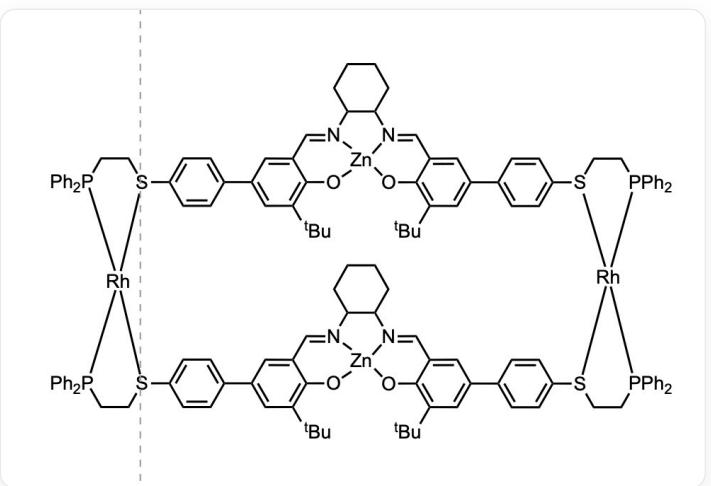
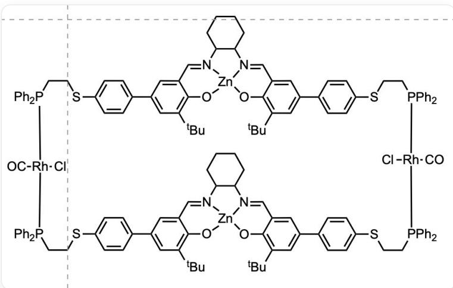

# 题目

超分子化合物A的结构如下，其中未展示其电荷：

CC(C1=C2C(C=[N]3C4CCCCC4[N]5=CC6=CC(C7=CC=C([S]

([Rh]89%10)CC[P]8(C%11=CC=CC=C%11)C%12=CC=CC=C%12)C=C7)=CC(C(C)(C)C=C6O[Zn]53O2)=CC(C%13=CC=C([S]9%14CC[P]

([Rh] \(914 \% 15[S](C C[P](C \% 16 = C C = C \% 16) \% 15C \% 17 = C C = C \% 17) C(C = C \% 18) = C C = C \% 18C \% 19 = C C(C(C)(C)C) = C \% 20C(C=

[N]%21C%22CCCCC%22[N]%23=CC%24=CC(C%25=CC=C([S]9CC[P]%10(C%26=CC=C%26)C%27=CC=CC=C%27)C=C%25)=CC(C(C

(C)C=C%240[Zn]%23%210%20)=C%19)(C%28=CC=CC=C%28)C%29=CC=CC=C%29)C=C%13)=C1)(C)C

A 可以在存在氯离子和一氧化碳的条件下改变结构成为另一种超分子 B

CI[Rh]1([C]=O)P(CCSC(C=C2)=CC=C2C3=CC(C(C)(C)C)=C4C=(N)5C6CCCCC6[N]7=CC8=CC(C9=CC=C(SCCP([Rh](Cl

$\left([C] = O\right)P(C C S C (C = C \% 10) = C C = C \% 10 C \% 11 = C C (C (C) (C) C) = C \% 12 C (C =$

[N]%13C%14C([N]%15=CC%16=CC(C%17=CC=C(SCCP(C%18=CC=C%18)1C%19=CC=C%19)C=C%17)=CC(C(C)

(C)C=C%16O[Zn]%13%15O%12)CCCCCC%14)=C%11)(C%20=CC=CC=C%20)C%21=CC=CC=C%21)

(C%22=CC=CC=C%22)C%23=CC=C%23)C=C9)=CC(C(C)(C)C=C8O[Zn]7504)=C3)(C%24=CC=CC=C%24)C%25=CC=C%25

已知两种超分子均可以催化乙酸酐对4-吡啶甲醇（ $\mathrm{OCC1 = CC = NC = C1}$ ）羟基的酰基化，但是B明显快于A。已知乙酸根和氯离子可以在超分子别构中起到差不多的作用

下面说法正确的是

A. 超分子  $\mathbf{A}$  和超分子  $\mathbf{B}$  中  $Rh$  元素的立体构型不同  
B. 相较于超分子  $\mathrm{A}$ , 超分子  $\mathrm{B}$  因为膦配体与金属元素  $Rh$  的反馈键更强, 超分子的孔洞更小  
C. 催化酰基化反应的过程中,  $Zn^{2+}$  起到固定超分子结构的作用,  $Rh$  元素起到路易斯酸催化作用  
D. 超分子 A 是电中性的  
E. B 催化的反应速率更快是因为有更多活性位点参与了催化反应的化学过程  
F. 在一氧化碳过量而氯离子不足的时候, 反应速率的变化规律是一直逐渐变快

# 答案

正确答案: E

# 详细解析

根据题目给出的结构信息，两种超分子中  $Rh$  都是四配位，常见四配位的  $Rh$  均为正一价  $Rh$  且为平面四方构型，因此  $A$  和  $B$  中  $Rh$  的杂化方式应当是一样的，即构型一样。而  $B$  中上下两个含有  $Zn$  的平面之间间隔两个  $Rh-P$  键的键长， $A$  中两个平面之间间隔小于两个  $Rh-P$  键的键长（根据三角形两边之和大于第三边）。因此  $B$  的孔洞更大

# CHECKPOINT

2 PTS

B的孔洞更大且两个分子中Rh的立体构型相同，排除选项A和选项B

可以由此推断出  $B$  相当于  $A$  与两分子一氧化碳和两分子氯离子反应，又由平面四方的杂化方式推断出  $A$  应当不是电中性的而是带两个正电荷的。

# CHECKPOINT

1 PTS

A不是电中性的，排除选项D

由题目信息，乙酸根和氯离子可以起到类似的，随着催化反应的进行，乙酸根浓度会上升，又由于一氧化碳过量而氯离子不足，过量的乙酸根应该可以进一步催化  $A$  变成  $B$  ，相当于增加催化剂的浓度，反应速率一开始会上升，但随着反应进行反应物被消耗，浓度降低，最后反应速率会下降。因此反应速率会先升后降。因此选项  $F$  错误。

# CHECKPOINT

3 PTS

反应速率应当先升后降，排除F选项

根据上面对  $R h$  价态的判断和化学反应常识，更加硬的  $Z n^{2+}$  显然更适合作为路易斯酸催化这个反应，因此选项  $C$  错误。

# CHECKPOINT

2 PTS

根据软硬酸碱和化学常识排除选项C

而考虑到从  $A$  变成  $B$  超分子的孔洞变大，而两个底物中刚好都有可以与路易斯酸结合的位点，B的速率更快很有可能是因为两个  $Zn^{2+}$  一起催化反应进行导致的。

# CHECKPOINT

3 PTS

反应速率的差异是因为催化反应的活性位点或者说金属离子数不同